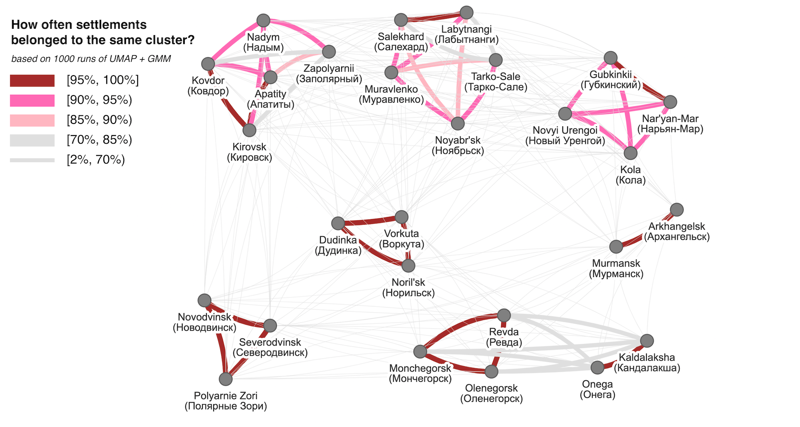

<!-- README.md is generated from README.Rmd. Please edit that file -->

# ru-resilient-arctic-clusters

<!-- badges: start -->
<!-- badges: end -->

This repository contains some supplementary materials (code, data and
plots) for the paper “Resilience Potential of the Russian Arctic
Cities”.

Zamyatina, N., Kotov, E., Goncharov, R., Burceva, A., Grebenec, V.,
Medvedkov, A., Molodcova, V., Kljueva, V., Kulchitsky, Y., Mironova, B.,
Nikitin, B., Pilyasov, A., Polyachenko, A., Poturaeva, A., Streletskiy,
D., & Shamalo, I. (2022). Resilience Potential of the Russian Arctic
Cities. Vestnik Moskovskogo Universiteta. Seria 5, Geografia (In
Russian), 5, 52–65. URL:
<a href="https://vestnik5.geogr.msu.ru/jour/article/view/1065"
target="_blank">https://vestnik5.geogr.msu.ru/jour/article/view/1065</a>

Current data and code:

<!-- github_id received via accessing https://api.github.com/repos/e-kotov/ru-covid19-regional-excess-mortality -->

You can see the published html version of the paper supplements at
<https://www.ekotov.pro/ru-resilient-arctic-clusters/>.

## The key result

The key result of the article is clustering of Russian Arctic cities.

<figure>

<figcaption aria-hidden="true">networked representation of settlement
groups</figcaption>
</figure>

An interactive version of this plot is in
[outputs/plots](outputs/plots). The code to reproduce the analysis is in
[paper/paper.Rmd](paper/paper.Rmd) and online at
<https://e-kotov.github.io/ru-resilient-arctic-clusters/> . Some helper
functions are in [R](R).

## Reproducing the analysis

If you want to re-run the analysis from scratch:

1.  Install R <https://cran.r-project.org> and RStudio
    <https://www.rstudio.com>.

2.  Extract all the files to a folder.

3.  Open the `ru-resilient-arctic-clusters.Rproj` file in RStudio.

4.  Open the `paper/paper.Rmd` file within RStudio file browser.

5.  Press Knit button at the top to run the analysis. All packages
    should install automatically, the analysis should run and you should
    get an regenerated `paper/paper.html` file.

## ABSTRACT

Resilience is the ability of urban systems to overcome natural or
manufactured crises. It is regarded as a complementary concept to that
of sustainable development. Application of the concept of resilience is
particularly relevant in the Arctic, where both natural and economic
systems are particularly vulnerable. The article analyzes 19
quantitative indicators for 27 Arctic settlements of the Russian
Federation according to the following subsystems: economic
specialization, life support and communal services, socio-cultural,
natural-ecological, administrative and managerial. Cluster analysis
identified 7 groups of cities that consistently demonstrate similarity
under different versions of analysis. Overcoming crises in a city
development requires simultaneous resilience in different subsystems of
urban development; the weakness of any of these subsystems could cause
the collapse of the entire system. Therefore, the assessment of
resilience requires an integrated approach.

## KEY WORDS

sustainable development, Arctic cities, socio-ecological systems

## FUNDING

The reported study was funded by RFBR according to the research project
\# 18-05-60088 “Urban Arctic resilience in the context of climate change
and socio-economic transformation”.
