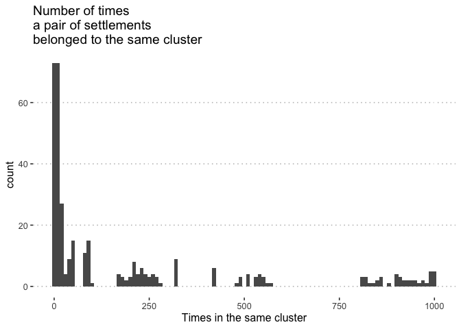

Clustering of Russian Arctic Cities: data, R code and plots
================

# Introduction

Author names will be added after peer-review.

All code is visible for reference. Some custom functions are saved in
`/R/functions.R`.

## Loading packages

``` r
# pre-install key packages
if( !"renv" %in% installed.packages()[,'Package'] )  { install.packages("renv") }
if( !"here" %in% installed.packages()[,'Package'] )  { install.packages("here") }

# install other packages
source(here::here("R", "functions.R"))

knitr::opts_chunk$set(cache = FALSE)

knitr::opts_chunk$set(echo = TRUE) 
knitr::opts_chunk$set(message = FALSE)
knitr::opts_chunk$set(warning = FALSE)

# Set so that long lines in R will be wrapped:
knitr::opts_chunk$set(tidy.opts=list(width.cutoff=60), tidy=TRUE)


invisible(lapply(eval(packages_to_load), require, character.only = TRUE))
```

## Loading data

Load the data set and replace the Russian city names with transliterated
versions.

``` r
settlements <- fread(here::here("data", "arctic_settlements_stats.csv"))
ru_en_names <- fread(here::here("data", "ru_en_names.csv"))
codebook <- fread(here::here("codebook", "codebook.csv"))

settlements <- settlements %>%
    rename(Settlement_Name_ru = Settlement_Name) %>%
    left_join(y = ru_en_names, by = "Settlement_Name_ru") %>%
    relocate(Settlement_Name_en, .before = Settlement_Name_ru) %>%
    mutate(Settlement_Name = paste0(Settlement_Name_en, "\n(",
        Settlement_Name_ru, ")")) %>%
    relocate(Settlement_Name, .before = Settlement_Name_en) %>%
    dplyr::select(-Settlement_Name_en, -Settlement_Name_ru)

DT::datatable(settlements, options = list(scrollX = TRUE, paging = TRUE))
```

<div id="htmlwidget-0171c13adccbca117153" style="width:100%;height:auto;" class="datatables html-widget"></div>
<script type="application/json" data-for="htmlwidget-0171c13adccbca117153">{"x":{"filter":"none","vertical":false,"data":[["1","2","3","4","5","6","7","8","9","10","11","12","13","14","15","16","17","18","19","20","21","22","23","24","25","26","27"],["Apatity\n(Апатиты)","Arkhangelsk\n(Архангельск)","Vorkuta\n(Воркута)","Gubkinkii\n(Губкинский)","Dudinka\n(Дудинка)","Zapolyarnii\n(Заполярный)","Kaldalaksha\n(Кандалакша)","Kirovsk\n(Кировск)","Kovdor\n(Ковдор)","Kola\n(Кола)","Labytnangi\n(Лабытнанги)","Monchegorsk\n(Мончегорск)","Muravlenko\n(Муравленко)","Murmansk\n(Мурманск)","Nadym\n(Надым)","Nar'yan-Mar\n(Нарьян-Мар)","Novodvinsk\n(Новодвинск)","Novyi Urengoi\n(Новый Уренгой)","Noril'sk\n(Норильск)","Noyabr'sk\n(Ноябрьск)","Olenegorsk\n(Оленегорск)","Onega\n(Онега)","Polyarnie Zori\n(Полярные Зори)","Revda\n(Ревда)","Salekhard\n(Салехард)","Severodvinsk\n(Северодвинск)","Tarko-Sale\n(Тарко-Сале)"],[3,5,3,3,3,1,3,3,3,3,3,3,3,5,2,4,3,3,3,3,3,1,3,1,4,3,2],[41.68,51.77,26.42,53.71,37.5,67.19,47.89,51.22,46.84,28.63,14.45,44.06,15.43,59.65,44.31,67.16,37.86,39.05,43.27,30.27,40.72,43.45,44.76,31.97,25.43,53.87,29.6],[40.63,25.69,50.52,152.34,40.5,15.92,79.87,68.9,54.96,239.98,201.81,47.13,156.22,47.12,13.6,36.63,26.17,109.45,101.16,109.11,46.45,4.25,58.44,12.44,154.86,37.17,15.51],[0,0.71,0.06,0.61,0.01,0.05,0.15,0,0.03,0,0.84,0.04,0.44,0.02,0.17,0.56,0.15,0.31,0,0.5,0,0.74,0.02,0.02,0.72,0.17,0.83],[3,3,2,3,2,3,3,3,3,3,2,3,3,3,3,2,3,3,1,3,3,3,3,3,2,3,3],[0.25205451,-0.07050298,5.11428620035143,0.31567418,0.3244887,0.44392173,0.62917049,0.75590183,1.74494164,3.9163211458726,0.74130583,0.27369417,1.14589582,0.24159292,0.34918478,0.48984683,3.12259615384615,1.53773248726204,-0.0396049,0.0957769080234834,0.42034717,0.0345382701595202,0.56947686,0.82814457,0.89895698,0.07827066,0.27682524],[1092.91019337067,1137.58842459861,1141.42019332732,1521.46199220265,1223.53619630204,1074.91050358084,1361.00779280273,2034.21417410058,2931.38672321456,1769.91805706468,1219.43359692375,1332.26953829495,1076.829568251,1072.91686349296,1232.66497316384,947.854236364892,2828.95873857281,1356.60623876762,1248.07770487703,1141.68238314842,1347.5389463205,1178.09572600009,3001.34592119396,2211.22537770823,1257.94046541012,3792.5512613955,2153.66462356427],[0.0184,0.0183,0.0126,0.0094,0.0053,0.0088,0.0079,0.0181,0.0284,0.0089,0.0148,0.0064,0.0118,0.016,0.0158,0.0204,0.0116,0.009,0.0081,0.0133,0.008,0,0.0061,0,0.0216,0.0121,0.0075],[51.3993049204317,16.7182994778355,7.65832911669379,1.37169507218545,0,3.3999728002176,0.617932398195637,4.61713311549936,0,0,0.760600874691006,2.44564009071101,0.316846741231266,9.69264921989807,6.8171606525882,0.397598505029621,0.795777076315022,11.9458117645065,5.8083464843065,7.85700255352583,0,0,1.22077763535372,0,0.390144938844781,8.68994917199541,0.465094646760616],[0.6,0.6,0.8,0.8,0.8,0.8,0.6,0.6,0.6,0.6,0.6,0.4,0.8,0.6,0.8,0.8,0.6,0.8,1,0.8,0.4,0.6,0.6,0.4,0.6,0.6,0.8],[8.22815533980583,17.4419496040538,10.0991114149009,9.45646912385036,12.4954894582195,8.81400685254455,11.433158453026,3.75404055245372,4.3692952266946,15.9167604049494,18.2120363890833,5.16022934352638,11.2537057263224,16.5156058717163,5.11357492784603,16.2917949846019,6.30597130550649,6.52304425584085,5.5560425981356,7.76756848732346,16.0727760543305,12.679173693086,6.9041424854913,23.2435033686237,27.5440595243119,8.53274010114483,4.25278075704077],[3,3,1.5,2.5,1,3,3,3,3,3,2.5,3,2.5,3,2.5,2,3,2.5,1.5,3,3,3,3,3,2.5,3,2.5],[1.5,1,2.5,1,3,3,1,1.5,1.5,3,2,2,1,3,1.5,2,1,1.5,3,1,2,1,1.5,2,1.5,1,1],[3,1,3,3,4,2.5,2,3,2,3,3,2,2,3,3,3,1,3,4,2,2,1,2,2.5,3,1,3],[0,1,3,0,0,0,0,0,0,0,0.5,0,0,0,0,1,1,0,0,0,0,1,0,0,1,1,0],[0.525904160599169,0.511574246337627,0.609923780384195,0.485170156466908,0.572114151652312,0.509758616287291,0.569744299038232,0.519550850155339,0.547012126794168,0.514302648836253,0.518898065184957,0.514913950512467,0.563214577574552,0.557274407504021,0.517825524643828,0.509189763641325,0.550389456553854,0.486353762528342,0.50560437161435,0.533635789101238,0.499191454926813,0.593298185159455,0.558799079941762,0.476788172407153,0.487734264952872,0.524104987728457,0.545667861782152],[0,2.8,6.7,3.5,8.9,0,0,7.1,0,10.3,0,2.2,9.3,4.4,3.1,8.1,0,5.1,2.8,2.8,0,0,0,0,17.9,0.5,4.6],[8.32681882569348,5.01002611440244,0.802361562714759,1.32911073197909,2.76971634481039,1.08922981867393,1.6310527100908,2.68364144271401,2.55698647530664,0,0,1.00583199624983,0,4.27569401746026,2.05830143079066,0,0,1.8193821304549,1.64074184457449,0.743708055752508,0.948300986720711,0,0,0,2.51391657329883,0.453534103067081,0],[308.8,456,300.7,270,252.7,177.6,257.7,192.3,214.5,289.6,360,259.5,280,449.9,200,359,246,241,273.6,259,207.3,223,208,192.1,261,339,295]],"container":"<table class=\"display\">\n  <thead>\n    <tr>\n      <th> <\/th>\n      <th>Settlement_Name<\/th>\n      <th>AUT_admin_lev<\/th>\n      <th>AUT_revenues<\/th>\n      <th>AUT_spend_pcap<\/th>\n      <th>BLD_wooden<\/th>\n      <th>INF_transport<\/th>\n      <th>INF_stock_demand<\/th>\n      <th>ECN_hhi_empl_rst<\/th>\n      <th>ECN_innov_share<\/th>\n      <th>ECN_patents<\/th>\n      <th>ECN_mining<\/th>\n      <th>ECN_empl_gov_military_O<\/th>\n      <th>ECO_permafrost<\/th>\n      <th>ECO_bioprod<\/th>\n      <th>ECO_int_discomf<\/th>\n      <th>ECO_gulleys<\/th>\n      <th>SOC_migr_4yr_mean<\/th>\n      <th>SOC_nat_auton_pcap<\/th>\n      <th>SOC_RSCI_publ_pcap<\/th>\n      <th>SOC_MSP_per_10k_resid<\/th>\n    <\/tr>\n  <\/thead>\n<\/table>","options":{"scrollX":true,"paging":true,"columnDefs":[{"className":"dt-right","targets":[2,3,4,5,6,7,8,9,10,11,12,13,14,15,16,17,18,19,20]},{"orderable":false,"targets":0}],"order":[],"autoWidth":false,"orderClasses":false}},"evals":[],"jsHooks":[]}</script>

# Data preprocessing

Scale and centre the data before clustering.

``` r
settlements_scaled <- scale(settlements %>%
    dplyr::select(-Settlement_Name), center = T, scale = T)
row.names(settlements_scaled) <- settlements$Settlement_Name
```

# UMAP + GMM

Here we iterate 1000 times with UMAP dimensionality reduction and
cluster the results using GMM with automatic selection of optimal number
of clusters. Since 100 runs of UMAP is time consuming, the results are
cached. To rerun the analysis, remove the
`./outputs/cache/um_gmm_clusters.rds` file.

``` r
um_gmm_cache_path <- here::here("outputs", "cache", "um_gmm_clusters.rds")

if (fs::file_exists(um_gmm_cache_path) == FALSE) {

    set.seed(84756)
    seeds <- sample(1:2^15, 1000)

    plan(multisession, workers = (parallel::detectCores() - 1))
    um_resamples <- seeds %>%
        future_map(~helper_umap_df(x = dtx_scaled, seed = .x,
            dims = 2), .progress = T, .options = furrr_options(seed = NULL))

    um_resamples_gmm <- um_resamples %>%
        future_map(~helper_gmm_clust(scale(.x), kk = 1:15, seed = 123),
            .options = furrr_options(seed = NULL))

    um_resamples_gmm_clusters <- um_resamples_gmm %>%
        purrr::map(~.x[["clust"]][["classification"]])
    saveRDS(um_resamples_gmm_clusters, um_gmm_cache_path)

} else {

    um_resamples_gmm_clusters <- readRDS(um_gmm_cache_path)

}
```

# Transform data into network structure

We find all pairs of cities that fell into the same cluster. Every
settlement is a node, every edge between settlements is evidence of them
being part of the same cluster. The edge weight is the count of how many
times (out of 1000 reruns of UMAP + GMM) a pair of settlements belonged
to the same cluster.

``` r
umap_city_pairs_w <- um_resamples_gmm_clusters %>%
    purrr::map(~helper_create_city_pairs(city_names = rownames(settlements_scaled),
        .x)) %>%
    rbindlist(.) %>%
    .[, .(from = V1, to = V2), ] %>%
    .[, .(weight = as.numeric(.N)), by = .(from, to)]

DT::datatable(umap_city_pairs_w, options = list(scrollX = TRUE,
    paging = TRUE))
```

<div id="htmlwidget-31c5b5c660a81dd760a3" style="width:100%;height:auto;" class="datatables html-widget"></div>
<script type="application/json" data-for="htmlwidget-31c5b5c660a81dd760a3">{"x":{"filter":"none","vertical":false,"data":[["1","2","3","4","5","6","7","8","9","10","11","12","13","14","15","16","17","18","19","20","21","22","23","24","25","26","27","28","29","30","31","32","33","34","35","36","37","38","39","40","41","42","43","44","45","46","47","48","49","50","51","52","53","54","55","56","57","58","59","60","61","62","63","64","65","66","67","68","69","70","71","72","73","74","75","76","77","78","79","80","81","82","83","84","85","86","87","88","89","90","91","92","93","94","95","96","97","98","99","100","101","102","103","104","105","106","107","108","109","110","111","112","113","114","115","116","117","118","119","120","121","122","123","124","125","126","127","128","129","130","131","132","133","134","135","136","137","138","139","140","141","142","143","144","145","146","147","148","149","150","151","152","153","154","155","156","157","158","159","160","161","162","163","164","165","166","167","168","169","170","171","172","173","174","175","176","177","178","179","180","181","182","183","184","185","186","187","188","189","190","191","192","193","194","195","196","197","198","199","200","201","202","203","204","205","206","207","208","209","210","211","212","213","214","215","216","217","218","219","220","221","222","223","224","225","226","227","228","229","230","231","232","233","234","235","236","237","238","239","240","241","242","243","244","245","246","247","248","249","250","251","252","253","254","255","256","257","258","259","260","261","262","263","264","265","266","267","268","269","270","271","272","273","274","275","276","277","278","279","280","281","282","283","284","285","286","287","288","289","290","291","292","293","294","295","296","297","298","299","300","301","302","303","304","305","306","307","308","309","310","311","312","313","314","315","316","317","318","319","320","321","322","323","324","325","326","327","328","329","330","331","332","333","334","335","336","337","338","339","340","341","342","343","344","345","346","347","348","349","350","351"],["Apatity\n(Апатиты)","Apatity\n(Апатиты)","Apatity\n(Апатиты)","Kirovsk\n(Кировск)","Kirovsk\n(Кировск)","Kovdor\n(Ковдор)","Arkhangelsk\n(Архангельск)","Vorkuta\n(Воркута)","Vorkuta\n(Воркута)","Dudinka\n(Дудинка)","Gubkinkii\n(Губкинский)","Gubkinkii\n(Губкинский)","Gubkinkii\n(Губкинский)","Gubkinkii\n(Губкинский)","Zapolyarnii\n(Заполярный)","Zapolyarnii\n(Заполярный)","Zapolyarnii\n(Заполярный)","Kola\n(Кола)","Kola\n(Кола)","Nar'yan-Mar\n(Нарьян-Мар)","Kaldalaksha\n(Кандалакша)","Kaldalaksha\n(Кандалакша)","Kaldalaksha\n(Кандалакша)","Kaldalaksha\n(Кандалакша)","Novodvinsk\n(Новодвинск)","Novodvinsk\n(Новодвинск)","Novodvinsk\n(Новодвинск)","Onega\n(Онега)","Onega\n(Онега)","Polyarnie Zori\n(Полярные Зори)","Labytnangi\n(Лабытнанги)","Labytnangi\n(Лабытнанги)","Labytnangi\n(Лабытнанги)","Labytnangi\n(Лабытнанги)","Muravlenko\n(Муравленко)","Muravlenko\n(Муравленко)","Muravlenko\n(Муравленко)","Noyabr'sk\n(Ноябрьск)","Noyabr'sk\n(Ноябрьск)","Salekhard\n(Салехард)","Monchegorsk\n(Мончегорск)","Monchegorsk\n(Мончегорск)","Olenegorsk\n(Оленегорск)","Apatity\n(Апатиты)","Apatity\n(Апатиты)","Apatity\n(Апатиты)","Apatity\n(Апатиты)","Zapolyarnii\n(Заполярный)","Zapolyarnii\n(Заполярный)","Zapolyarnii\n(Заполярный)","Zapolyarnii\n(Заполярный)","Zapolyarnii\n(Заполярный)","Zapolyarnii\n(Заполярный)","Kirovsk\n(Кировск)","Kirovsk\n(Кировск)","Kirovsk\n(Кировск)","Kovdor\n(Ковдор)","Kovdor\n(Ковдор)","Kovdor\n(Ковдор)","Muravlenko\n(Муравленко)","Nadym\n(Надым)","Nadym\n(Надым)","Gubkinkii\n(Губкинский)","Gubkinkii\n(Губкинский)","Kola\n(Кола)","Kola\n(Кола)","Labytnangi\n(Лабытнанги)","Labytnangi\n(Лабытнанги)","Nar'yan-Mar\n(Нарьян-Мар)","Novyi Urengoi\n(Новый Уренгой)","Kaldalaksha\n(Кандалакша)","Kaldalaksha\n(Кандалакша)","Kaldalaksha\n(Кандалакша)","Monchegorsk\n(Мончегорск)","Olenegorsk\n(Оленегорск)","Onega\n(Онега)","Gubkinkii\n(Губкинский)","Gubkinkii\n(Губкинский)","Gubkinkii\n(Губкинский)","Kola\n(Кола)","Kola\n(Кола)","Kola\n(Кола)","Muravlenko\n(Муравленко)","Muravlenko\n(Муравленко)","Nar'yan-Mar\n(Нарьян-Мар)","Nar'yan-Mar\n(Нарьян-Мар)","Novyi Urengoi\n(Новый Уренгой)","Novyi Urengoi\n(Новый Уренгой)","Monchegorsk\n(Мончегорск)","Monchegorsk\n(Мончегорск)","Monchegorsk\n(Мончегорск)","Novodvinsk\n(Новодвинск)","Novodvinsk\n(Новодвинск)","Olenegorsk\n(Оленегорск)","Olenegorsk\n(Оленегорск)","Polyarnie Zori\n(Полярные Зори)","Revda\n(Ревда)","Apatity\n(Апатиты)","Apatity\n(Апатиты)","Apatity\n(Апатиты)","Vorkuta\n(Воркута)","Vorkuta\n(Воркута)","Vorkuta\n(Воркута)","Vorkuta\n(Воркута)","Dudinka\n(Дудинка)","Dudinka\n(Дудинка)","Dudinka\n(Дудинка)","Dudinka\n(Дудинка)","Zapolyarnii\n(Заполярный)","Kirovsk\n(Кировск)","Kovdor\n(Ковдор)","Nadym\n(Надым)","Apatity\n(Апатиты)","Apatity\n(Апатиты)","Apatity\n(Апатиты)","Apatity\n(Апатиты)","Vorkuta\n(Воркута)","Vorkuta\n(Воркута)","Vorkuta\n(Воркута)","Vorkuta\n(Воркута)","Gubkinkii\n(Губкинский)","Gubkinkii\n(Губкинский)","Gubkinkii\n(Губкинский)","Gubkinkii\n(Губкинский)","Gubkinkii\n(Губкинский)","Dudinka\n(Дудинка)","Dudinka\n(Дудинка)","Dudinka\n(Дудинка)","Kirovsk\n(Кировск)","Kirovsk\n(Кировск)","Kirovsk\n(Кировск)","Kovdor\n(Ковдор)","Kovdor\n(Ковдор)","Kovdor\n(Ковдор)","Kola\n(Кола)","Kola\n(Кола)","Nadym\n(Надым)","Nadym\n(Надым)","Nar'yan-Mar\n(Нарьян-Мар)","Novyi Urengoi\n(Новый Уренгой)","Arkhangelsk\n(Архангельск)","Arkhangelsk\n(Архангельск)","Kaldalaksha\n(Кандалакша)","Murmansk\n(Мурманск)","Apatity\n(Апатиты)","Apatity\n(Апатиты)","Zapolyarnii\n(Заполярный)","Zapolyarnii\n(Заполярный)","Kirovsk\n(Кировск)","Kirovsk\n(Кировск)","Kovdor\n(Ковдор)","Kovdor\n(Ковдор)","Labytnangi\n(Лабытнанги)","Nadym\n(Надым)","Vorkuta\n(Воркута)","Vorkuta\n(Воркута)","Vorkuta\n(Воркута)","Vorkuta\n(Воркута)","Vorkuta\n(Воркута)","Vorkuta\n(Воркута)","Vorkuta\n(Воркута)","Vorkuta\n(Воркута)","Dudinka\n(Дудинка)","Dudinka\n(Дудинка)","Dudinka\n(Дудинка)","Dudinka\n(Дудинка)","Dudinka\n(Дудинка)","Dudinka\n(Дудинка)","Dudinka\n(Дудинка)","Dudinka\n(Дудинка)","Kaldalaksha\n(Кандалакша)","Monchegorsk\n(Мончегорск)","Novodvinsk\n(Новодвинск)","Noril'sk\n(Норильск)","Noril'sk\n(Норильск)","Noril'sk\n(Норильск)","Noril'sk\n(Норильск)","Noril'sk\n(Норильск)","Vorkuta\n(Воркута)","Vorkuta\n(Воркута)","Vorkuta\n(Воркута)","Vorkuta\n(Воркута)","Vorkuta\n(Воркута)","Dudinka\n(Дудинка)","Dudinka\n(Дудинка)","Dudinka\n(Дудинка)","Dudinka\n(Дудинка)","Dudinka\n(Дудинка)","Labytnangi\n(Лабытнанги)","Muravlenko\n(Муравленко)","Noril'sk\n(Норильск)","Noril'sk\n(Норильск)","Noril'sk\n(Норильск)","Arkhangelsk\n(Архангельск)","Arkhangelsk\n(Архангельск)","Arkhangelsk\n(Архангельск)","Arkhangelsk\n(Архангельск)","Arkhangelsk\n(Архангельск)","Arkhangelsk\n(Архангельск)","Arkhangelsk\n(Архангельск)","Arkhangelsk\n(Архангельск)","Arkhangelsk\n(Архангельск)","Gubkinkii\n(Губкинский)","Kola\n(Кола)","Labytnangi\n(Лабытнанги)","Muravlenko\n(Муравленко)","Murmansk\n(Мурманск)","Murmansk\n(Мурманск)","Murmansk\n(Мурманск)","Murmansk\n(Мурманск)","Murmansk\n(Мурманск)","Apatity\n(Апатиты)","Apatity\n(Апатиты)","Arkhangelsk\n(Архангельск)","Arkhangelsk\n(Архангельск)","Arkhangelsk\n(Архангельск)","Arkhangelsk\n(Архангельск)","Arkhangelsk\n(Архангельск)","Arkhangelsk\n(Архангельск)","Arkhangelsk\n(Архангельск)","Vorkuta\n(Воркута)","Dudinka\n(Дудинка)","Zapolyarnii\n(Заполярный)","Kirovsk\n(Кировск)","Kovdor\n(Ковдор)","Murmansk\n(Мурманск)","Murmansk\n(Мурманск)","Arkhangelsk\n(Архангельск)","Arkhangelsk\n(Архангельск)","Arkhangelsk\n(Архангельск)","Monchegorsk\n(Мончегорск)","Murmansk\n(Мурманск)","Murmansk\n(Мурманск)","Kovdor\n(Ковдор)","Kovdor\n(Ковдор)","Kovdor\n(Ковдор)","Apatity\n(Апатиты)","Apatity\n(Апатиты)","Apatity\n(Апатиты)","Gubkinkii\n(Губкинский)","Gubkinkii\n(Губкинский)","Gubkinkii\n(Губкинский)","Zapolyarnii\n(Заполярный)","Zapolyarnii\n(Заполярный)","Zapolyarnii\n(Заполярный)","Kirovsk\n(Кировск)","Kirovsk\n(Кировск)","Kirovsk\n(Кировск)","Kola\n(Кола)","Kola\n(Кола)","Kola\n(Кола)","Labytnangi\n(Лабытнанги)","Labytnangi\n(Лабытнанги)","Labytnangi\n(Лабытнанги)","Muravlenko\n(Муравленко)","Muravlenko\n(Муравленко)","Muravlenko\n(Муравленко)","Nadym\n(Надым)","Nadym\n(Надым)","Nadym\n(Надым)","Nar'yan-Mar\n(Нарьян-Мар)","Nar'yan-Mar\n(Нарьян-Мар)","Nar'yan-Mar\n(Нарьян-Мар)","Novodvinsk\n(Новодвинск)","Novodvinsk\n(Новодвинск)","Novodvinsk\n(Новодвинск)","Novodvinsk\n(Новодвинск)","Novyi Urengoi\n(Новый Уренгой)","Novyi Urengoi\n(Новый Уренгой)","Noyabr'sk\n(Ноябрьск)","Noyabr'sk\n(Ноябрьск)","Polyarnie Zori\n(Полярные Зори)","Polyarnie Zori\n(Полярные Зори)","Salekhard\n(Салехард)","Severodvinsk\n(Северодвинск)","Arkhangelsk\n(Архангельск)","Arkhangelsk\n(Архангельск)","Arkhangelsk\n(Архангельск)","Murmansk\n(Мурманск)","Murmansk\n(Мурманск)","Murmansk\n(Мурманск)","Zapolyarnii\n(Заполярный)","Zapolyarnii\n(Заполярный)","Zapolyarnii\n(Заполярный)","Zapolyarnii\n(Заполярный)","Zapolyarnii\n(Заполярный)","Kaldalaksha\n(Кандалакша)","Kovdor\n(Ковдор)","Kovdor\n(Ковдор)","Kovdor\n(Ковдор)","Kovdor\n(Ковдор)","Apatity\n(Апатиты)","Apatity\n(Апатиты)","Apatity\n(Апатиты)","Gubkinkii\n(Губкинский)","Gubkinkii\n(Губкинский)","Gubkinkii\n(Губкинский)","Kirovsk\n(Кировск)","Kirovsk\n(Кировск)","Kirovsk\n(Кировск)","Kola\n(Кола)","Kola\n(Кола)","Kola\n(Кола)","Monchegorsk\n(Мончегорск)","Monchegorsk\n(Мончегорск)","Monchegorsk\n(Мончегорск)","Nadym\n(Надым)","Nadym\n(Надым)","Nar'yan-Mar\n(Нарьян-Мар)","Nar'yan-Mar\n(Нарьян-Мар)","Novyi Urengoi\n(Новый Уренгой)","Novyi Urengoi\n(Новый Уренгой)","Kaldalaksha\n(Кандалакша)","Kaldalaksha\n(Кандалакша)","Kaldalaksha\n(Кандалакша)","Kaldalaksha\n(Кандалакша)","Kaldalaksha\n(Кандалакша)","Labytnangi\n(Лабытнанги)","Muravlenko\n(Муравленко)","Noyabr'sk\n(Ноябрьск)","Onega\n(Онега)","Onega\n(Онега)","Apatity\n(Апатиты)","Gubkinkii\n(Губкинский)","Kirovsk\n(Кировск)","Kola\n(Кола)","Labytnangi\n(Лабытнанги)","Labytnangi\n(Лабытнанги)","Labytnangi\n(Лабытнанги)","Monchegorsk\n(Мончегорск)","Monchegorsk\n(Мончегорск)","Monchegorsk\n(Мончегорск)","Monchegorsk\n(Мончегорск)","Muravlenko\n(Муравленко)","Muravlenko\n(Муравленко)","Nadym\n(Надым)","Nar'yan-Mar\n(Нарьян-Мар)","Novyi Urengoi\n(Новый Уренгой)","Noyabr'sk\n(Ноябрьск)","Noyabr'sk\n(Ноябрьск)","Olenegorsk\n(Оленегорск)","Olenegorsk\n(Оленегорск)","Revda\n(Ревда)","Revda\n(Ревда)","Apatity\n(Апатиты)","Gubkinkii\n(Губкинский)","Kaldalaksha\n(Кандалакша)","Kaldalaksha\n(Кандалакша)","Kaldalaksha\n(Кандалакша)","Kaldalaksha\n(Кандалакша)","Kaldalaksha\n(Кандалакша)"],["Kirovsk\n(Кировск)","Kovdor\n(Ковдор)","Nadym\n(Надым)","Kovdor\n(Ковдор)","Nadym\n(Надым)","Nadym\n(Надым)","Murmansk\n(Мурманск)","Dudinka\n(Дудинка)","Noril'sk\n(Норильск)","Noril'sk\n(Норильск)","Zapolyarnii\n(Заполярный)","Kola\n(Кола)","Nar'yan-Mar\n(Нарьян-Мар)","Novyi Urengoi\n(Новый Уренгой)","Kola\n(Кола)","Nar'yan-Mar\n(Нарьян-Мар)","Novyi Urengoi\n(Новый Уренгой)","Nar'yan-Mar\n(Нарьян-Мар)","Novyi Urengoi\n(Новый Уренгой)","Novyi Urengoi\n(Новый Уренгой)","Novodvinsk\n(Новодвинск)","Onega\n(Онега)","Polyarnie Zori\n(Полярные Зори)","Severodvinsk\n(Северодвинск)","Onega\n(Онега)","Polyarnie Zori\n(Полярные Зори)","Severodvinsk\n(Северодвинск)","Polyarnie Zori\n(Полярные Зори)","Severodvinsk\n(Северодвинск)","Severodvinsk\n(Северодвинск)","Muravlenko\n(Муравленко)","Noyabr'sk\n(Ноябрьск)","Salekhard\n(Салехард)","Tarko-Sale\n(Тарко-Сале)","Noyabr'sk\n(Ноябрьск)","Salekhard\n(Салехард)","Tarko-Sale\n(Тарко-Сале)","Salekhard\n(Салехард)","Tarko-Sale\n(Тарко-Сале)","Tarko-Sale\n(Тарко-Сале)","Olenegorsk\n(Оленегорск)","Revda\n(Ревда)","Revda\n(Ревда)","Zapolyarnii\n(Заполярный)","Muravlenko\n(Муравленко)","Noyabr'sk\n(Ноябрьск)","Tarko-Sale\n(Тарко-Сале)","Kirovsk\n(Кировск)","Kovdor\n(Ковдор)","Muravlenko\n(Муравленко)","Nadym\n(Надым)","Noyabr'sk\n(Ноябрьск)","Tarko-Sale\n(Тарко-Сале)","Muravlenko\n(Муравленко)","Noyabr'sk\n(Ноябрьск)","Tarko-Sale\n(Тарко-Сале)","Muravlenko\n(Муравленко)","Noyabr'sk\n(Ноябрьск)","Tarko-Sale\n(Тарко-Сале)","Nadym\n(Надым)","Noyabr'sk\n(Ноябрьск)","Tarko-Sale\n(Тарко-Сале)","Labytnangi\n(Лабытнанги)","Salekhard\n(Салехард)","Labytnangi\n(Лабытнанги)","Salekhard\n(Салехард)","Nar'yan-Mar\n(Нарьян-Мар)","Novyi Urengoi\n(Новый Уренгой)","Salekhard\n(Салехард)","Salekhard\n(Салехард)","Monchegorsk\n(Мончегорск)","Olenegorsk\n(Оленегорск)","Revda\n(Ревда)","Onega\n(Онега)","Onega\n(Онега)","Revda\n(Ревда)","Muravlenko\n(Муравленко)","Noyabr'sk\n(Ноябрьск)","Tarko-Sale\n(Тарко-Сале)","Muravlenko\n(Муравленко)","Noyabr'sk\n(Ноябрьск)","Tarko-Sale\n(Тарко-Сале)","Nar'yan-Mar\n(Нарьян-Мар)","Novyi Urengoi\n(Новый Уренгой)","Noyabr'sk\n(Ноябрьск)","Tarko-Sale\n(Тарко-Сале)","Noyabr'sk\n(Ноябрьск)","Tarko-Sale\n(Тарко-Сале)","Novodvinsk\n(Новодвинск)","Polyarnie Zori\n(Полярные Зори)","Severodvinsk\n(Северодвинск)","Olenegorsk\n(Оленегорск)","Revda\n(Ревда)","Polyarnie Zori\n(Полярные Зори)","Severodvinsk\n(Северодвинск)","Revda\n(Ревда)","Severodvinsk\n(Северодвинск)","Vorkuta\n(Воркута)","Dudinka\n(Дудинка)","Noril'sk\n(Норильск)","Zapolyarnii\n(Заполярный)","Kirovsk\n(Кировск)","Kovdor\n(Ковдор)","Nadym\n(Надым)","Zapolyarnii\n(Заполярный)","Kirovsk\n(Кировск)","Kovdor\n(Ковдор)","Nadym\n(Надым)","Noril'sk\n(Норильск)","Noril'sk\n(Норильск)","Noril'sk\n(Норильск)","Noril'sk\n(Норильск)","Gubkinkii\n(Губкинский)","Kola\n(Кола)","Nar'yan-Mar\n(Нарьян-Мар)","Novyi Urengoi\n(Новый Уренгой)","Gubkinkii\n(Губкинский)","Kola\n(Кола)","Nar'yan-Mar\n(Нарьян-Мар)","Novyi Urengoi\n(Новый Уренгой)","Dudinka\n(Дудинка)","Kirovsk\n(Кировск)","Kovdor\n(Ковдор)","Nadym\n(Надым)","Noril'sk\n(Норильск)","Kola\n(Кола)","Nar'yan-Mar\n(Нарьян-Мар)","Novyi Urengoi\n(Новый Уренгой)","Kola\n(Кола)","Nar'yan-Mar\n(Нарьян-Мар)","Novyi Urengoi\n(Новый Уренгой)","Kola\n(Кола)","Nar'yan-Mar\n(Нарьян-Мар)","Novyi Urengoi\n(Новый Уренгой)","Nadym\n(Надым)","Noril'sk\n(Норильск)","Nar'yan-Mar\n(Нарьян-Мар)","Novyi Urengoi\n(Новый Уренгой)","Noril'sk\n(Норильск)","Noril'sk\n(Норильск)","Kaldalaksha\n(Кандалакша)","Onega\n(Онега)","Murmansk\n(Мурманск)","Onega\n(Онега)","Labytnangi\n(Лабытнанги)","Salekhard\n(Салехард)","Labytnangi\n(Лабытнанги)","Salekhard\n(Салехард)","Labytnangi\n(Лабытнанги)","Salekhard\n(Салехард)","Labytnangi\n(Лабытнанги)","Salekhard\n(Салехард)","Nadym\n(Надым)","Salekhard\n(Салехард)","Kaldalaksha\n(Кандалакша)","Monchegorsk\n(Мончегорск)","Novodvinsk\n(Новодвинск)","Olenegorsk\n(Оленегорск)","Onega\n(Онега)","Polyarnie Zori\n(Полярные Зори)","Revda\n(Ревда)","Severodvinsk\n(Северодвинск)","Kaldalaksha\n(Кандалакша)","Monchegorsk\n(Мончегорск)","Novodvinsk\n(Новодвинск)","Olenegorsk\n(Оленегорск)","Onega\n(Онега)","Polyarnie Zori\n(Полярные Зори)","Revda\n(Ревда)","Severodvinsk\n(Северодвинск)","Noril'sk\n(Норильск)","Noril'sk\n(Норильск)","Noril'sk\n(Норильск)","Olenegorsk\n(Оленегорск)","Onega\n(Онега)","Polyarnie Zori\n(Полярные Зори)","Revda\n(Ревда)","Severodvinsk\n(Северодвинск)","Labytnangi\n(Лабытнанги)","Muravlenko\n(Муравленко)","Noyabr'sk\n(Ноябрьск)","Salekhard\n(Салехард)","Tarko-Sale\n(Тарко-Сале)","Labytnangi\n(Лабытнанги)","Muravlenko\n(Муравленко)","Noyabr'sk\n(Ноябрьск)","Salekhard\n(Салехард)","Tarko-Sale\n(Тарко-Сале)","Noril'sk\n(Норильск)","Noril'sk\n(Норильск)","Noyabr'sk\n(Ноябрьск)","Salekhard\n(Салехард)","Tarko-Sale\n(Тарко-Сале)","Gubkinkii\n(Губкинский)","Kola\n(Кола)","Labytnangi\n(Лабытнанги)","Muravlenko\n(Муравленко)","Nar'yan-Mar\n(Нарьян-Мар)","Novyi Urengoi\n(Новый Уренгой)","Noyabr'sk\n(Ноябрьск)","Salekhard\n(Салехард)","Tarko-Sale\n(Тарко-Сале)","Murmansk\n(Мурманск)","Murmansk\n(Мурманск)","Murmansk\n(Мурманск)","Murmansk\n(Мурманск)","Nar'yan-Mar\n(Нарьян-Мар)","Novyi Urengoi\n(Новый Уренгой)","Noyabr'sk\n(Ноябрьск)","Salekhard\n(Салехард)","Tarko-Sale\n(Тарко-Сале)","Arkhangelsk\n(Архангельск)","Murmansk\n(Мурманск)","Vorkuta\n(Воркута)","Dudinka\n(Дудинка)","Zapolyarnii\n(Заполярный)","Kirovsk\n(Кировск)","Kovdor\n(Ковдор)","Nadym\n(Надым)","Noril'sk\n(Норильск)","Murmansk\n(Мурманск)","Murmansk\n(Мурманск)","Murmansk\n(Мурманск)","Murmansk\n(Мурманск)","Murmansk\n(Мурманск)","Nadym\n(Надым)","Noril'sk\n(Норильск)","Monchegorsk\n(Мончегорск)","Olenegorsk\n(Оленегорск)","Revda\n(Ревда)","Murmansk\n(Мурманск)","Olenegorsk\n(Оленегорск)","Revda\n(Ревда)","Novodvinsk\n(Новодвинск)","Polyarnie Zori\n(Полярные Зори)","Severodvinsk\n(Северодвинск)","Novodvinsk\n(Новодвинск)","Polyarnie Zori\n(Полярные Зори)","Severodvinsk\n(Северодвинск)","Novodvinsk\n(Новодвинск)","Polyarnie Zori\n(Полярные Зори)","Severodvinsk\n(Северодвинск)","Novodvinsk\n(Новодвинск)","Polyarnie Zori\n(Полярные Зори)","Severodvinsk\n(Северодвинск)","Novodvinsk\n(Новодвинск)","Polyarnie Zori\n(Полярные Зори)","Severodvinsk\n(Северодвинск)","Novodvinsk\n(Новодвинск)","Polyarnie Zori\n(Полярные Зори)","Severodvinsk\n(Северодвинск)","Novodvinsk\n(Новодвинск)","Polyarnie Zori\n(Полярные Зори)","Severodvinsk\n(Северодвинск)","Novodvinsk\n(Новодвинск)","Polyarnie Zori\n(Полярные Зори)","Severodvinsk\n(Северодвинск)","Novodvinsk\n(Новодвинск)","Polyarnie Zori\n(Полярные Зори)","Severodvinsk\n(Северодвинск)","Novodvinsk\n(Новодвинск)","Polyarnie Zori\n(Полярные Зори)","Severodvinsk\n(Северодвинск)","Novyi Urengoi\n(Новый Уренгой)","Noyabr'sk\n(Ноябрьск)","Salekhard\n(Салехард)","Tarko-Sale\n(Тарко-Сале)","Polyarnie Zori\n(Полярные Зори)","Severodvinsk\n(Северодвинск)","Polyarnie Zori\n(Полярные Зори)","Severodvinsk\n(Северодвинск)","Salekhard\n(Салехард)","Tarko-Sale\n(Тарко-Сале)","Severodvinsk\n(Северодвинск)","Tarko-Sale\n(Тарко-Сале)","Novodvinsk\n(Новодвинск)","Polyarnie Zori\n(Полярные Зори)","Severodvinsk\n(Северодвинск)","Novodvinsk\n(Новодвинск)","Polyarnie Zori\n(Полярные Зори)","Severodvinsk\n(Северодвинск)","Kaldalaksha\n(Кандалакша)","Monchegorsk\n(Мончегорск)","Olenegorsk\n(Оленегорск)","Onega\n(Онега)","Revda\n(Ревда)","Kovdor\n(Ковдор)","Monchegorsk\n(Мончегорск)","Olenegorsk\n(Оленегорск)","Onega\n(Онега)","Revda\n(Ревда)","Monchegorsk\n(Мончегорск)","Olenegorsk\n(Оленегорск)","Revda\n(Ревда)","Monchegorsk\n(Мончегорск)","Olenegorsk\n(Оленегорск)","Revda\n(Ревда)","Monchegorsk\n(Мончегорск)","Olenegorsk\n(Оленегорск)","Revda\n(Ревда)","Monchegorsk\n(Мончегорск)","Olenegorsk\n(Оленегорск)","Revda\n(Ревда)","Nadym\n(Надым)","Nar'yan-Mar\n(Нарьян-Мар)","Novyi Urengoi\n(Новый Уренгой)","Olenegorsk\n(Оленегорск)","Revda\n(Ревда)","Olenegorsk\n(Оленегорск)","Revda\n(Ревда)","Olenegorsk\n(Оленегорск)","Revda\n(Ревда)","Labytnangi\n(Лабытнанги)","Muravlenko\n(Муравленко)","Noyabr'sk\n(Ноябрьск)","Salekhard\n(Салехард)","Tarko-Sale\n(Тарко-Сале)","Onega\n(Онега)","Onega\n(Онега)","Onega\n(Онега)","Salekhard\n(Салехард)","Tarko-Sale\n(Тарко-Сале)","Onega\n(Онега)","Onega\n(Онега)","Onega\n(Онега)","Onega\n(Онега)","Monchegorsk\n(Мончегорск)","Olenegorsk\n(Оленегорск)","Revda\n(Ревда)","Muravlenko\n(Муравленко)","Noyabr'sk\n(Ноябрьск)","Salekhard\n(Салехард)","Tarko-Sale\n(Тарко-Сале)","Olenegorsk\n(Оленегорск)","Revda\n(Ревда)","Onega\n(Онега)","Onega\n(Онега)","Onega\n(Онега)","Olenegorsk\n(Оленегорск)","Revda\n(Ревда)","Salekhard\n(Салехард)","Tarko-Sale\n(Тарко-Сале)","Salekhard\n(Салехард)","Tarko-Sale\n(Тарко-Сале)","Kaldalaksha\n(Кандалакша)","Kaldalaksha\n(Кандалакша)","Kirovsk\n(Кировск)","Kola\n(Кола)","Nadym\n(Надым)","Nar'yan-Mar\n(Нарьян-Мар)","Novyi Urengoi\n(Новый Уренгой)"],[955,943,925,985,906,904,999,996,987,991,253,904,971,936,274,261,274,910,933,924,418,968,423,420,417,994,997,422,419,997,928,879,963,845,905,910,862,860,947,828,992,992,996,861,194,226,243,847,847,224,903,260,284,183,213,232,181,212,231,212,237,256,529,543,546,559,535,532,548,541,818,819,819,813,811,811,545,510,489,569,512,494,540,549,506,487,507,484,321,325,322,320,320,324,321,324,321,88,91,91,92,92,91,89,95,95,94,92,96,95,94,92,228,239,234,249,79,82,80,79,79,206,204,242,83,84,80,81,224,213,229,220,211,225,263,86,248,269,82,85,30,33,30,33,184,188,212,211,172,174,169,171,198,201,18,13,40,13,19,39,13,40,18,13,38,13,19,37,13,38,18,13,38,13,19,37,13,38,46,49,48,46,47,46,50,48,46,47,50,51,49,49,48,11,11,15,16,11,11,16,15,16,11,11,15,16,11,11,16,15,16,4,4,3,3,5,4,5,4,3,3,3,5,4,5,4,3,20,20,20,20,20,20,22,19,20,17,14,15,5,4,4,18,15,16,18,15,16,6,4,4,8,7,7,7,6,6,17,14,15,5,4,4,6,9,7,10,4,5,8,8,6,9,6,9,13,13,13,13,13,13,5,10,9,6,8,5,9,8,6,7,9,7,6,7,5,5,8,7,6,5,4,4,9,7,6,7,6,5,5,4,4,2,1,3,2,4,4,3,5,4,6,6,4,6,3,3,2,2,2,4,3,4,2,2,5,4,3,3,3,2,3,2,4,4,2,4,1,4,2,1]],"container":"<table class=\"display\">\n  <thead>\n    <tr>\n      <th> <\/th>\n      <th>from<\/th>\n      <th>to<\/th>\n      <th>weight<\/th>\n    <\/tr>\n  <\/thead>\n<\/table>","options":{"scrollX":true,"paging":true,"columnDefs":[{"className":"dt-right","targets":3},{"orderable":false,"targets":0}],"order":[],"autoWidth":false,"orderClasses":false}},"evals":[],"jsHooks":[]}</script>

As we can see in the histogram below, there is a significant number of
settlements that were never grouped in the same cluster despite certain
randomness in UMAP dimensionality reduction followed by the GMM
clustering. We can also observe a set of settlement pairs that almost
always ended up in the same cluster in over 90% of reruns of UMAP + GMM,
which means we can be confident that those settlements do have similar
characteristics.

``` r
umap_city_pairs_w %>%
    ggplot(aes(x = weight)) + geom_histogram(binwidth = 10) +
    labs(title = "Number of times\na pair of settlements\nbelonged to the same cluster",
        x = "Times in the same cluster") + theme_pubclean()
```

<!-- -->

# Visualise the network-based groups

Here we visualise the clustering results using a network representation.
The weight of the edges shows how confident we are that a pair of
settlements is similar in terms of their resiliency indicators.

``` r
netw_plot_path <- here::here("outputs", "plots", "umap_net.html")

umapgt <- prep_graph(DF = umap_city_pairs_w, cut_off = c(85,
    90, 95), colour_scale = c("#DFDFDF", "lightpink", "hotpink",
    "brown"))

umap_vis <- vis_net(umapgt, cut_off_weight = 1, font_size = 40,
    width = "100%", height = "100%")

visNetwork::visSave(umap_vis, file = netw_plot_path, selfcontained = TRUE)
umap_vis
```

<div id="htmlwidget-6caab21fa83970c8db5a" style="width:672px;height:480px;" class="visNetwork html-widget"></div>
<script type="application/json" data-for="htmlwidget-6caab21fa83970c8db5a">{"x":{"nodes":{"id":["Apatity\n(Апатиты)","Kirovsk\n(Кировск)","Kovdor\n(Ковдор)","Arkhangelsk\n(Архангельск)","Vorkuta\n(Воркута)","Dudinka\n(Дудинка)","Gubkinkii\n(Губкинский)","Zapolyarnii\n(Заполярный)","Kola\n(Кола)","Nar'yan-Mar\n(Нарьян-Мар)","Kaldalaksha\n(Кандалакша)","Novodvinsk\n(Новодвинск)","Onega\n(Онега)","Polyarnie Zori\n(Полярные Зори)","Labytnangi\n(Лабытнанги)","Muravlenko\n(Муравленко)","Noyabr'sk\n(Ноябрьск)","Salekhard\n(Салехард)","Monchegorsk\n(Мончегорск)","Olenegorsk\n(Оленегорск)","Nadym\n(Надым)","Novyi Urengoi\n(Новый Уренгой)","Revda\n(Ревда)","Murmansk\n(Мурманск)","Noril'sk\n(Норильск)","Severodvinsk\n(Северодвинск)","Tarko-Sale\n(Тарко-Сале)"],"font.size":[40,40,40,40,40,40,40,40,40,40,40,40,40,40,40,40,40,40,40,40,40,40,40,40,40,40,40],"smooth":[true,true,true,true,true,true,true,true,true,true,true,true,true,true,true,true,true,true,true,true,true,true,true,true,true,true,true],"x":[-0.869893445139953,-0.649080831078241,-0.321139744456849,0.472669359471253,0.260473710642459,-0.246733313745039,0.837088789295852,-0.929555221074337,-0.282254786832444,1,0.138920067857459,-0.843295983092872,-0.218580378942271,-1,0.641044811808266,0.109699581760313,0.442006500273494,0.0175632813909927,-0.602935686131234,0.472566982538491,-0.634114195156523,0.852289330606757,0.772966789691563,0.804408036220607,0.0140724003249639,-0.49459223457726,0.35643827130477],"y":[-0.608796780857281,-0.294862451873143,-0.42057762347119,0.198485956574078,0.0451606191845835,0.0252056623996544,-0.309096764315221,-0.385771105428336,-0.92344402421189,-0.483274034470269,0.993365952705227,0.476225369026959,1,0.320911471557386,-0.856632164264904,-0.675074434592384,-0.478330119652009,-1,0.933994745271888,0.919602046704597,-0.714813922727403,-0.691690240167615,0.780083893564318,0.179366268519958,0.0691411749789839,0.479828422067449,-0.967419836062705],"label":["Apatity\n(Апатиты)","Kirovsk\n(Кировск)","Kovdor\n(Ковдор)","Arkhangelsk\n(Архангельск)","Vorkuta\n(Воркута)","Dudinka\n(Дудинка)","Gubkinkii\n(Губкинский)","Zapolyarnii\n(Заполярный)","Kola\n(Кола)","Nar'yan-Mar\n(Нарьян-Мар)","Kaldalaksha\n(Кандалакша)","Novodvinsk\n(Новодвинск)","Onega\n(Онега)","Polyarnie Zori\n(Полярные Зори)","Labytnangi\n(Лабытнанги)","Muravlenko\n(Муравленко)","Noyabr'sk\n(Ноябрьск)","Salekhard\n(Салехард)","Monchegorsk\n(Мончегорск)","Olenegorsk\n(Оленегорск)","Nadym\n(Надым)","Novyi Urengoi\n(Новый Уренгой)","Revda\n(Ревда)","Murmansk\n(Мурманск)","Noril'sk\n(Норильск)","Severodvinsk\n(Северодвинск)","Tarko-Sale\n(Тарко-Сале)"]},"edges":{"from":["Apatity\n(Апатиты)","Apatity\n(Апатиты)","Apatity\n(Апатиты)","Kirovsk\n(Кировск)","Kirovsk\n(Кировск)","Kovdor\n(Ковдор)","Arkhangelsk\n(Архангельск)","Vorkuta\n(Воркута)","Vorkuta\n(Воркута)","Dudinka\n(Дудинка)","Gubkinkii\n(Губкинский)","Gubkinkii\n(Губкинский)","Gubkinkii\n(Губкинский)","Gubkinkii\n(Губкинский)","Zapolyarnii\n(Заполярный)","Zapolyarnii\n(Заполярный)","Zapolyarnii\n(Заполярный)","Kola\n(Кола)","Kola\n(Кола)","Nar'yan-Mar\n(Нарьян-Мар)","Kaldalaksha\n(Кандалакша)","Kaldalaksha\n(Кандалакша)","Kaldalaksha\n(Кандалакша)","Kaldalaksha\n(Кандалакша)","Novodvinsk\n(Новодвинск)","Novodvinsk\n(Новодвинск)","Novodvinsk\n(Новодвинск)","Onega\n(Онега)","Onega\n(Онега)","Polyarnie Zori\n(Полярные Зори)","Labytnangi\n(Лабытнанги)","Labytnangi\n(Лабытнанги)","Labytnangi\n(Лабытнанги)","Labytnangi\n(Лабытнанги)","Muravlenko\n(Муравленко)","Muravlenko\n(Муравленко)","Muravlenko\n(Муравленко)","Noyabr'sk\n(Ноябрьск)","Noyabr'sk\n(Ноябрьск)","Salekhard\n(Салехард)","Monchegorsk\n(Мончегорск)","Monchegorsk\n(Мончегорск)","Olenegorsk\n(Оленегорск)","Apatity\n(Апатиты)","Apatity\n(Апатиты)","Apatity\n(Апатиты)","Apatity\n(Апатиты)","Kirovsk\n(Кировск)","Kovdor\n(Ковдор)","Zapolyarnii\n(Заполярный)","Zapolyarnii\n(Заполярный)","Zapolyarnii\n(Заполярный)","Zapolyarnii\n(Заполярный)","Kirovsk\n(Кировск)","Kirovsk\n(Кировск)","Kirovsk\n(Кировск)","Kovdor\n(Ковдор)","Kovdor\n(Ковдор)","Kovdor\n(Ковдор)","Muravlenko\n(Муравленко)","Noyabr'sk\n(Ноябрьск)","Nadym\n(Надым)","Gubkinkii\n(Губкинский)","Gubkinkii\n(Губкинский)","Kola\n(Кола)","Kola\n(Кола)","Nar'yan-Mar\n(Нарьян-Мар)","Labytnangi\n(Лабытнанги)","Nar'yan-Mar\n(Нарьян-Мар)","Salekhard\n(Салехард)","Kaldalaksha\n(Кандалакша)","Kaldalaksha\n(Кандалакша)","Kaldalaksha\n(Кандалакша)","Onega\n(Онега)","Onega\n(Онега)","Onega\n(Онега)","Gubkinkii\n(Губкинский)","Gubkinkii\n(Губкинский)","Gubkinkii\n(Губкинский)","Kola\n(Кола)","Kola\n(Кола)","Kola\n(Кола)","Nar'yan-Mar\n(Нарьян-Мар)","Muravlenko\n(Муравленко)","Nar'yan-Mar\n(Нарьян-Мар)","Nar'yan-Mar\n(Нарьян-Мар)","Noyabr'sk\n(Ноябрьск)","Novyi Urengoi\n(Новый Уренгой)","Novodvinsk\n(Новодвинск)","Polyarnie Zori\n(Полярные Зори)","Monchegorsk\n(Мончегорск)","Novodvinsk\n(Новодвинск)","Novodvinsk\n(Новодвинск)","Polyarnie Zori\n(Полярные Зори)","Olenegorsk\n(Оленегорск)","Polyarnie Zori\n(Полярные Зори)","Revda\n(Ревда)","Apatity\n(Апатиты)","Apatity\n(Апатиты)","Apatity\n(Апатиты)","Vorkuta\n(Воркута)","Kirovsk\n(Кировск)","Kovdor\n(Ковдор)","Vorkuta\n(Воркута)","Dudinka\n(Дудинка)","Kirovsk\n(Кировск)","Kovdor\n(Ковдор)","Dudinka\n(Дудинка)","Zapolyarnii\n(Заполярный)","Kirovsk\n(Кировск)","Kovdor\n(Ковдор)","Nadym\n(Надым)","Apatity\n(Апатиты)","Apatity\n(Апатиты)","Apatity\n(Апатиты)","Apatity\n(Апатиты)","Vorkuta\n(Воркута)","Vorkuta\n(Воркута)","Vorkuta\n(Воркута)","Vorkuta\n(Воркута)","Dudinka\n(Дудинка)","Kirovsk\n(Кировск)","Kovdor\n(Ковдор)","Gubkinkii\n(Губкинский)","Gubkinkii\n(Губкинский)","Dudinka\n(Дудинка)","Dudinka\n(Дудинка)","Dudinka\n(Дудинка)","Kirovsk\n(Кировск)","Kirovsk\n(Кировск)","Kirovsk\n(Кировск)","Kovdor\n(Ковдор)","Kovdor\n(Ковдор)","Kovdor\n(Ковдор)","Kola\n(Кола)","Kola\n(Кола)","Nar'yan-Mar\n(Нарьян-Мар)","Nadym\n(Надым)","Nar'yan-Mar\n(Нарьян-Мар)","Novyi Urengoi\n(Новый Уренгой)","Arkhangelsk\n(Архангельск)","Arkhangelsk\n(Архангельск)","Kaldalaksha\n(Кандалакша)","Onega\n(Онега)","Apatity\n(Апатиты)","Apatity\n(Апатиты)","Zapolyarnii\n(Заполярный)","Zapolyarnii\n(Заполярный)","Kirovsk\n(Кировск)","Kirovsk\n(Кировск)","Kovdor\n(Ковдор)","Kovdor\n(Ковдор)","Labytnangi\n(Лабытнанги)","Salekhard\n(Салехард)","Vorkuta\n(Воркута)","Vorkuta\n(Воркута)","Vorkuta\n(Воркута)","Vorkuta\n(Воркута)","Vorkuta\n(Воркута)","Vorkuta\n(Воркута)","Vorkuta\n(Воркута)","Vorkuta\n(Воркута)","Dudinka\n(Дудинка)","Dudinka\n(Дудинка)","Dudinka\n(Дудинка)","Dudinka\n(Дудинка)","Dudinka\n(Дудинка)","Dudinka\n(Дудинка)","Dudinka\n(Дудинка)","Dudinka\n(Дудинка)","Kaldalaksha\n(Кандалакша)","Monchegorsk\n(Мончегорск)","Novodvinsk\n(Новодвинск)","Olenegorsk\n(Оленегорск)","Onega\n(Онега)","Polyarnie Zori\n(Полярные Зори)","Revda\n(Ревда)","Noril'sk\n(Норильск)","Vorkuta\n(Воркута)","Vorkuta\n(Воркута)","Vorkuta\n(Воркута)","Vorkuta\n(Воркута)","Vorkuta\n(Воркута)","Dudinka\n(Дудинка)","Dudinka\n(Дудинка)","Dudinka\n(Дудинка)","Dudinka\n(Дудинка)","Dudinka\n(Дудинка)","Labytnangi\n(Лабытнанги)","Muravlenko\n(Муравленко)","Noyabr'sk\n(Ноябрьск)","Salekhard\n(Салехард)","Noril'sk\n(Норильск)","Arkhangelsk\n(Архангельск)","Arkhangelsk\n(Архангельск)","Arkhangelsk\n(Архангельск)","Arkhangelsk\n(Архангельск)","Arkhangelsk\n(Архангельск)","Arkhangelsk\n(Архангельск)","Arkhangelsk\n(Архангельск)","Arkhangelsk\n(Архангельск)","Arkhangelsk\n(Архангельск)","Gubkinkii\n(Губкинский)","Kola\n(Кола)","Labytnangi\n(Лабытнанги)","Muravlenko\n(Муравленко)","Nar'yan-Mar\n(Нарьян-Мар)","Novyi Urengoi\n(Новый Уренгой)","Noyabr'sk\n(Ноябрьск)","Salekhard\n(Салехард)","Murmansk\n(Мурманск)","Arkhangelsk\n(Архангельск)","Arkhangelsk\n(Архангельск)","Arkhangelsk\n(Архангельск)","Monchegorsk\n(Мончегорск)","Olenegorsk\n(Оленегорск)","Revda\n(Ревда)","Kovdor\n(Ковдор)","Kovdor\n(Ковдор)","Kovdor\n(Ковдор)","Apatity\n(Апатиты)","Apatity\n(Апатиты)","Apatity\n(Апатиты)","Zapolyarnii\n(Заполярный)","Zapolyarnii\n(Заполярный)","Zapolyarnii\n(Заполярный)","Kirovsk\n(Кировск)","Kirovsk\n(Кировск)","Kirovsk\n(Кировск)","Novodvinsk\n(Новодвинск)","Polyarnie Zori\n(Полярные Зори)","Nadym\n(Надым)","Arkhangelsk\n(Архангельск)","Arkhangelsk\n(Архангельск)","Arkhangelsk\n(Архангельск)","Novodvinsk\n(Новодвинск)","Polyarnie Zori\n(Полярные Зори)","Murmansk\n(Мурманск)"],"to":["Kirovsk\n(Кировск)","Kovdor\n(Ковдор)","Nadym\n(Надым)","Kovdor\n(Ковдор)","Nadym\n(Надым)","Nadym\n(Надым)","Murmansk\n(Мурманск)","Dudinka\n(Дудинка)","Noril'sk\n(Норильск)","Noril'sk\n(Норильск)","Zapolyarnii\n(Заполярный)","Kola\n(Кола)","Nar'yan-Mar\n(Нарьян-Мар)","Novyi Urengoi\n(Новый Уренгой)","Kola\n(Кола)","Nar'yan-Mar\n(Нарьян-Мар)","Novyi Urengoi\n(Новый Уренгой)","Nar'yan-Mar\n(Нарьян-Мар)","Novyi Urengoi\n(Новый Уренгой)","Novyi Urengoi\n(Новый Уренгой)","Novodvinsk\n(Новодвинск)","Onega\n(Онега)","Polyarnie Zori\n(Полярные Зори)","Severodvinsk\n(Северодвинск)","Onega\n(Онега)","Polyarnie Zori\n(Полярные Зори)","Severodvinsk\n(Северодвинск)","Polyarnie Zori\n(Полярные Зори)","Severodvinsk\n(Северодвинск)","Severodvinsk\n(Северодвинск)","Muravlenko\n(Муравленко)","Noyabr'sk\n(Ноябрьск)","Salekhard\n(Салехард)","Tarko-Sale\n(Тарко-Сале)","Noyabr'sk\n(Ноябрьск)","Salekhard\n(Салехард)","Tarko-Sale\n(Тарко-Сале)","Salekhard\n(Салехард)","Tarko-Sale\n(Тарко-Сале)","Tarko-Sale\n(Тарко-Сале)","Olenegorsk\n(Оленегорск)","Revda\n(Ревда)","Revda\n(Ревда)","Zapolyarnii\n(Заполярный)","Muravlenko\n(Муравленко)","Noyabr'sk\n(Ноябрьск)","Tarko-Sale\n(Тарко-Сале)","Zapolyarnii\n(Заполярный)","Zapolyarnii\n(Заполярный)","Muravlenko\n(Муравленко)","Nadym\n(Надым)","Noyabr'sk\n(Ноябрьск)","Tarko-Sale\n(Тарко-Сале)","Muravlenko\n(Муравленко)","Noyabr'sk\n(Ноябрьск)","Tarko-Sale\n(Тарко-Сале)","Muravlenko\n(Муравленко)","Noyabr'sk\n(Ноябрьск)","Tarko-Sale\n(Тарко-Сале)","Nadym\n(Надым)","Nadym\n(Надым)","Tarko-Sale\n(Тарко-Сале)","Labytnangi\n(Лабытнанги)","Salekhard\n(Салехард)","Labytnangi\n(Лабытнанги)","Salekhard\n(Салехард)","Labytnangi\n(Лабытнанги)","Novyi Urengoi\n(Новый Уренгой)","Salekhard\n(Салехард)","Novyi Urengoi\n(Новый Уренгой)","Monchegorsk\n(Мончегорск)","Olenegorsk\n(Оленегорск)","Revda\n(Ревда)","Monchegorsk\n(Мончегорск)","Olenegorsk\n(Оленегорск)","Revda\n(Ревда)","Muravlenko\n(Муравленко)","Noyabr'sk\n(Ноябрьск)","Tarko-Sale\n(Тарко-Сале)","Muravlenko\n(Муравленко)","Noyabr'sk\n(Ноябрьск)","Tarko-Sale\n(Тарко-Сале)","Muravlenko\n(Муравленко)","Novyi Urengoi\n(Новый Уренгой)","Noyabr'sk\n(Ноябрьск)","Tarko-Sale\n(Тарко-Сале)","Novyi Urengoi\n(Новый Уренгой)","Tarko-Sale\n(Тарко-Сале)","Monchegorsk\n(Мончегорск)","Monchegorsk\n(Мончегорск)","Severodvinsk\n(Северодвинск)","Olenegorsk\n(Оленегорск)","Revda\n(Ревда)","Olenegorsk\n(Оленегорск)","Severodvinsk\n(Северодвинск)","Revda\n(Ревда)","Severodvinsk\n(Северодвинск)","Vorkuta\n(Воркута)","Dudinka\n(Дудинка)","Noril'sk\n(Норильск)","Zapolyarnii\n(Заполярный)","Vorkuta\n(Воркута)","Vorkuta\n(Воркута)","Nadym\n(Надым)","Zapolyarnii\n(Заполярный)","Dudinka\n(Дудинка)","Dudinka\n(Дудинка)","Nadym\n(Надым)","Noril'sk\n(Норильск)","Noril'sk\n(Норильск)","Noril'sk\n(Норильск)","Noril'sk\n(Норильск)","Gubkinkii\n(Губкинский)","Kola\n(Кола)","Nar'yan-Mar\n(Нарьян-Мар)","Novyi Urengoi\n(Новый Уренгой)","Gubkinkii\n(Губкинский)","Kola\n(Кола)","Nar'yan-Mar\n(Нарьян-Мар)","Novyi Urengoi\n(Новый Уренгой)","Gubkinkii\n(Губкинский)","Gubkinkii\n(Губкинский)","Gubkinkii\n(Губкинский)","Nadym\n(Надым)","Noril'sk\n(Норильск)","Kola\n(Кола)","Nar'yan-Mar\n(Нарьян-Мар)","Novyi Urengoi\n(Новый Уренгой)","Kola\n(Кола)","Nar'yan-Mar\n(Нарьян-Мар)","Novyi Urengoi\n(Новый Уренгой)","Kola\n(Кола)","Nar'yan-Mar\n(Нарьян-Мар)","Novyi Urengoi\n(Новый Уренгой)","Nadym\n(Надым)","Noril'sk\n(Норильск)","Nadym\n(Надым)","Novyi Urengoi\n(Новый Уренгой)","Noril'sk\n(Норильск)","Noril'sk\n(Норильск)","Kaldalaksha\n(Кандалакша)","Onega\n(Онега)","Murmansk\n(Мурманск)","Murmansk\n(Мурманск)","Labytnangi\n(Лабытнанги)","Salekhard\n(Салехард)","Labytnangi\n(Лабытнанги)","Salekhard\n(Салехард)","Labytnangi\n(Лабытнанги)","Salekhard\n(Салехард)","Labytnangi\n(Лабытнанги)","Salekhard\n(Салехард)","Nadym\n(Надым)","Nadym\n(Надым)","Kaldalaksha\n(Кандалакша)","Monchegorsk\n(Мончегорск)","Novodvinsk\n(Новодвинск)","Olenegorsk\n(Оленегорск)","Onega\n(Онега)","Polyarnie Zori\n(Полярные Зори)","Revda\n(Ревда)","Severodvinsk\n(Северодвинск)","Kaldalaksha\n(Кандалакша)","Monchegorsk\n(Мончегорск)","Novodvinsk\n(Новодвинск)","Olenegorsk\n(Оленегорск)","Onega\n(Онега)","Polyarnie Zori\n(Полярные Зори)","Revda\n(Ревда)","Severodvinsk\n(Северодвинск)","Noril'sk\n(Норильск)","Noril'sk\n(Норильск)","Noril'sk\n(Норильск)","Noril'sk\n(Норильск)","Noril'sk\n(Норильск)","Noril'sk\n(Норильск)","Noril'sk\n(Норильск)","Severodvinsk\n(Северодвинск)","Labytnangi\n(Лабытнанги)","Muravlenko\n(Муравленко)","Noyabr'sk\n(Ноябрьск)","Salekhard\n(Салехард)","Tarko-Sale\n(Тарко-Сале)","Labytnangi\n(Лабытнанги)","Muravlenko\n(Муравленко)","Noyabr'sk\n(Ноябрьск)","Salekhard\n(Салехард)","Tarko-Sale\n(Тарко-Сале)","Noril'sk\n(Норильск)","Noril'sk\n(Норильск)","Noril'sk\n(Норильск)","Noril'sk\n(Норильск)","Tarko-Sale\n(Тарко-Сале)","Gubkinkii\n(Губкинский)","Kola\n(Кола)","Labytnangi\n(Лабытнанги)","Muravlenko\n(Муравленко)","Nar'yan-Mar\n(Нарьян-Мар)","Novyi Urengoi\n(Новый Уренгой)","Noyabr'sk\n(Ноябрьск)","Salekhard\n(Салехард)","Tarko-Sale\n(Тарко-Сале)","Murmansk\n(Мурманск)","Murmansk\n(Мурманск)","Murmansk\n(Мурманск)","Murmansk\n(Мурманск)","Murmansk\n(Мурманск)","Murmansk\n(Мурманск)","Murmansk\n(Мурманск)","Murmansk\n(Мурманск)","Tarko-Sale\n(Тарко-Сале)","Monchegorsk\n(Мончегорск)","Olenegorsk\n(Оленегорск)","Revda\n(Ревда)","Murmansk\n(Мурманск)","Murmansk\n(Мурманск)","Murmansk\n(Мурманск)","Novodvinsk\n(Новодвинск)","Polyarnie Zori\n(Полярные Зори)","Severodvinsk\n(Северодвинск)","Novodvinsk\n(Новодвинск)","Polyarnie Zori\n(Полярные Зори)","Severodvinsk\n(Северодвинск)","Novodvinsk\n(Новодвинск)","Polyarnie Zori\n(Полярные Зори)","Severodvinsk\n(Северодвинск)","Novodvinsk\n(Новодвинск)","Polyarnie Zori\n(Полярные Зори)","Severodvinsk\n(Северодвинск)","Nadym\n(Надым)","Nadym\n(Надым)","Severodvinsk\n(Северодвинск)","Novodvinsk\n(Новодвинск)","Polyarnie Zori\n(Полярные Зори)","Severodvinsk\n(Северодвинск)","Murmansk\n(Мурманск)","Murmansk\n(Мурманск)","Severodvinsk\n(Северодвинск)"],"weight":[95.5911823647294,94.3887775551102,92.5851703406814,98.5971943887776,90.6813627254509,90.4809619238477,100,99.6993987975952,98.7975951903808,99.1983967935872,25.250501002004,90.4809619238477,97.1943887775551,93.687374749499,27.3547094188377,26.0521042084168,27.3547094188377,91.0821643286573,93.3867735470942,92.4849699398798,41.7835671342685,96.8937875751503,42.2845691382766,41.9839679358717,41.6833667334669,99.498997995992,99.7995991983968,42.1843687374749,41.8837675350701,99.7995991983968,92.8857715430862,87.9759519038076,96.3927855711423,84.5691382765531,90.5811623246493,91.0821643286573,86.2725450901804,86.0721442885772,94.7895791583166,82.8657314629259,99.2985971943888,99.2985971943888,99.6993987975952,86.1723446893788,19.3386773547094,22.5450901803607,24.248496993988,84.7695390781563,84.7695390781563,22.3446893787575,90.3807615230461,25.9519038076152,28.3567134268537,18.2364729458918,21.2424849699399,23.1462925851703,18.0360721442886,21.1422845691383,23.0460921843687,21.1422845691383,23.6472945891784,25.5511022044088,52.9058116232465,54.3086172344689,54.6092184368738,55.9118236472946,53.5070140280561,53.2064128256513,54.809619238477,54.1082164328657,81.8637274549098,81.9639278557114,81.9639278557114,81.3627254509018,81.1623246492986,81.1623246492986,54.5090180360721,51.002004008016,48.8977955911824,56.9138276553106,51.2024048096192,49.3987975951904,54.0080160320641,54.9098196392786,50.6012024048096,48.6973947895792,50.7014028056112,48.3967935871743,32.064128256513,32.4649298597194,32.1643286573146,31.9639278557114,31.9639278557114,32.3647294589178,32.064128256513,32.3647294589178,32.064128256513,8.71743486973948,9.01803607214429,9.01803607214429,9.11823647294589,9.11823647294589,9.01803607214429,8.81763527054108,9.4188376753507,9.4188376753507,9.3186372745491,9.11823647294589,9.5190380761523,9.4188376753507,9.3186372745491,9.11823647294589,22.7454909819639,23.8476953907816,23.3466933867735,24.8496993987976,7.81563126252505,8.11623246492986,7.91583166332665,7.81563126252505,7.81563126252505,20.5410821643287,20.3406813627255,24.1482965931864,8.21643286573146,8.31663326653307,7.91583166332665,8.01603206412826,22.3446893787575,21.2424849699399,22.8456913827655,21.9438877755511,21.0420841683367,22.4448897795591,26.25250501002,8.51703406813627,24.749498997996,26.8537074148297,8.11623246492986,8.41683366733467,2.90581162324649,3.2064128256513,2.90581162324649,3.2064128256513,18.3366733466934,18.7374749498998,21.1422845691383,21.0420841683367,17.1342685370741,17.3346693386774,16.8336673346693,17.0340681362725,19.7394789579158,20.0400801603206,1.70340681362725,1.20240480961924,3.90781563126252,1.20240480961924,1.80360721442886,3.80761523046092,1.20240480961924,3.90781563126252,1.70340681362725,1.20240480961924,3.70741482965932,1.20240480961924,1.80360721442886,3.60721442885772,1.20240480961924,3.70741482965932,1.70340681362725,1.20240480961924,3.70741482965932,1.20240480961924,1.80360721442886,3.60721442885772,1.20240480961924,3.70741482965932,4.50901803607214,4.80961923847695,4.70941883767535,4.50901803607214,4.60921843687375,4.50901803607214,4.90981963927856,4.70941883767535,4.50901803607214,4.60921843687375,4.90981963927856,5.01002004008016,4.80961923847695,4.80961923847695,4.70941883767535,1.00200400801603,1.00200400801603,1.40280561122244,1.50300601202405,1.00200400801603,1.00200400801603,1.50300601202405,1.40280561122244,1.50300601202405,1.00200400801603,1.00200400801603,1.40280561122244,1.50300601202405,1.00200400801603,1.00200400801603,1.50300601202405,1.40280561122244,1.50300601202405,1.90380761523046,1.90380761523046,1.90380761523046,1.90380761523046,1.90380761523046,1.90380761523046,2.10420841683367,1.80360721442886,1.90380761523046,1.60320641282565,1.30260521042084,1.40280561122244,1.70340681362725,1.40280561122244,1.50300601202405,1.70340681362725,1.40280561122244,1.50300601202405,1.60320641282565,1.30260521042084,1.40280561122244,1.20240480961924,1.20240480961924,1.20240480961924,1.20240480961924,1.20240480961924,1.20240480961924],"width":[19.1182364729459,18.877755511022,18.5170340681363,19.7194388777555,18.1362725450902,18.0961923847695,20,19.939879759519,19.7595190380762,19.8396793587174,1,18.0961923847695,19.438877755511,18.7374749498998,1,1,1,18.2164328657315,18.6773547094188,18.496993987976,1,19.3787575150301,1,1,1,19.8997995991984,19.9599198396794,1,1,19.9599198396794,18.5771543086172,17.5951903807615,19.2785571142285,16.9138276553106,18.1162324649299,18.2164328657315,17.2545090180361,17.2144288577154,18.9579158316633,16.5731462925852,19.8597194388778,19.8597194388778,19.939879759519,17.2344689378758,1,1,1,16.9539078156313,16.9539078156313,1,18.0761523046092,1,1,1,1,1,1,1,1,1,1,1,1,1,1,1,1,1,1,1,16.372745490982,16.3927855711423,16.3927855711423,16.2725450901804,16.2324649298597,16.2324649298597,1,1,1,1,1,1,1,1,1,1,1,1,1,1,1,1,1,1,1,1,1,1,1,1,1,1,1,1,1,1,1,1,1,1,1,1,1,1,1,1,1,1,1,1,1,1,1,1,1,1,1,1,1,1,1,1,1,1,1,1,1,1,1,1,1,1,1,1,1,1,1,1,1,1,1,1,1,1,1,1,1,1,1,1,1,1,1,1,1,1,1,1,1,1,1,1,1,1,1,1,1,1,1,1,1,1,1,1,1,1,1,1,1,1,1,1,1,1,1,1,1,1,1,1,1,1,1,1,1,1,1,1,1,1,1,1,1,1,1,1,1,1,1,1,1,1,1,1,1,1,1,1,1,1,1,1,1,1,1,1,1,1],"color":["brown","hotpink","hotpink","brown","hotpink","hotpink","brown","brown","brown","brown","#DFDFDF","hotpink","brown","hotpink","#DFDFDF","#DFDFDF","#DFDFDF","hotpink","hotpink","hotpink","#DFDFDF","brown","#DFDFDF","#DFDFDF","#DFDFDF","brown","brown","#DFDFDF","#DFDFDF","brown","hotpink","lightpink","brown","#DFDFDF","hotpink","hotpink","lightpink","lightpink","hotpink","#DFDFDF","brown","brown","brown","lightpink","#DFDFDF","#DFDFDF","#DFDFDF","#DFDFDF","#DFDFDF","#DFDFDF","hotpink","#DFDFDF","#DFDFDF","#DFDFDF","#DFDFDF","#DFDFDF","#DFDFDF","#DFDFDF","#DFDFDF","#DFDFDF","#DFDFDF","#DFDFDF","#DFDFDF","#DFDFDF","#DFDFDF","#DFDFDF","#DFDFDF","#DFDFDF","#DFDFDF","#DFDFDF","#DFDFDF","#DFDFDF","#DFDFDF","#DFDFDF","#DFDFDF","#DFDFDF","#DFDFDF","#DFDFDF","#DFDFDF","#DFDFDF","#DFDFDF","#DFDFDF","#DFDFDF","#DFDFDF","#DFDFDF","#DFDFDF","#DFDFDF","#DFDFDF","#DFDFDF","#DFDFDF","#DFDFDF","#DFDFDF","#DFDFDF","#DFDFDF","#DFDFDF","#DFDFDF","#DFDFDF","#DFDFDF","#DFDFDF","#DFDFDF","#DFDFDF","#DFDFDF","#DFDFDF","#DFDFDF","#DFDFDF","#DFDFDF","#DFDFDF","#DFDFDF","#DFDFDF","#DFDFDF","#DFDFDF","#DFDFDF","#DFDFDF","#DFDFDF","#DFDFDF","#DFDFDF","#DFDFDF","#DFDFDF","#DFDFDF","#DFDFDF","#DFDFDF","#DFDFDF","#DFDFDF","#DFDFDF","#DFDFDF","#DFDFDF","#DFDFDF","#DFDFDF","#DFDFDF","#DFDFDF","#DFDFDF","#DFDFDF","#DFDFDF","#DFDFDF","#DFDFDF","#DFDFDF","#DFDFDF","#DFDFDF","#DFDFDF","#DFDFDF","#DFDFDF","#DFDFDF","#DFDFDF","#DFDFDF","#DFDFDF","#DFDFDF","#DFDFDF","#DFDFDF","#DFDFDF","#DFDFDF","#DFDFDF","#DFDFDF","#DFDFDF","#DFDFDF","#DFDFDF","#DFDFDF","#DFDFDF","#DFDFDF","#DFDFDF","#DFDFDF","#DFDFDF","#DFDFDF","#DFDFDF","#DFDFDF","#DFDFDF","#DFDFDF","#DFDFDF","#DFDFDF","#DFDFDF","#DFDFDF","#DFDFDF","#DFDFDF","#DFDFDF","#DFDFDF","#DFDFDF","#DFDFDF","#DFDFDF","#DFDFDF","#DFDFDF","#DFDFDF","#DFDFDF","#DFDFDF","#DFDFDF","#DFDFDF","#DFDFDF","#DFDFDF","#DFDFDF","#DFDFDF","#DFDFDF","#DFDFDF","#DFDFDF","#DFDFDF","#DFDFDF","#DFDFDF","#DFDFDF","#DFDFDF","#DFDFDF","#DFDFDF","#DFDFDF","#DFDFDF","#DFDFDF","#DFDFDF","#DFDFDF","#DFDFDF","#DFDFDF","#DFDFDF","#DFDFDF","#DFDFDF","#DFDFDF","#DFDFDF","#DFDFDF","#DFDFDF","#DFDFDF","#DFDFDF","#DFDFDF","#DFDFDF","#DFDFDF","#DFDFDF","#DFDFDF","#DFDFDF","#DFDFDF","#DFDFDF","#DFDFDF","#DFDFDF","#DFDFDF","#DFDFDF","#DFDFDF","#DFDFDF","#DFDFDF","#DFDFDF","#DFDFDF","#DFDFDF","#DFDFDF","#DFDFDF","#DFDFDF","#DFDFDF","#DFDFDF","#DFDFDF"]},"nodesToDataframe":true,"edgesToDataframe":true,"options":{"nodes":{"shape":"dot","physics":true,"color":{"background":"grey","border":"#5B5B5B","highlight":"darkblue"},"font":{"strokeWidth":20,"strokeColor":"white"}},"manipulation":{"enabled":false},"edges":{"color":{"highlight":"red"},"smooth":{"enabled":true,"type":"continuous"}},"physics":{"solver":"forceAtlas2Based","maxVelocity":5,"timestep":0.01,"enabled":true,"forceAtlas2Based":{"gravitationalConstant":-1000,"centralGravity":0.001}},"layout":{"randomSeed":3},"interaction":{"hover":true,"hoverConnectedEdges":true,"multiselect":true,"navigationButtons":false,"selectable":true,"selectConnectedEdges":true,"zoomSpeed":1},"height":"100%","width":"100%"},"groups":null,"width":null,"height":null,"idselection":{"enabled":false,"style":"width: 150px; height: 26px","useLabels":true,"main":"Select by id"},"byselection":{"enabled":false,"style":"width: 150px; height: 26px","multiple":false,"hideColor":"rgba(200,200,200,0.5)","highlight":false},"main":null,"submain":null,"footer":null,"background":"rgba(0, 0, 0, 0)","igraphlayout":{"type":"square"},"tooltipStay":300,"tooltipStyle":"position: fixed;visibility:hidden;padding: 5px;white-space: nowrap;font-family: verdana;font-size:14px;font-color:#000000;background-color: #f5f4ed;-moz-border-radius: 3px;-webkit-border-radius: 3px;border-radius: 3px;border: 1px solid #808074;box-shadow: 3px 3px 10px rgba(0, 0, 0, 0.2);","legend":{"width":0.2,"useGroups":true,"position":"left","ncol":1,"stepX":100,"stepY":100,"zoom":false,"edges":{"label":["< 85%","[ 85%, 90% )","[ 90%, 95% )","> 95%"],"color":["#DFDFDF","lightpink","hotpink","brown"]},"edgesToDataframe":true,"main":{"text":"Times a neighbour\n(out of 1000 runs)","style":"font-family:Tahoma, sans;font-weight:bold;font-size=60px;text-align:center"}},"highlight":{"enabled":true,"hoverNearest":false,"degree":1,"algorithm":"all","hideColor":"rgba(200,200,200,0.5)","labelOnly":true},"collapse":{"enabled":false,"fit":false,"resetHighlight":true,"clusterOptions":null,"keepCoord":true,"labelSuffix":"(cluster)"}},"evals":[],"jsHooks":[]}</script>

# Set the clusters and show the indicators

After examining the network representation above with our Arctic
experts, we have settled on a cluster that was manually assigned to each
settlement.

``` r
expert_clusters <- fread(here::here("data", "manual_clusters.csv"))


expert_clusters <- expert_clusters %>%
    rename(Settlement_Name_ru = Settlement_Name) %>%
    left_join(y = ru_en_names, by = "Settlement_Name_ru") %>%
    relocate(Settlement_Name_en, .before = Settlement_Name_ru) %>%
    mutate(Settlement_Name = paste0(Settlement_Name_en, "\n(",
        Settlement_Name_ru, ")")) %>%
    relocate(Settlement_Name, .before = Settlement_Name_en) %>%
    dplyr::select(-Settlement_Name_en, -Settlement_Name_ru)


DT::datatable(expert_clusters, options = list(scrollX = TRUE,
    paging = TRUE))
```

<div id="htmlwidget-c0cee6f45e3f69043fbb" style="width:100%;height:auto;" class="datatables html-widget"></div>
<script type="application/json" data-for="htmlwidget-c0cee6f45e3f69043fbb">{"x":{"filter":"none","vertical":false,"data":[["1","2","3","4","5","6","7","8","9","10","11","12","13","14","15","16","17","18","19","20","21","22","23","24","25","26","27"],["Apatity\n(Апатиты)","Arkhangelsk\n(Архангельск)","Vorkuta\n(Воркута)","Gubkinkii\n(Губкинский)","Dudinka\n(Дудинка)","Zapolyarnii\n(Заполярный)","Kaldalaksha\n(Кандалакша)","Kirovsk\n(Кировск)","Kovdor\n(Ковдор)","Kola\n(Кола)","Labytnangi\n(Лабытнанги)","Monchegorsk\n(Мончегорск)","Muravlenko\n(Муравленко)","Murmansk\n(Мурманск)","Nadym\n(Надым)","Nar'yan-Mar\n(Нарьян-Мар)","Novodvinsk\n(Новодвинск)","Novyi Urengoi\n(Новый Уренгой)","Noril'sk\n(Норильск)","Noyabr'sk\n(Ноябрьск)","Olenegorsk\n(Оленегорск)","Onega\n(Онега)","Polyarnie Zori\n(Полярные Зори)","Revda\n(Ревда)","Salekhard\n(Салехард)","Severodvinsk\n(Северодвинск)","Tarko-Sale\n(Тарко-Сале)"],[1,5,2,7,2,1,4,1,1,7,6,4,6,5,1,7,3,7,2,6,4,4,3,4,6,3,6]],"container":"<table class=\"display\">\n  <thead>\n    <tr>\n      <th> <\/th>\n      <th>Settlement_Name<\/th>\n      <th>Cluster<\/th>\n    <\/tr>\n  <\/thead>\n<\/table>","options":{"scrollX":true,"paging":true,"columnDefs":[{"className":"dt-right","targets":2},{"orderable":false,"targets":0}],"order":[],"autoWidth":false,"orderClasses":false}},"evals":[],"jsHooks":[]}</script>

``` r
settlements_cl <- settlements %>%
    left_join(expert_clusters, by = "Settlement_Name") %>%
    relocate(Settlement_Name, Cluster, .before = AUT_admin_lev) %>%
    as.data.frame()

row.names(settlements_cl) <- settlements_cl$Settlement_Name
```

``` r
settlements_cl_long_var_names <- copy(settlements_cl)
names_dt <- data.table(var_id = names(settlements_cl)[names(settlements_cl) %in%
    codebook$var_id])
names_dt <- merge(names_dt, codebook[var_id %in% names_dt$var_id,
    .(var_id, var_name_short_en)], by = "var_id")
setnames(settlements_cl_long_var_names, old = names_dt$var_id,
    new = names_dt$var_name_short_en)
```

We now add these clusters to the original data set and visualise the
indicator values for every cluster.

``` r
k_bee_plot <- helper_hists_with_clusters(df = settlements_cl_long_var_names %>%
    select(-Settlement_Name, -Cluster), clust = settlements_cl_long_var_names %>%
    pull(Cluster), n_col = 2)
k_bee_plot_inter <- ggplotly(k_bee_plot, tooltip = "text", height = 1400)
htmlwidgets::saveWidget(k_bee_plot_inter, file = here::here("outputs",
    "plots", "umap_net_groups.html"))
k_bee_plot_inter
```

<div id="htmlwidget-15e07cb48a7d76996d63" style="width:672px;height:1400px;" class="plotly html-widget"></div>
<script type="application/json" data-for="htmlwidget-15e07cb48a7d76996d63">{"x":{"data":[{"x":[1,1,1.07,0.93,1],"y":[3,1,3,3,2],"text":["Apatity<br />(Апатиты)","Zapolyarnii<br />(Заполярный)","Kirovsk<br />(Кировск)","Kovdor<br />(Ковдор)","Nadym<br />(Надым)"],"type":"scatter","mode":"markers","marker":{"autocolorscale":false,"color":"rgba(248,118,109,1)","opacity":1,"size":5.66929133858268,"symbol":"circle","line":{"width":1.88976377952756,"color":"rgba(248,118,109,1)"}},"hoveron":"points","name":"1","legendgroup":"1","showlegend":true,"xaxis":"x","yaxis":"y","hoverinfo":"text","frame":null},{"x":[1,1,1.07,0.93,1.14],"y":[1.5,3,1.5,1.5,1.5],"text":["Apatity<br />(Апатиты)","Zapolyarnii<br />(Заполярный)","Kirovsk<br />(Кировск)","Kovdor<br />(Ковдор)","Nadym<br />(Надым)"],"type":"scatter","mode":"markers","marker":{"autocolorscale":false,"color":"rgba(248,118,109,1)","opacity":1,"size":5.66929133858268,"symbol":"circle","line":{"width":1.88976377952756,"color":"rgba(248,118,109,1)"}},"hoveron":"points","name":"1","legendgroup":"1","showlegend":false,"xaxis":"x2","yaxis":"y2","hoverinfo":"text","frame":null},{"x":[1,1.0124032418725,1,1,1],"y":[40.63,15.92,68.9,54.96,13.6],"text":["Apatity<br />(Апатиты)","Zapolyarnii<br />(Заполярный)","Kirovsk<br />(Кировск)","Kovdor<br />(Ковдор)","Nadym<br />(Надым)"],"type":"scatter","mode":"markers","marker":{"autocolorscale":false,"color":"rgba(248,118,109,1)","opacity":1,"size":5.66929133858268,"symbol":"circle","line":{"width":1.88976377952756,"color":"rgba(248,118,109,1)"}},"hoveron":"points","name":"1","legendgroup":"1","showlegend":false,"xaxis":"x3","yaxis":"y3","hoverinfo":"text","frame":null},{"x":[1,1,1,1,1],"y":[0.25205451,0.44392173,0.75590183,1.74494164,0.34918478],"text":["Apatity<br />(Апатиты)","Zapolyarnii<br />(Заполярный)","Kirovsk<br />(Кировск)","Kovdor<br />(Ковдор)","Nadym<br />(Надым)"],"type":"scatter","mode":"markers","marker":{"autocolorscale":false,"color":"rgba(248,118,109,1)","opacity":1,"size":5.66929133858268,"symbol":"circle","line":{"width":1.88976377952756,"color":"rgba(248,118,109,1)"}},"hoveron":"points","name":"1","legendgroup":"1","showlegend":false,"xaxis":"x4","yaxis":"y4","hoverinfo":"text","frame":null},{"x":[1,1,1.07,0.93,1.07],"y":[0.6,0.8,0.6,0.6,0.8],"text":["Apatity<br />(Апатиты)","Zapolyarnii<br />(Заполярный)","Kirovsk<br />(Кировск)","Kovdor<br />(Ковдор)","Nadym<br />(Надым)"],"type":"scatter","mode":"markers","marker":{"autocolorscale":false,"color":"rgba(248,118,109,1)","opacity":1,"size":5.66929133858268,"symbol":"circle","line":{"width":1.88976377952756,"color":"rgba(248,118,109,1)"}},"hoveron":"points","name":"1","legendgroup":"1","showlegend":false,"xaxis":"x5","yaxis":"y5","hoverinfo":"text","frame":null},{"x":[1,1.07,0.93,1.14,0.86],"y":[0,0,0,0,0],"text":["Apatity<br />(Апатиты)","Zapolyarnii<br />(Заполярный)","Kirovsk<br />(Кировск)","Kovdor<br />(Ковдор)","Nadym<br />(Надым)"],"type":"scatter","mode":"markers","marker":{"autocolorscale":false,"color":"rgba(248,118,109,1)","opacity":1,"size":5.66929133858268,"symbol":"circle","line":{"width":1.88976377952756,"color":"rgba(248,118,109,1)"}},"hoveron":"points","name":"1","legendgroup":"1","showlegend":false,"xaxis":"x6","yaxis":"y6","hoverinfo":"text","frame":null},{"x":[1.05420519274071,1,1,1,1],"y":[1092.91019337067,1074.91050358084,2034.21417410058,2931.38672321456,1232.66497316384],"text":["Apatity<br />(Апатиты)","Zapolyarnii<br />(Заполярный)","Kirovsk<br />(Кировск)","Kovdor<br />(Ковдор)","Nadym<br />(Надым)"],"type":"scatter","mode":"markers","marker":{"autocolorscale":false,"color":"rgba(248,118,109,1)","opacity":1,"size":5.66929133858268,"symbol":"circle","line":{"width":1.88976377952756,"color":"rgba(248,118,109,1)"}},"hoveron":"points","name":"1","legendgroup":"1","showlegend":false,"xaxis":"x7","yaxis":"y7","hoverinfo":"text","frame":null},{"x":[1,1.07,1,0.93,1],"y":[0,0,7.1,0,3.1],"text":["Apatity<br />(Апатиты)","Zapolyarnii<br />(Заполярный)","Kirovsk<br />(Кировск)","Kovdor<br />(Ковдор)","Nadym<br />(Надым)"],"type":"scatter","mode":"markers","marker":{"autocolorscale":false,"color":"rgba(248,118,109,1)","opacity":1,"size":5.66929133858268,"symbol":"circle","line":{"width":1.88976377952756,"color":"rgba(248,118,109,1)"}},"hoveron":"points","name":"1","legendgroup":"1","showlegend":false,"xaxis":"x8","yaxis":"y8","hoverinfo":"text","frame":null},{"x":[1,1,1,1,1],"y":[8.32681882569348,1.08922981867393,2.68364144271401,2.55698647530664,2.05830143079066],"text":["Apatity<br />(Апатиты)","Zapolyarnii<br />(Заполярный)","Kirovsk<br />(Кировск)","Kovdor<br />(Ковдор)","Nadym<br />(Надым)"],"type":"scatter","mode":"markers","marker":{"autocolorscale":false,"color":"rgba(248,118,109,1)","opacity":1,"size":5.66929133858268,"symbol":"circle","line":{"width":1.88976377952756,"color":"rgba(248,118,109,1)"}},"hoveron":"points","name":"1","legendgroup":"1","showlegend":false,"xaxis":"x9","yaxis":"y9","hoverinfo":"text","frame":null},{"x":[1,1,1,1,1],"y":[51.3993049204317,3.3999728002176,4.61713311549936,0,6.8171606525882],"text":["Apatity<br />(Апатиты)","Zapolyarnii<br />(Заполярный)","Kirovsk<br />(Кировск)","Kovdor<br />(Ковдор)","Nadym<br />(Надым)"],"type":"scatter","mode":"markers","marker":{"autocolorscale":false,"color":"rgba(248,118,109,1)","opacity":1,"size":5.66929133858268,"symbol":"circle","line":{"width":1.88976377952756,"color":"rgba(248,118,109,1)"}},"hoveron":"points","name":"1","legendgroup":"1","showlegend":false,"xaxis":"x10","yaxis":"y10","hoverinfo":"text","frame":null},{"x":[1,1,1,1,1],"y":[308.8,177.6,192.3,214.5,200],"text":["Apatity<br />(Апатиты)","Zapolyarnii<br />(Заполярный)","Kirovsk<br />(Кировск)","Kovdor<br />(Ковдор)","Nadym<br />(Надым)"],"type":"scatter","mode":"markers","marker":{"autocolorscale":false,"color":"rgba(248,118,109,1)","opacity":1,"size":5.66929133858268,"symbol":"circle","line":{"width":1.88976377952756,"color":"rgba(248,118,109,1)"}},"hoveron":"points","name":"1","legendgroup":"1","showlegend":false,"xaxis":"x11","yaxis":"y11","hoverinfo":"text","frame":null},{"x":[1,1.07,0.93,1.14,1],"y":[3,3,3,3,2.5],"text":["Apatity<br />(Апатиты)","Zapolyarnii<br />(Заполярный)","Kirovsk<br />(Кировск)","Kovdor<br />(Ковдор)","Nadym<br />(Надым)"],"type":"scatter","mode":"markers","marker":{"autocolorscale":false,"color":"rgba(248,118,109,1)","opacity":1,"size":5.66929133858268,"symbol":"circle","line":{"width":1.88976377952756,"color":"rgba(248,118,109,1)"}},"hoveron":"points","name":"1","legendgroup":"1","showlegend":false,"xaxis":"x12","yaxis":"y12","hoverinfo":"text","frame":null},{"x":[1,1,1,1,1],"y":[0.525904160599169,0.509758616287291,0.519550850155339,0.547012126794168,0.517825524643828],"text":["Apatity<br />(Апатиты)","Zapolyarnii<br />(Заполярный)","Kirovsk<br />(Кировск)","Kovdor<br />(Ковдор)","Nadym<br />(Надым)"],"type":"scatter","mode":"markers","marker":{"autocolorscale":false,"color":"rgba(248,118,109,1)","opacity":1,"size":5.66929133858268,"symbol":"circle","line":{"width":1.88976377952756,"color":"rgba(248,118,109,1)"}},"hoveron":"points","name":"1","legendgroup":"1","showlegend":false,"xaxis":"x13","yaxis":"y13","hoverinfo":"text","frame":null},{"x":[1,1,1,1,1],"y":[0.0184,0.0088,0.0181,0.0284,0.0158],"text":["Apatity<br />(Апатиты)","Zapolyarnii<br />(Заполярный)","Kirovsk<br />(Кировск)","Kovdor<br />(Ковдор)","Nadym<br />(Надым)"],"type":"scatter","mode":"markers","marker":{"autocolorscale":false,"color":"rgba(248,118,109,1)","opacity":1,"size":5.66929133858268,"symbol":"circle","line":{"width":1.88976377952756,"color":"rgba(248,118,109,1)"}},"hoveron":"points","name":"1","legendgroup":"1","showlegend":false,"xaxis":"x14","yaxis":"y14","hoverinfo":"text","frame":null},{"x":[1,1,1,1,1],"y":[41.68,67.19,51.22,46.84,44.31],"text":["Apatity<br />(Апатиты)","Zapolyarnii<br />(Заполярный)","Kirovsk<br />(Кировск)","Kovdor<br />(Ковдор)","Nadym<br />(Надым)"],"type":"scatter","mode":"markers","marker":{"autocolorscale":false,"color":"rgba(248,118,109,1)","opacity":1,"size":5.66929133858268,"symbol":"circle","line":{"width":1.88976377952756,"color":"rgba(248,118,109,1)"}},"hoveron":"points","name":"1","legendgroup":"1","showlegend":false,"xaxis":"x15","yaxis":"y15","hoverinfo":"text","frame":null},{"x":[1,1,1.07,1,1],"y":[0,0.05,0,0.03,0.17],"text":["Apatity<br />(Апатиты)","Zapolyarnii<br />(Заполярный)","Kirovsk<br />(Кировск)","Kovdor<br />(Ковдор)","Nadym<br />(Надым)"],"type":"scatter","mode":"markers","marker":{"autocolorscale":false,"color":"rgba(248,118,109,1)","opacity":1,"size":5.66929133858268,"symbol":"circle","line":{"width":1.88976377952756,"color":"rgba(248,118,109,1)"}},"hoveron":"points","name":"1","legendgroup":"1","showlegend":false,"xaxis":"x16","yaxis":"y16","hoverinfo":"text","frame":null},{"x":[1,1,1,1,1],"y":[8.22815533980583,8.81400685254455,3.75404055245372,4.3692952266946,5.11357492784603],"text":["Apatity<br />(Апатиты)","Zapolyarnii<br />(Заполярный)","Kirovsk<br />(Кировск)","Kovdor<br />(Ковдор)","Nadym<br />(Надым)"],"type":"scatter","mode":"markers","marker":{"autocolorscale":false,"color":"rgba(248,118,109,1)","opacity":1,"size":5.66929133858268,"symbol":"circle","line":{"width":1.88976377952756,"color":"rgba(248,118,109,1)"}},"hoveron":"points","name":"1","legendgroup":"1","showlegend":false,"xaxis":"x17","yaxis":"y17","hoverinfo":"text","frame":null},{"x":[1,1.07,0.93,1.14,0.86],"y":[3,3,3,3,3],"text":["Apatity<br />(Апатиты)","Zapolyarnii<br />(Заполярный)","Kirovsk<br />(Кировск)","Kovdor<br />(Ковдор)","Nadym<br />(Надым)"],"type":"scatter","mode":"markers","marker":{"autocolorscale":false,"color":"rgba(248,118,109,1)","opacity":1,"size":5.66929133858268,"symbol":"circle","line":{"width":1.88976377952756,"color":"rgba(248,118,109,1)"}},"hoveron":"points","name":"1","legendgroup":"1","showlegend":false,"xaxis":"x18","yaxis":"y18","hoverinfo":"text","frame":null},{"x":[1,1,1.07,1,0.93],"y":[3,2.5,3,2,3],"text":["Apatity<br />(Апатиты)","Zapolyarnii<br />(Заполярный)","Kirovsk<br />(Кировск)","Kovdor<br />(Ковдор)","Nadym<br />(Надым)"],"type":"scatter","mode":"markers","marker":{"autocolorscale":false,"color":"rgba(248,118,109,1)","opacity":1,"size":5.66929133858268,"symbol":"circle","line":{"width":1.88976377952756,"color":"rgba(248,118,109,1)"}},"hoveron":"points","name":"1","legendgroup":"1","showlegend":false,"xaxis":"x19","yaxis":"y19","hoverinfo":"text","frame":null},{"x":[2,2.07,1.93],"y":[3,3,3],"text":["Vorkuta<br />(Воркута)","Dudinka<br />(Дудинка)","Noril'sk<br />(Норильск)"],"type":"scatter","mode":"markers","marker":{"autocolorscale":false,"color":"rgba(196,154,0,1)","opacity":1,"size":5.66929133858268,"symbol":"circle","line":{"width":1.88976377952756,"color":"rgba(196,154,0,1)"}},"hoveron":"points","name":"2","legendgroup":"2","showlegend":true,"xaxis":"x","yaxis":"y","hoverinfo":"text","frame":null},{"x":[2,2,2.07],"y":[2.5,3,3],"text":["Vorkuta<br />(Воркута)","Dudinka<br />(Дудинка)","Noril'sk<br />(Норильск)"],"type":"scatter","mode":"markers","marker":{"autocolorscale":false,"color":"rgba(196,154,0,1)","opacity":1,"size":5.66929133858268,"symbol":"circle","line":{"width":1.88976377952756,"color":"rgba(196,154,0,1)"}},"hoveron":"points","name":"2","legendgroup":"2","showlegend":false,"xaxis":"x2","yaxis":"y2","hoverinfo":"text","frame":null},{"x":[2,2,2],"y":[50.52,40.5,101.16],"text":["Vorkuta<br />(Воркута)","Dudinka<br />(Дудинка)","Noril'sk<br />(Норильск)"],"type":"scatter","mode":"markers","marker":{"autocolorscale":false,"color":"rgba(196,154,0,1)","opacity":1,"size":5.66929133858268,"symbol":"circle","line":{"width":1.88976377952756,"color":"rgba(196,154,0,1)"}},"hoveron":"points","name":"2","legendgroup":"2","showlegend":false,"xaxis":"x3","yaxis":"y3","hoverinfo":"text","frame":null},{"x":[2,2,2],"y":[5.11428620035143,0.3244887,-0.0396049],"text":["Vorkuta<br />(Воркута)","Dudinka<br />(Дудинка)","Noril'sk<br />(Норильск)"],"type":"scatter","mode":"markers","marker":{"autocolorscale":false,"color":"rgba(196,154,0,1)","opacity":1,"size":5.66929133858268,"symbol":"circle","line":{"width":1.88976377952756,"color":"rgba(196,154,0,1)"}},"hoveron":"points","name":"2","legendgroup":"2","showlegend":false,"xaxis":"x4","yaxis":"y4","hoverinfo":"text","frame":null},{"x":[2,2.07,2],"y":[0.8,0.8,1],"text":["Vorkuta<br />(Воркута)","Dudinka<br />(Дудинка)","Noril'sk<br />(Норильск)"],"type":"scatter","mode":"markers","marker":{"autocolorscale":false,"color":"rgba(196,154,0,1)","opacity":1,"size":5.66929133858268,"symbol":"circle","line":{"width":1.88976377952756,"color":"rgba(196,154,0,1)"}},"hoveron":"points","name":"2","legendgroup":"2","showlegend":false,"xaxis":"x5","yaxis":"y5","hoverinfo":"text","frame":null},{"x":[2,2,2.07],"y":[3,0,0],"text":["Vorkuta<br />(Воркута)","Dudinka<br />(Дудинка)","Noril'sk<br />(Норильск)"],"type":"scatter","mode":"markers","marker":{"autocolorscale":false,"color":"rgba(196,154,0,1)","opacity":1,"size":5.66929133858268,"symbol":"circle","line":{"width":1.88976377952756,"color":"rgba(196,154,0,1)"}},"hoveron":"points","name":"2","legendgroup":"2","showlegend":false,"xaxis":"x6","yaxis":"y6","hoverinfo":"text","frame":null},{"x":[2,2,2.03539883242063],"y":[1141.42019332732,1223.53619630204,1248.07770487703],"text":["Vorkuta<br />(Воркута)","Dudinka<br />(Дудинка)","Noril'sk<br />(Норильск)"],"type":"scatter","mode":"markers","marker":{"autocolorscale":false,"color":"rgba(196,154,0,1)","opacity":1,"size":5.66929133858268,"symbol":"circle","line":{"width":1.88976377952756,"color":"rgba(196,154,0,1)"}},"hoveron":"points","name":"2","legendgroup":"2","showlegend":false,"xaxis":"x7","yaxis":"y7","hoverinfo":"text","frame":null},{"x":[2,2,2],"y":[6.7,8.9,2.8],"text":["Vorkuta<br />(Воркута)","Dudinka<br />(Дудинка)","Noril'sk<br />(Норильск)"],"type":"scatter","mode":"markers","marker":{"autocolorscale":false,"color":"rgba(196,154,0,1)","opacity":1,"size":5.66929133858268,"symbol":"circle","line":{"width":1.88976377952756,"color":"rgba(196,154,0,1)"}},"hoveron":"points","name":"2","legendgroup":"2","showlegend":false,"xaxis":"x8","yaxis":"y8","hoverinfo":"text","frame":null},{"x":[2,2,2],"y":[0.802361562714759,2.76971634481039,1.64074184457449],"text":["Vorkuta<br />(Воркута)","Dudinka<br />(Дудинка)","Noril'sk<br />(Норильск)"],"type":"scatter","mode":"markers","marker":{"autocolorscale":false,"color":"rgba(196,154,0,1)","opacity":1,"size":5.66929133858268,"symbol":"circle","line":{"width":1.88976377952756,"color":"rgba(196,154,0,1)"}},"hoveron":"points","name":"2","legendgroup":"2","showlegend":false,"xaxis":"x9","yaxis":"y9","hoverinfo":"text","frame":null},{"x":[2,2,2],"y":[7.65832911669379,0,5.8083464843065],"text":["Vorkuta<br />(Воркута)","Dudinka<br />(Дудинка)","Noril'sk<br />(Норильск)"],"type":"scatter","mode":"markers","marker":{"autocolorscale":false,"color":"rgba(196,154,0,1)","opacity":1,"size":5.66929133858268,"symbol":"circle","line":{"width":1.88976377952756,"color":"rgba(196,154,0,1)"}},"hoveron":"points","name":"2","legendgroup":"2","showlegend":false,"xaxis":"x10","yaxis":"y10","hoverinfo":"text","frame":null},{"x":[2,2,2],"y":[300.7,252.7,273.6],"text":["Vorkuta<br />(Воркута)","Dudinka<br />(Дудинка)","Noril'sk<br />(Норильск)"],"type":"scatter","mode":"markers","marker":{"autocolorscale":false,"color":"rgba(196,154,0,1)","opacity":1,"size":5.66929133858268,"symbol":"circle","line":{"width":1.88976377952756,"color":"rgba(196,154,0,1)"}},"hoveron":"points","name":"2","legendgroup":"2","showlegend":false,"xaxis":"x11","yaxis":"y11","hoverinfo":"text","frame":null},{"x":[2,2,2.07],"y":[1.5,1,1.5],"text":["Vorkuta<br />(Воркута)","Dudinka<br />(Дудинка)","Noril'sk<br />(Норильск)"],"type":"scatter","mode":"markers","marker":{"autocolorscale":false,"color":"rgba(196,154,0,1)","opacity":1,"size":5.66929133858268,"symbol":"circle","line":{"width":1.88976377952756,"color":"rgba(196,154,0,1)"}},"hoveron":"points","name":"2","legendgroup":"2","showlegend":false,"xaxis":"x12","yaxis":"y12","hoverinfo":"text","frame":null},{"x":[2,2,2],"y":[0.609923780384195,0.572114151652312,0.50560437161435],"text":["Vorkuta<br />(Воркута)","Dudinka<br />(Дудинка)","Noril'sk<br />(Норильск)"],"type":"scatter","mode":"markers","marker":{"autocolorscale":false,"color":"rgba(196,154,0,1)","opacity":1,"size":5.66929133858268,"symbol":"circle","line":{"width":1.88976377952756,"color":"rgba(196,154,0,1)"}},"hoveron":"points","name":"2","legendgroup":"2","showlegend":false,"xaxis":"x13","yaxis":"y13","hoverinfo":"text","frame":null},{"x":[2,2,2],"y":[0.0126,0.0053,0.0081],"text":["Vorkuta<br />(Воркута)","Dudinka<br />(Дудинка)","Noril'sk<br />(Норильск)"],"type":"scatter","mode":"markers","marker":{"autocolorscale":false,"color":"rgba(196,154,0,1)","opacity":1,"size":5.66929133858268,"symbol":"circle","line":{"width":1.88976377952756,"color":"rgba(196,154,0,1)"}},"hoveron":"points","name":"2","legendgroup":"2","showlegend":false,"xaxis":"x14","yaxis":"y14","hoverinfo":"text","frame":null},{"x":[2,2,2],"y":[26.42,37.5,43.27],"text":["Vorkuta<br />(Воркута)","Dudinka<br />(Дудинка)","Noril'sk<br />(Норильск)"],"type":"scatter","mode":"markers","marker":{"autocolorscale":false,"color":"rgba(196,154,0,1)","opacity":1,"size":5.66929133858268,"symbol":"circle","line":{"width":1.88976377952756,"color":"rgba(196,154,0,1)"}},"hoveron":"points","name":"2","legendgroup":"2","showlegend":false,"xaxis":"x15","yaxis":"y15","hoverinfo":"text","frame":null},{"x":[2,2,2],"y":[0.06,0.01,0],"text":["Vorkuta<br />(Воркута)","Dudinka<br />(Дудинка)","Noril'sk<br />(Норильск)"],"type":"scatter","mode":"markers","marker":{"autocolorscale":false,"color":"rgba(196,154,0,1)","opacity":1,"size":5.66929133858268,"symbol":"circle","line":{"width":1.88976377952756,"color":"rgba(196,154,0,1)"}},"hoveron":"points","name":"2","legendgroup":"2","showlegend":false,"xaxis":"x16","yaxis":"y16","hoverinfo":"text","frame":null},{"x":[2,2,2],"y":[10.0991114149009,12.4954894582195,5.5560425981356],"text":["Vorkuta<br />(Воркута)","Dudinka<br />(Дудинка)","Noril'sk<br />(Норильск)"],"type":"scatter","mode":"markers","marker":{"autocolorscale":false,"color":"rgba(196,154,0,1)","opacity":1,"size":5.66929133858268,"symbol":"circle","line":{"width":1.88976377952756,"color":"rgba(196,154,0,1)"}},"hoveron":"points","name":"2","legendgroup":"2","showlegend":false,"xaxis":"x17","yaxis":"y17","hoverinfo":"text","frame":null},{"x":[2,2.07,2],"y":[2,2,1],"text":["Vorkuta<br />(Воркута)","Dudinka<br />(Дудинка)","Noril'sk<br />(Норильск)"],"type":"scatter","mode":"markers","marker":{"autocolorscale":false,"color":"rgba(196,154,0,1)","opacity":1,"size":5.66929133858268,"symbol":"circle","line":{"width":1.88976377952756,"color":"rgba(196,154,0,1)"}},"hoveron":"points","name":"2","legendgroup":"2","showlegend":false,"xaxis":"x18","yaxis":"y18","hoverinfo":"text","frame":null},{"x":[2,2,2.07],"y":[3,4,4],"text":["Vorkuta<br />(Воркута)","Dudinka<br />(Дудинка)","Noril'sk<br />(Норильск)"],"type":"scatter","mode":"markers","marker":{"autocolorscale":false,"color":"rgba(196,154,0,1)","opacity":1,"size":5.66929133858268,"symbol":"circle","line":{"width":1.88976377952756,"color":"rgba(196,154,0,1)"}},"hoveron":"points","name":"2","legendgroup":"2","showlegend":false,"xaxis":"x19","yaxis":"y19","hoverinfo":"text","frame":null},{"x":[3,3.07,2.93],"y":[3,3,3],"text":["Novodvinsk<br />(Новодвинск)","Polyarnie Zori<br />(Полярные Зори)","Severodvinsk<br />(Северодвинск)"],"type":"scatter","mode":"markers","marker":{"autocolorscale":false,"color":"rgba(83,180,0,1)","opacity":1,"size":5.66929133858268,"symbol":"circle","line":{"width":1.88976377952756,"color":"rgba(83,180,0,1)"}},"hoveron":"points","name":"3","legendgroup":"3","showlegend":true,"xaxis":"x","yaxis":"y","hoverinfo":"text","frame":null},{"x":[3,3,3.07],"y":[1,1.5,1],"text":["Novodvinsk<br />(Новодвинск)","Polyarnie Zori<br />(Полярные Зори)","Severodvinsk<br />(Северодвинск)"],"type":"scatter","mode":"markers","marker":{"autocolorscale":false,"color":"rgba(83,180,0,1)","opacity":1,"size":5.66929133858268,"symbol":"circle","line":{"width":1.88976377952756,"color":"rgba(83,180,0,1)"}},"hoveron":"points","name":"3","legendgroup":"3","showlegend":false,"xaxis":"x2","yaxis":"y2","hoverinfo":"text","frame":null},{"x":[3,3,3],"y":[26.17,58.44,37.17],"text":["Novodvinsk<br />(Новодвинск)","Polyarnie Zori<br />(Полярные Зори)","Severodvinsk<br />(Северодвинск)"],"type":"scatter","mode":"markers","marker":{"autocolorscale":false,"color":"rgba(83,180,0,1)","opacity":1,"size":5.66929133858268,"symbol":"circle","line":{"width":1.88976377952756,"color":"rgba(83,180,0,1)"}},"hoveron":"points","name":"3","legendgroup":"3","showlegend":false,"xaxis":"x3","yaxis":"y3","hoverinfo":"text","frame":null},{"x":[3,3,3],"y":[3.12259615384615,0.56947686,0.07827066],"text":["Novodvinsk<br />(Новодвинск)","Polyarnie Zori<br />(Полярные Зори)","Severodvinsk<br />(Северодвинск)"],"type":"scatter","mode":"markers","marker":{"autocolorscale":false,"color":"rgba(83,180,0,1)","opacity":1,"size":5.66929133858268,"symbol":"circle","line":{"width":1.88976377952756,"color":"rgba(83,180,0,1)"}},"hoveron":"points","name":"3","legendgroup":"3","showlegend":false,"xaxis":"x4","yaxis":"y4","hoverinfo":"text","frame":null},{"x":[3,3.07,2.93],"y":[0.6,0.6,0.6],"text":["Novodvinsk<br />(Новодвинск)","Polyarnie Zori<br />(Полярные Зори)","Severodvinsk<br />(Северодвинск)"],"type":"scatter","mode":"markers","marker":{"autocolorscale":false,"color":"rgba(83,180,0,1)","opacity":1,"size":5.66929133858268,"symbol":"circle","line":{"width":1.88976377952756,"color":"rgba(83,180,0,1)"}},"hoveron":"points","name":"3","legendgroup":"3","showlegend":false,"xaxis":"x5","yaxis":"y5","hoverinfo":"text","frame":null},{"x":[3,3,3.07],"y":[1,0,1],"text":["Novodvinsk<br />(Новодвинск)","Polyarnie Zori<br />(Полярные Зори)","Severodvinsk<br />(Северодвинск)"],"type":"scatter","mode":"markers","marker":{"autocolorscale":false,"color":"rgba(83,180,0,1)","opacity":1,"size":5.66929133858268,"symbol":"circle","line":{"width":1.88976377952756,"color":"rgba(83,180,0,1)"}},"hoveron":"points","name":"3","legendgroup":"3","showlegend":false,"xaxis":"x6","yaxis":"y6","hoverinfo":"text","frame":null},{"x":[3,3,3],"y":[2828.95873857281,3001.34592119396,3792.5512613955],"text":["Novodvinsk<br />(Новодвинск)","Polyarnie Zori<br />(Полярные Зори)","Severodvinsk<br />(Северодвинск)"],"type":"scatter","mode":"markers","marker":{"autocolorscale":false,"color":"rgba(83,180,0,1)","opacity":1,"size":5.66929133858268,"symbol":"circle","line":{"width":1.88976377952756,"color":"rgba(83,180,0,1)"}},"hoveron":"points","name":"3","legendgroup":"3","showlegend":false,"xaxis":"x7","yaxis":"y7","hoverinfo":"text","frame":null},{"x":[3,3.07,3],"y":[0,0,0.5],"text":["Novodvinsk<br />(Новодвинск)","Polyarnie Zori<br />(Полярные Зори)","Severodvinsk<br />(Северодвинск)"],"type":"scatter","mode":"markers","marker":{"autocolorscale":false,"color":"rgba(83,180,0,1)","opacity":1,"size":5.66929133858268,"symbol":"circle","line":{"width":1.88976377952756,"color":"rgba(83,180,0,1)"}},"hoveron":"points","name":"3","legendgroup":"3","showlegend":false,"xaxis":"x8","yaxis":"y8","hoverinfo":"text","frame":null},{"x":[3,3.07,3],"y":[0,0,0.453534103067081],"text":["Novodvinsk<br />(Новодвинск)","Polyarnie Zori<br />(Полярные Зори)","Severodvinsk<br />(Северодвинск)"],"type":"scatter","mode":"markers","marker":{"autocolorscale":false,"color":"rgba(83,180,0,1)","opacity":1,"size":5.66929133858268,"symbol":"circle","line":{"width":1.88976377952756,"color":"rgba(83,180,0,1)"}},"hoveron":"points","name":"3","legendgroup":"3","showlegend":false,"xaxis":"x9","yaxis":"y9","hoverinfo":"text","frame":null},{"x":[3,3.03936849309426,3],"y":[0.795777076315022,1.22077763535372,8.68994917199541],"text":["Novodvinsk<br />(Новодвинск)","Polyarnie Zori<br />(Полярные Зори)","Severodvinsk<br />(Северодвинск)"],"type":"scatter","mode":"markers","marker":{"autocolorscale":false,"color":"rgba(83,180,0,1)","opacity":1,"size":5.66929133858268,"symbol":"circle","line":{"width":1.88976377952756,"color":"rgba(83,180,0,1)"}},"hoveron":"points","name":"3","legendgroup":"3","showlegend":false,"xaxis":"x10","yaxis":"y10","hoverinfo":"text","frame":null},{"x":[3,3,3],"y":[246,208,339],"text":["Novodvinsk<br />(Новодвинск)","Polyarnie Zori<br />(Полярные Зори)","Severodvinsk<br />(Северодвинск)"],"type":"scatter","mode":"markers","marker":{"autocolorscale":false,"color":"rgba(83,180,0,1)","opacity":1,"size":5.66929133858268,"symbol":"circle","line":{"width":1.88976377952756,"color":"rgba(83,180,0,1)"}},"hoveron":"points","name":"3","legendgroup":"3","showlegend":false,"xaxis":"x11","yaxis":"y11","hoverinfo":"text","frame":null},{"x":[3,3.07,2.93],"y":[3,3,3],"text":["Novodvinsk<br />(Новодвинск)","Polyarnie Zori<br />(Полярные Зори)","Severodvinsk<br />(Северодвинск)"],"type":"scatter","mode":"markers","marker":{"autocolorscale":false,"color":"rgba(83,180,0,1)","opacity":1,"size":5.66929133858268,"symbol":"circle","line":{"width":1.88976377952756,"color":"rgba(83,180,0,1)"}},"hoveron":"points","name":"3","legendgroup":"3","showlegend":false,"xaxis":"x12","yaxis":"y12","hoverinfo":"text","frame":null},{"x":[3,3,3],"y":[0.550389456553854,0.558799079941762,0.524104987728457],"text":["Novodvinsk<br />(Новодвинск)","Polyarnie Zori<br />(Полярные Зори)","Severodvinsk<br />(Северодвинск)"],"type":"scatter","mode":"markers","marker":{"autocolorscale":false,"color":"rgba(83,180,0,1)","opacity":1,"size":5.66929133858268,"symbol":"circle","line":{"width":1.88976377952756,"color":"rgba(83,180,0,1)"}},"hoveron":"points","name":"3","legendgroup":"3","showlegend":false,"xaxis":"x13","yaxis":"y13","hoverinfo":"text","frame":null},{"x":[3,3,3],"y":[0.0116,0.0061,0.0121],"text":["Novodvinsk<br />(Новодвинск)","Polyarnie Zori<br />(Полярные Зори)","Severodvinsk<br />(Северодвинск)"],"type":"scatter","mode":"markers","marker":{"autocolorscale":false,"color":"rgba(83,180,0,1)","opacity":1,"size":5.66929133858268,"symbol":"circle","line":{"width":1.88976377952756,"color":"rgba(83,180,0,1)"}},"hoveron":"points","name":"3","legendgroup":"3","showlegend":false,"xaxis":"x14","yaxis":"y14","hoverinfo":"text","frame":null},{"x":[3,3,3],"y":[37.86,44.76,53.87],"text":["Novodvinsk<br />(Новодвинск)","Polyarnie Zori<br />(Полярные Зори)","Severodvinsk<br />(Северодвинск)"],"type":"scatter","mode":"markers","marker":{"autocolorscale":false,"color":"rgba(83,180,0,1)","opacity":1,"size":5.66929133858268,"symbol":"circle","line":{"width":1.88976377952756,"color":"rgba(83,180,0,1)"}},"hoveron":"points","name":"3","legendgroup":"3","showlegend":false,"xaxis":"x15","yaxis":"y15","hoverinfo":"text","frame":null},{"x":[3,3,3],"y":[0.15,0.02,0.17],"text":["Novodvinsk<br />(Новодвинск)","Polyarnie Zori<br />(Полярные Зори)","Severodvinsk<br />(Северодвинск)"],"type":"scatter","mode":"markers","marker":{"autocolorscale":false,"color":"rgba(83,180,0,1)","opacity":1,"size":5.66929133858268,"symbol":"circle","line":{"width":1.88976377952756,"color":"rgba(83,180,0,1)"}},"hoveron":"points","name":"3","legendgroup":"3","showlegend":false,"xaxis":"x16","yaxis":"y16","hoverinfo":"text","frame":null},{"x":[3,3,3],"y":[6.30597130550649,6.9041424854913,8.53274010114483],"text":["Novodvinsk<br />(Новодвинск)","Polyarnie Zori<br />(Полярные Зори)","Severodvinsk<br />(Северодвинск)"],"type":"scatter","mode":"markers","marker":{"autocolorscale":false,"color":"rgba(83,180,0,1)","opacity":1,"size":5.66929133858268,"symbol":"circle","line":{"width":1.88976377952756,"color":"rgba(83,180,0,1)"}},"hoveron":"points","name":"3","legendgroup":"3","showlegend":false,"xaxis":"x17","yaxis":"y17","hoverinfo":"text","frame":null},{"x":[3,3.07,2.93],"y":[3,3,3],"text":["Novodvinsk<br />(Новодвинск)","Polyarnie Zori<br />(Полярные Зори)","Severodvinsk<br />(Северодвинск)"],"type":"scatter","mode":"markers","marker":{"autocolorscale":false,"color":"rgba(83,180,0,1)","opacity":1,"size":5.66929133858268,"symbol":"circle","line":{"width":1.88976377952756,"color":"rgba(83,180,0,1)"}},"hoveron":"points","name":"3","legendgroup":"3","showlegend":false,"xaxis":"x18","yaxis":"y18","hoverinfo":"text","frame":null},{"x":[3,3,3.07],"y":[1,2,1],"text":["Novodvinsk<br />(Новодвинск)","Polyarnie Zori<br />(Полярные Зори)","Severodvinsk<br />(Северодвинск)"],"type":"scatter","mode":"markers","marker":{"autocolorscale":false,"color":"rgba(83,180,0,1)","opacity":1,"size":5.66929133858268,"symbol":"circle","line":{"width":1.88976377952756,"color":"rgba(83,180,0,1)"}},"hoveron":"points","name":"3","legendgroup":"3","showlegend":false,"xaxis":"x19","yaxis":"y19","hoverinfo":"text","frame":null},{"x":[4,4.07,3.93,4,4.07],"y":[3,3,3,1,1],"text":["Kaldalaksha<br />(Кандалакша)","Monchegorsk<br />(Мончегорск)","Olenegorsk<br />(Оленегорск)","Onega<br />(Онега)","Revda<br />(Ревда)"],"type":"scatter","mode":"markers","marker":{"autocolorscale":false,"color":"rgba(0,192,148,1)","opacity":1,"size":5.66929133858268,"symbol":"circle","line":{"width":1.88976377952756,"color":"rgba(0,192,148,1)"}},"hoveron":"points","name":"4","legendgroup":"4","showlegend":true,"xaxis":"x","yaxis":"y","hoverinfo":"text","frame":null},{"x":[4,4,4.07,4.07,3.93],"y":[1,2,2,1,2],"text":["Kaldalaksha<br />(Кандалакша)","Monchegorsk<br />(Мончегорск)","Olenegorsk<br />(Оленегорск)","Onega<br />(Онега)","Revda<br />(Ревда)"],"type":"scatter","mode":"markers","marker":{"autocolorscale":false,"color":"rgba(0,192,148,1)","opacity":1,"size":5.66929133858268,"symbol":"circle","line":{"width":1.88976377952756,"color":"rgba(0,192,148,1)"}},"hoveron":"points","name":"4","legendgroup":"4","showlegend":false,"xaxis":"x2","yaxis":"y2","hoverinfo":"text","frame":null},{"x":[4,4.0670243178183,4,4,4],"y":[79.87,47.13,46.45,4.25,12.44],"text":["Kaldalaksha<br />(Кандалакша)","Monchegorsk<br />(Мончегорск)","Olenegorsk<br />(Оленегорск)","Onega<br />(Онега)","Revda<br />(Ревда)"],"type":"scatter","mode":"markers","marker":{"autocolorscale":false,"color":"rgba(0,192,148,1)","opacity":1,"size":5.66929133858268,"symbol":"circle","line":{"width":1.88976377952756,"color":"rgba(0,192,148,1)"}},"hoveron":"points","name":"4","legendgroup":"4","showlegend":false,"xaxis":"x3","yaxis":"y3","hoverinfo":"text","frame":null},{"x":[4,4,4,4,4],"y":[0.62917049,0.27369417,0.42034717,0.0345382701595202,0.82814457],"text":["Kaldalaksha<br />(Кандалакша)","Monchegorsk<br />(Мончегорск)","Olenegorsk<br />(Оленегорск)","Onega<br />(Онега)","Revda<br />(Ревда)"],"type":"scatter","mode":"markers","marker":{"autocolorscale":false,"color":"rgba(0,192,148,1)","opacity":1,"size":5.66929133858268,"symbol":"circle","line":{"width":1.88976377952756,"color":"rgba(0,192,148,1)"}},"hoveron":"points","name":"4","legendgroup":"4","showlegend":false,"xaxis":"x4","yaxis":"y4","hoverinfo":"text","frame":null},{"x":[4,4,4.07,4.07,3.93],"y":[0.6,0.4,0.4,0.6,0.4],"text":["Kaldalaksha<br />(Кандалакша)","Monchegorsk<br />(Мончегорск)","Olenegorsk<br />(Оленегорск)","Onega<br />(Онега)","Revda<br />(Ревда)"],"type":"scatter","mode":"markers","marker":{"autocolorscale":false,"color":"rgba(0,192,148,1)","opacity":1,"size":5.66929133858268,"symbol":"circle","line":{"width":1.88976377952756,"color":"rgba(0,192,148,1)"}},"hoveron":"points","name":"4","legendgroup":"4","showlegend":false,"xaxis":"x5","yaxis":"y5","hoverinfo":"text","frame":null},{"x":[4,4.07,3.93,4,4.14],"y":[0,0,0,1,0],"text":["Kaldalaksha<br />(Кандалакша)","Monchegorsk<br />(Мончегорск)","Olenegorsk<br />(Оленегорск)","Onega<br />(Онега)","Revda<br />(Ревда)"],"type":"scatter","mode":"markers","marker":{"autocolorscale":false,"color":"rgba(0,192,148,1)","opacity":1,"size":5.66929133858268,"symbol":"circle","line":{"width":1.88976377952756,"color":"rgba(0,192,148,1)"}},"hoveron":"points","name":"4","legendgroup":"4","showlegend":false,"xaxis":"x6","yaxis":"y6","hoverinfo":"text","frame":null},{"x":[3.99740449823882,4,4.0590611157109,4,4],"y":[1361.00779280273,1332.26953829495,1347.5389463205,1178.09572600009,2211.22537770823],"text":["Kaldalaksha<br />(Кандалакша)","Monchegorsk<br />(Мончегорск)","Olenegorsk<br />(Оленегорск)","Onega<br />(Онега)","Revda<br />(Ревда)"],"type":"scatter","mode":"markers","marker":{"autocolorscale":false,"color":"rgba(0,192,148,1)","opacity":1,"size":5.66929133858268,"symbol":"circle","line":{"width":1.88976377952756,"color":"rgba(0,192,148,1)"}},"hoveron":"points","name":"4","legendgroup":"4","showlegend":false,"xaxis":"x7","yaxis":"y7","hoverinfo":"text","frame":null},{"x":[4,4,4.07,3.93,4.14],"y":[0,2.2,0,0,0],"text":["Kaldalaksha<br />(Кандалакша)","Monchegorsk<br />(Мончегорск)","Olenegorsk<br />(Оленегорск)","Onega<br />(Онега)","Revda<br />(Ревда)"],"type":"scatter","mode":"markers","marker":{"autocolorscale":false,"color":"rgba(0,192,148,1)","opacity":1,"size":5.66929133858268,"symbol":"circle","line":{"width":1.88976377952756,"color":"rgba(0,192,148,1)"}},"hoveron":"points","name":"4","legendgroup":"4","showlegend":false,"xaxis":"x8","yaxis":"y8","hoverinfo":"text","frame":null},{"x":[4,4.05060570552698,4,4,4.07],"y":[1.6310527100908,1.00583199624983,0.948300986720711,0,0],"text":["Kaldalaksha<br />(Кандалакша)","Monchegorsk<br />(Мончегорск)","Olenegorsk<br />(Оленегорск)","Onega<br />(Онега)","Revda<br />(Ревда)"],"type":"scatter","mode":"markers","marker":{"autocolorscale":false,"color":"rgba(0,192,148,1)","opacity":1,"size":5.66929133858268,"symbol":"circle","line":{"width":1.88976377952756,"color":"rgba(0,192,148,1)"}},"hoveron":"points","name":"4","legendgroup":"4","showlegend":false,"xaxis":"x9","yaxis":"y9","hoverinfo":"text","frame":null},{"x":[4,4,4,4.07,3.93],"y":[0.617932398195637,2.44564009071101,0,0,0],"text":["Kaldalaksha<br />(Кандалакша)","Monchegorsk<br />(Мончегорск)","Olenegorsk<br />(Оленегорск)","Onega<br />(Онега)","Revda<br />(Ревда)"],"type":"scatter","mode":"markers","marker":{"autocolorscale":false,"color":"rgba(0,192,148,1)","opacity":1,"size":5.66929133858268,"symbol":"circle","line":{"width":1.88976377952756,"color":"rgba(0,192,148,1)"}},"hoveron":"points","name":"4","legendgroup":"4","showlegend":false,"xaxis":"x10","yaxis":"y10","hoverinfo":"text","frame":null},{"x":[4,4.05340091060338,4,4,4],"y":[257.7,259.5,207.3,223,192.1],"text":["Kaldalaksha<br />(Кандалакша)","Monchegorsk<br />(Мончегорск)","Olenegorsk<br />(Оленегорск)","Onega<br />(Онега)","Revda<br />(Ревда)"],"type":"scatter","mode":"markers","marker":{"autocolorscale":false,"color":"rgba(0,192,148,1)","opacity":1,"size":5.66929133858268,"symbol":"circle","line":{"width":1.88976377952756,"color":"rgba(0,192,148,1)"}},"hoveron":"points","name":"4","legendgroup":"4","showlegend":false,"xaxis":"x11","yaxis":"y11","hoverinfo":"text","frame":null},{"x":[4,4.07,3.93,4.14,3.86],"y":[3,3,3,3,3],"text":["Kaldalaksha<br />(Кандалакша)","Monchegorsk<br />(Мончегорск)","Olenegorsk<br />(Оленегорск)","Onega<br />(Онега)","Revda<br />(Ревда)"],"type":"scatter","mode":"markers","marker":{"autocolorscale":false,"color":"rgba(0,192,148,1)","opacity":1,"size":5.66929133858268,"symbol":"circle","line":{"width":1.88976377952756,"color":"rgba(0,192,148,1)"}},"hoveron":"points","name":"4","legendgroup":"4","showlegend":false,"xaxis":"x12","yaxis":"y12","hoverinfo":"text","frame":null},{"x":[4,4,4,4,4],"y":[0.569744299038232,0.514913950512467,0.499191454926813,0.593298185159455,0.476788172407153],"text":["Kaldalaksha<br />(Кандалакша)","Monchegorsk<br />(Мончегорск)","Olenegorsk<br />(Оленегорск)","Onega<br />(Онега)","Revda<br />(Ревда)"],"type":"scatter","mode":"markers","marker":{"autocolorscale":false,"color":"rgba(0,192,148,1)","opacity":1,"size":5.66929133858268,"symbol":"circle","line":{"width":1.88976377952756,"color":"rgba(0,192,148,1)"}},"hoveron":"points","name":"4","legendgroup":"4","showlegend":false,"xaxis":"x13","yaxis":"y13","hoverinfo":"text","frame":null},{"x":[4,4,4.06551703328499,4,4.07],"y":[0.0079,0.0064,0.008,0,0],"text":["Kaldalaksha<br />(Кандалакша)","Monchegorsk<br />(Мончегорск)","Olenegorsk<br />(Оленегорск)","Onega<br />(Онега)","Revda<br />(Ревда)"],"type":"scatter","mode":"markers","marker":{"autocolorscale":false,"color":"rgba(0,192,148,1)","opacity":1,"size":5.66929133858268,"symbol":"circle","line":{"width":1.88976377952756,"color":"rgba(0,192,148,1)"}},"hoveron":"points","name":"4","legendgroup":"4","showlegend":false,"xaxis":"x14","yaxis":"y14","hoverinfo":"text","frame":null},{"x":[4,4,4,4,4],"y":[47.89,44.06,40.72,43.45,31.97],"text":["Kaldalaksha<br />(Кандалакша)","Monchegorsk<br />(Мончегорск)","Olenegorsk<br />(Оленегорск)","Onega<br />(Онега)","Revda<br />(Ревда)"],"type":"scatter","mode":"markers","marker":{"autocolorscale":false,"color":"rgba(0,192,148,1)","opacity":1,"size":5.66929133858268,"symbol":"circle","line":{"width":1.88976377952756,"color":"rgba(0,192,148,1)"}},"hoveron":"points","name":"4","legendgroup":"4","showlegend":false,"xaxis":"x15","yaxis":"y15","hoverinfo":"text","frame":null},{"x":[4,4,4,4,4],"y":[0.15,0.04,0,0.74,0.02],"text":["Kaldalaksha<br />(Кандалакша)","Monchegorsk<br />(Мончегорск)","Olenegorsk<br />(Оленегорск)","Onega<br />(Онега)","Revda<br />(Ревда)"],"type":"scatter","mode":"markers","marker":{"autocolorscale":false,"color":"rgba(0,192,148,1)","opacity":1,"size":5.66929133858268,"symbol":"circle","line":{"width":1.88976377952756,"color":"rgba(0,192,148,1)"}},"hoveron":"points","name":"4","legendgroup":"4","showlegend":false,"xaxis":"x16","yaxis":"y16","hoverinfo":"text","frame":null},{"x":[4,4,4,4,4],"y":[11.433158453026,5.16022934352638,16.0727760543305,12.679173693086,23.2435033686237],"text":["Kaldalaksha<br />(Кандалакша)","Monchegorsk<br />(Мончегорск)","Olenegorsk<br />(Оленегорск)","Onega<br />(Онега)","Revda<br />(Ревда)"],"type":"scatter","mode":"markers","marker":{"autocolorscale":false,"color":"rgba(0,192,148,1)","opacity":1,"size":5.66929133858268,"symbol":"circle","line":{"width":1.88976377952756,"color":"rgba(0,192,148,1)"}},"hoveron":"points","name":"4","legendgroup":"4","showlegend":false,"xaxis":"x17","yaxis":"y17","hoverinfo":"text","frame":null},{"x":[4,4.07,3.93,4.14,3.86],"y":[3,3,3,3,3],"text":["Kaldalaksha<br />(Кандалакша)","Monchegorsk<br />(Мончегорск)","Olenegorsk<br />(Оленегорск)","Onega<br />(Онега)","Revda<br />(Ревда)"],"type":"scatter","mode":"markers","marker":{"autocolorscale":false,"color":"rgba(0,192,148,1)","opacity":1,"size":5.66929133858268,"symbol":"circle","line":{"width":1.88976377952756,"color":"rgba(0,192,148,1)"}},"hoveron":"points","name":"4","legendgroup":"4","showlegend":false,"xaxis":"x18","yaxis":"y18","hoverinfo":"text","frame":null},{"x":[4,4.07,3.93,4,4],"y":[2,2,2,1,2.5],"text":["Kaldalaksha<br />(Кандалакша)","Monchegorsk<br />(Мончегорск)","Olenegorsk<br />(Оленегорск)","Onega<br />(Онега)","Revda<br />(Ревда)"],"type":"scatter","mode":"markers","marker":{"autocolorscale":false,"color":"rgba(0,192,148,1)","opacity":1,"size":5.66929133858268,"symbol":"circle","line":{"width":1.88976377952756,"color":"rgba(0,192,148,1)"}},"hoveron":"points","name":"4","legendgroup":"4","showlegend":false,"xaxis":"x19","yaxis":"y19","hoverinfo":"text","frame":null},{"x":[5,5.07],"y":[5,5],"text":["Arkhangelsk<br />(Архангельск)","Murmansk<br />(Мурманск)"],"type":"scatter","mode":"markers","marker":{"autocolorscale":false,"color":"rgba(0,182,235,1)","opacity":1,"size":5.66929133858268,"symbol":"circle","line":{"width":1.88976377952756,"color":"rgba(0,182,235,1)"}},"hoveron":"points","name":"5","legendgroup":"5","showlegend":true,"xaxis":"x","yaxis":"y","hoverinfo":"text","frame":null},{"x":[5,5],"y":[1,3],"text":["Arkhangelsk<br />(Архангельск)","Murmansk<br />(Мурманск)"],"type":"scatter","mode":"markers","marker":{"autocolorscale":false,"color":"rgba(0,182,235,1)","opacity":1,"size":5.66929133858268,"symbol":"circle","line":{"width":1.88976377952756,"color":"rgba(0,182,235,1)"}},"hoveron":"points","name":"5","legendgroup":"5","showlegend":false,"xaxis":"x2","yaxis":"y2","hoverinfo":"text","frame":null},{"x":[5,5],"y":[25.69,47.12],"text":["Arkhangelsk<br />(Архангельск)","Murmansk<br />(Мурманск)"],"type":"scatter","mode":"markers","marker":{"autocolorscale":false,"color":"rgba(0,182,235,1)","opacity":1,"size":5.66929133858268,"symbol":"circle","line":{"width":1.88976377952756,"color":"rgba(0,182,235,1)"}},"hoveron":"points","name":"5","legendgroup":"5","showlegend":false,"xaxis":"x3","yaxis":"y3","hoverinfo":"text","frame":null},{"x":[5,5],"y":[-0.07050298,0.24159292],"text":["Arkhangelsk<br />(Архангельск)","Murmansk<br />(Мурманск)"],"type":"scatter","mode":"markers","marker":{"autocolorscale":false,"color":"rgba(0,182,235,1)","opacity":1,"size":5.66929133858268,"symbol":"circle","line":{"width":1.88976377952756,"color":"rgba(0,182,235,1)"}},"hoveron":"points","name":"5","legendgroup":"5","showlegend":false,"xaxis":"x4","yaxis":"y4","hoverinfo":"text","frame":null},{"x":[5,5.07],"y":[0.6,0.6],"text":["Arkhangelsk<br />(Архангельск)","Murmansk<br />(Мурманск)"],"type":"scatter","mode":"markers","marker":{"autocolorscale":false,"color":"rgba(0,182,235,1)","opacity":1,"size":5.66929133858268,"symbol":"circle","line":{"width":1.88976377952756,"color":"rgba(0,182,235,1)"}},"hoveron":"points","name":"5","legendgroup":"5","showlegend":false,"xaxis":"x5","yaxis":"y5","hoverinfo":"text","frame":null},{"x":[5,5],"y":[1,0],"text":["Arkhangelsk<br />(Архангельск)","Murmansk<br />(Мурманск)"],"type":"scatter","mode":"markers","marker":{"autocolorscale":false,"color":"rgba(0,182,235,1)","opacity":1,"size":5.66929133858268,"symbol":"circle","line":{"width":1.88976377952756,"color":"rgba(0,182,235,1)"}},"hoveron":"points","name":"5","legendgroup":"5","showlegend":false,"xaxis":"x6","yaxis":"y6","hoverinfo":"text","frame":null},{"x":[5,5],"y":[1137.58842459861,1072.91686349296],"text":["Arkhangelsk<br />(Архангельск)","Murmansk<br />(Мурманск)"],"type":"scatter","mode":"markers","marker":{"autocolorscale":false,"color":"rgba(0,182,235,1)","opacity":1,"size":5.66929133858268,"symbol":"circle","line":{"width":1.88976377952756,"color":"rgba(0,182,235,1)"}},"hoveron":"points","name":"5","legendgroup":"5","showlegend":false,"xaxis":"x7","yaxis":"y7","hoverinfo":"text","frame":null},{"x":[5,5],"y":[2.8,4.4],"text":["Arkhangelsk<br />(Архангельск)","Murmansk<br />(Мурманск)"],"type":"scatter","mode":"markers","marker":{"autocolorscale":false,"color":"rgba(0,182,235,1)","opacity":1,"size":5.66929133858268,"symbol":"circle","line":{"width":1.88976377952756,"color":"rgba(0,182,235,1)"}},"hoveron":"points","name":"5","legendgroup":"5","showlegend":false,"xaxis":"x8","yaxis":"y8","hoverinfo":"text","frame":null},{"x":[5,5],"y":[5.01002611440244,4.27569401746026],"text":["Arkhangelsk<br />(Архангельск)","Murmansk<br />(Мурманск)"],"type":"scatter","mode":"markers","marker":{"autocolorscale":false,"color":"rgba(0,182,235,1)","opacity":1,"size":5.66929133858268,"symbol":"circle","line":{"width":1.88976377952756,"color":"rgba(0,182,235,1)"}},"hoveron":"points","name":"5","legendgroup":"5","showlegend":false,"xaxis":"x9","yaxis":"y9","hoverinfo":"text","frame":null},{"x":[5,5],"y":[16.7182994778355,9.69264921989807],"text":["Arkhangelsk<br />(Архангельск)","Murmansk<br />(Мурманск)"],"type":"scatter","mode":"markers","marker":{"autocolorscale":false,"color":"rgba(0,182,235,1)","opacity":1,"size":5.66929133858268,"symbol":"circle","line":{"width":1.88976377952756,"color":"rgba(0,182,235,1)"}},"hoveron":"points","name":"5","legendgroup":"5","showlegend":false,"xaxis":"x10","yaxis":"y10","hoverinfo":"text","frame":null},{"x":[5,5],"y":[456,449.9],"text":["Arkhangelsk<br />(Архангельск)","Murmansk<br />(Мурманск)"],"type":"scatter","mode":"markers","marker":{"autocolorscale":false,"color":"rgba(0,182,235,1)","opacity":1,"size":5.66929133858268,"symbol":"circle","line":{"width":1.88976377952756,"color":"rgba(0,182,235,1)"}},"hoveron":"points","name":"5","legendgroup":"5","showlegend":false,"xaxis":"x11","yaxis":"y11","hoverinfo":"text","frame":null},{"x":[5,5.07],"y":[3,3],"text":["Arkhangelsk<br />(Архангельск)","Murmansk<br />(Мурманск)"],"type":"scatter","mode":"markers","marker":{"autocolorscale":false,"color":"rgba(0,182,235,1)","opacity":1,"size":5.66929133858268,"symbol":"circle","line":{"width":1.88976377952756,"color":"rgba(0,182,235,1)"}},"hoveron":"points","name":"5","legendgroup":"5","showlegend":false,"xaxis":"x12","yaxis":"y12","hoverinfo":"text","frame":null},{"x":[5,5],"y":[0.511574246337627,0.557274407504021],"text":["Arkhangelsk<br />(Архангельск)","Murmansk<br />(Мурманск)"],"type":"scatter","mode":"markers","marker":{"autocolorscale":false,"color":"rgba(0,182,235,1)","opacity":1,"size":5.66929133858268,"symbol":"circle","line":{"width":1.88976377952756,"color":"rgba(0,182,235,1)"}},"hoveron":"points","name":"5","legendgroup":"5","showlegend":false,"xaxis":"x13","yaxis":"y13","hoverinfo":"text","frame":null},{"x":[5,5],"y":[0.0183,0.016],"text":["Arkhangelsk<br />(Архангельск)","Murmansk<br />(Мурманск)"],"type":"scatter","mode":"markers","marker":{"autocolorscale":false,"color":"rgba(0,182,235,1)","opacity":1,"size":5.66929133858268,"symbol":"circle","line":{"width":1.88976377952756,"color":"rgba(0,182,235,1)"}},"hoveron":"points","name":"5","legendgroup":"5","showlegend":false,"xaxis":"x14","yaxis":"y14","hoverinfo":"text","frame":null},{"x":[5,5],"y":[51.77,59.65],"text":["Arkhangelsk<br />(Архангельск)","Murmansk<br />(Мурманск)"],"type":"scatter","mode":"markers","marker":{"autocolorscale":false,"color":"rgba(0,182,235,1)","opacity":1,"size":5.66929133858268,"symbol":"circle","line":{"width":1.88976377952756,"color":"rgba(0,182,235,1)"}},"hoveron":"points","name":"5","legendgroup":"5","showlegend":false,"xaxis":"x15","yaxis":"y15","hoverinfo":"text","frame":null},{"x":[5,5],"y":[0.71,0.02],"text":["Arkhangelsk<br />(Архангельск)","Murmansk<br />(Мурманск)"],"type":"scatter","mode":"markers","marker":{"autocolorscale":false,"color":"rgba(0,182,235,1)","opacity":1,"size":5.66929133858268,"symbol":"circle","line":{"width":1.88976377952756,"color":"rgba(0,182,235,1)"}},"hoveron":"points","name":"5","legendgroup":"5","showlegend":false,"xaxis":"x16","yaxis":"y16","hoverinfo":"text","frame":null},{"x":[5,5],"y":[17.4419496040538,16.5156058717163],"text":["Arkhangelsk<br />(Архангельск)","Murmansk<br />(Мурманск)"],"type":"scatter","mode":"markers","marker":{"autocolorscale":false,"color":"rgba(0,182,235,1)","opacity":1,"size":5.66929133858268,"symbol":"circle","line":{"width":1.88976377952756,"color":"rgba(0,182,235,1)"}},"hoveron":"points","name":"5","legendgroup":"5","showlegend":false,"xaxis":"x17","yaxis":"y17","hoverinfo":"text","frame":null},{"x":[5,5.07],"y":[3,3],"text":["Arkhangelsk<br />(Архангельск)","Murmansk<br />(Мурманск)"],"type":"scatter","mode":"markers","marker":{"autocolorscale":false,"color":"rgba(0,182,235,1)","opacity":1,"size":5.66929133858268,"symbol":"circle","line":{"width":1.88976377952756,"color":"rgba(0,182,235,1)"}},"hoveron":"points","name":"5","legendgroup":"5","showlegend":false,"xaxis":"x18","yaxis":"y18","hoverinfo":"text","frame":null},{"x":[5,5],"y":[1,3],"text":["Arkhangelsk<br />(Архангельск)","Murmansk<br />(Мурманск)"],"type":"scatter","mode":"markers","marker":{"autocolorscale":false,"color":"rgba(0,182,235,1)","opacity":1,"size":5.66929133858268,"symbol":"circle","line":{"width":1.88976377952756,"color":"rgba(0,182,235,1)"}},"hoveron":"points","name":"5","legendgroup":"5","showlegend":false,"xaxis":"x19","yaxis":"y19","hoverinfo":"text","frame":null},{"x":[6,6.07,5.93,6,6],"y":[3,3,3,4,2],"text":["Labytnangi<br />(Лабытнанги)","Muravlenko<br />(Муравленко)","Noyabr'sk<br />(Ноябрьск)","Salekhard<br />(Салехард)","Tarko-Sale<br />(Тарко-Сале)"],"type":"scatter","mode":"markers","marker":{"autocolorscale":false,"color":"rgba(165,138,255,1)","opacity":1,"size":5.66929133858268,"symbol":"circle","line":{"width":1.88976377952756,"color":"rgba(165,138,255,1)"}},"hoveron":"points","name":"6","legendgroup":"6","showlegend":true,"xaxis":"x","yaxis":"y","hoverinfo":"text","frame":null},{"x":[6,6,6.07,6,5.93],"y":[2,1,1,1.5,1],"text":["Labytnangi<br />(Лабытнанги)","Muravlenko<br />(Муравленко)","Noyabr'sk<br />(Ноябрьск)","Salekhard<br />(Салехард)","Tarko-Sale<br />(Тарко-Сале)"],"type":"scatter","mode":"markers","marker":{"autocolorscale":false,"color":"rgba(165,138,255,1)","opacity":1,"size":5.66929133858268,"symbol":"circle","line":{"width":1.88976377952756,"color":"rgba(165,138,255,1)"}},"hoveron":"points","name":"6","legendgroup":"6","showlegend":false,"xaxis":"x2","yaxis":"y2","hoverinfo":"text","frame":null},{"x":[6,6.05717549051854,6,6,6],"y":[201.81,156.22,109.11,154.86,15.51],"text":["Labytnangi<br />(Лабытнанги)","Muravlenko<br />(Муравленко)","Noyabr'sk<br />(Ноябрьск)","Salekhard<br />(Салехард)","Tarko-Sale<br />(Тарко-Сале)"],"type":"scatter","mode":"markers","marker":{"autocolorscale":false,"color":"rgba(165,138,255,1)","opacity":1,"size":5.66929133858268,"symbol":"circle","line":{"width":1.88976377952756,"color":"rgba(165,138,255,1)"}},"hoveron":"points","name":"6","legendgroup":"6","showlegend":false,"xaxis":"x3","yaxis":"y3","hoverinfo":"text","frame":null},{"x":[6,6,6,6,6],"y":[0.74130583,1.14589582,0.0957769080234834,0.89895698,0.27682524],"text":["Labytnangi<br />(Лабытнанги)","Muravlenko<br />(Муравленко)","Noyabr'sk<br />(Ноябрьск)","Salekhard<br />(Салехард)","Tarko-Sale<br />(Тарко-Сале)"],"type":"scatter","mode":"markers","marker":{"autocolorscale":false,"color":"rgba(165,138,255,1)","opacity":1,"size":5.66929133858268,"symbol":"circle","line":{"width":1.88976377952756,"color":"rgba(165,138,255,1)"}},"hoveron":"points","name":"6","legendgroup":"6","showlegend":false,"xaxis":"x4","yaxis":"y4","hoverinfo":"text","frame":null},{"x":[6,6,6.07,6.07,5.93],"y":[0.6,0.8,0.8,0.6,0.8],"text":["Labytnangi<br />(Лабытнанги)","Muravlenko<br />(Муравленко)","Noyabr'sk<br />(Ноябрьск)","Salekhard<br />(Салехард)","Tarko-Sale<br />(Тарко-Сале)"],"type":"scatter","mode":"markers","marker":{"autocolorscale":false,"color":"rgba(165,138,255,1)","opacity":1,"size":5.66929133858268,"symbol":"circle","line":{"width":1.88976377952756,"color":"rgba(165,138,255,1)"}},"hoveron":"points","name":"6","legendgroup":"6","showlegend":false,"xaxis":"x5","yaxis":"y5","hoverinfo":"text","frame":null},{"x":[6,6,6.07,6,5.93],"y":[0.5,0,0,1,0],"text":["Labytnangi<br />(Лабытнанги)","Muravlenko<br />(Муравленко)","Noyabr'sk<br />(Ноябрьск)","Salekhard<br />(Салехард)","Tarko-Sale<br />(Тарко-Сале)"],"type":"scatter","mode":"markers","marker":{"autocolorscale":false,"color":"rgba(165,138,255,1)","opacity":1,"size":5.66929133858268,"symbol":"circle","line":{"width":1.88976377952756,"color":"rgba(165,138,255,1)"}},"hoveron":"points","name":"6","legendgroup":"6","showlegend":false,"xaxis":"x6","yaxis":"y6","hoverinfo":"text","frame":null},{"x":[6,6,6,6,6],"y":[1219.43359692375,1076.829568251,1141.68238314842,1257.94046541012,2153.66462356427],"text":["Labytnangi<br />(Лабытнанги)","Muravlenko<br />(Муравленко)","Noyabr'sk<br />(Ноябрьск)","Salekhard<br />(Салехард)","Tarko-Sale<br />(Тарко-Сале)"],"type":"scatter","mode":"markers","marker":{"autocolorscale":false,"color":"rgba(165,138,255,1)","opacity":1,"size":5.66929133858268,"symbol":"circle","line":{"width":1.88976377952756,"color":"rgba(165,138,255,1)"}},"hoveron":"points","name":"6","legendgroup":"6","showlegend":false,"xaxis":"x7","yaxis":"y7","hoverinfo":"text","frame":null},{"x":[6,6,6,6,6],"y":[0,9.3,2.8,17.9,4.6],"text":["Labytnangi<br />(Лабытнанги)","Muravlenko<br />(Муравленко)","Noyabr'sk<br />(Ноябрьск)","Salekhard<br />(Салехард)","Tarko-Sale<br />(Тарко-Сале)"],"type":"scatter","mode":"markers","marker":{"autocolorscale":false,"color":"rgba(165,138,255,1)","opacity":1,"size":5.66929133858268,"symbol":"circle","line":{"width":1.88976377952756,"color":"rgba(165,138,255,1)"}},"hoveron":"points","name":"6","legendgroup":"6","showlegend":false,"xaxis":"x8","yaxis":"y8","hoverinfo":"text","frame":null},{"x":[6,6.07,6,6,5.93],"y":[0,0,0.743708055752508,2.51391657329883,0],"text":["Labytnangi<br />(Лабытнанги)","Muravlenko<br />(Муравленко)","Noyabr'sk<br />(Ноябрьск)","Salekhard<br />(Салехард)","Tarko-Sale<br />(Тарко-Сале)"],"type":"scatter","mode":"markers","marker":{"autocolorscale":false,"color":"rgba(165,138,255,1)","opacity":1,"size":5.66929133858268,"symbol":"circle","line":{"width":1.88976377952756,"color":"rgba(165,138,255,1)"}},"hoveron":"points","name":"6","legendgroup":"6","showlegend":false,"xaxis":"x9","yaxis":"y9","hoverinfo":"text","frame":null},{"x":[6.11780887470948,6,6,6.06928457327198,5.93297480352288],"y":[0.760600874691006,0.316846741231266,7.85700255352583,0.390144938844781,0.465094646760616],"text":["Labytnangi<br />(Лабытнанги)","Muravlenko<br />(Муравленко)","Noyabr'sk<br />(Ноябрьск)","Salekhard<br />(Салехард)","Tarko-Sale<br />(Тарко-Сале)"],"type":"scatter","mode":"markers","marker":{"autocolorscale":false,"color":"rgba(165,138,255,1)","opacity":1,"size":5.66929133858268,"symbol":"circle","line":{"width":1.88976377952756,"color":"rgba(165,138,255,1)"}},"hoveron":"points","name":"6","legendgroup":"6","showlegend":false,"xaxis":"x10","yaxis":"y10","hoverinfo":"text","frame":null},{"x":[6,6,6,6.04869478200137,6],"y":[360,280,259,261,295],"text":["Labytnangi<br />(Лабытнанги)","Muravlenko<br />(Муравленко)","Noyabr'sk<br />(Ноябрьск)","Salekhard<br />(Салехард)","Tarko-Sale<br />(Тарко-Сале)"],"type":"scatter","mode":"markers","marker":{"autocolorscale":false,"color":"rgba(165,138,255,1)","opacity":1,"size":5.66929133858268,"symbol":"circle","line":{"width":1.88976377952756,"color":"rgba(165,138,255,1)"}},"hoveron":"points","name":"6","legendgroup":"6","showlegend":false,"xaxis":"x11","yaxis":"y11","hoverinfo":"text","frame":null},{"x":[6,6.07,6,5.93,6.14],"y":[2.5,2.5,3,2.5,2.5],"text":["Labytnangi<br />(Лабытнанги)","Muravlenko<br />(Муравленко)","Noyabr'sk<br />(Ноябрьск)","Salekhard<br />(Салехард)","Tarko-Sale<br />(Тарко-Сале)"],"type":"scatter","mode":"markers","marker":{"autocolorscale":false,"color":"rgba(165,138,255,1)","opacity":1,"size":5.66929133858268,"symbol":"circle","line":{"width":1.88976377952756,"color":"rgba(165,138,255,1)"}},"hoveron":"points","name":"6","legendgroup":"6","showlegend":false,"xaxis":"x12","yaxis":"y12","hoverinfo":"text","frame":null},{"x":[6,6,6,6,6],"y":[0.518898065184957,0.563214577574552,0.533635789101238,0.487734264952872,0.545667861782152],"text":["Labytnangi<br />(Лабытнанги)","Muravlenko<br />(Муравленко)","Noyabr'sk<br />(Ноябрьск)","Salekhard<br />(Салехард)","Tarko-Sale<br />(Тарко-Сале)"],"type":"scatter","mode":"markers","marker":{"autocolorscale":false,"color":"rgba(165,138,255,1)","opacity":1,"size":5.66929133858268,"symbol":"circle","line":{"width":1.88976377952756,"color":"rgba(165,138,255,1)"}},"hoveron":"points","name":"6","legendgroup":"6","showlegend":false,"xaxis":"x13","yaxis":"y13","hoverinfo":"text","frame":null},{"x":[6,6,6,6,6],"y":[0.0148,0.0118,0.0133,0.0216,0.0075],"text":["Labytnangi<br />(Лабытнанги)","Muravlenko<br />(Муравленко)","Noyabr'sk<br />(Ноябрьск)","Salekhard<br />(Салехард)","Tarko-Sale<br />(Тарко-Сале)"],"type":"scatter","mode":"markers","marker":{"autocolorscale":false,"color":"rgba(165,138,255,1)","opacity":1,"size":5.66929133858268,"symbol":"circle","line":{"width":1.88976377952756,"color":"rgba(165,138,255,1)"}},"hoveron":"points","name":"6","legendgroup":"6","showlegend":false,"xaxis":"x14","yaxis":"y14","hoverinfo":"text","frame":null},{"x":[6,6,6,6,6],"y":[14.45,15.43,30.27,25.43,29.6],"text":["Labytnangi<br />(Лабытнанги)","Muravlenko<br />(Муравленко)","Noyabr'sk<br />(Ноябрьск)","Salekhard<br />(Салехард)","Tarko-Sale<br />(Тарко-Сале)"],"type":"scatter","mode":"markers","marker":{"autocolorscale":false,"color":"rgba(165,138,255,1)","opacity":1,"size":5.66929133858268,"symbol":"circle","line":{"width":1.88976377952756,"color":"rgba(165,138,255,1)"}},"hoveron":"points","name":"6","legendgroup":"6","showlegend":false,"xaxis":"x15","yaxis":"y15","hoverinfo":"text","frame":null},{"x":[6,6,6,6,6],"y":[0.84,0.44,0.5,0.72,0.83],"text":["Labytnangi<br />(Лабытнанги)","Muravlenko<br />(Муравленко)","Noyabr'sk<br />(Ноябрьск)","Salekhard<br />(Салехард)","Tarko-Sale<br />(Тарко-Сале)"],"type":"scatter","mode":"markers","marker":{"autocolorscale":false,"color":"rgba(165,138,255,1)","opacity":1,"size":5.66929133858268,"symbol":"circle","line":{"width":1.88976377952756,"color":"rgba(165,138,255,1)"}},"hoveron":"points","name":"6","legendgroup":"6","showlegend":false,"xaxis":"x16","yaxis":"y16","hoverinfo":"text","frame":null},{"x":[6,6,6,6,6],"y":[18.2120363890833,11.2537057263224,7.76756848732346,27.5440595243119,4.25278075704077],"text":["Labytnangi<br />(Лабытнанги)","Muravlenko<br />(Муравленко)","Noyabr'sk<br />(Ноябрьск)","Salekhard<br />(Салехард)","Tarko-Sale<br />(Тарко-Сале)"],"type":"scatter","mode":"markers","marker":{"autocolorscale":false,"color":"rgba(165,138,255,1)","opacity":1,"size":5.66929133858268,"symbol":"circle","line":{"width":1.88976377952756,"color":"rgba(165,138,255,1)"}},"hoveron":"points","name":"6","legendgroup":"6","showlegend":false,"xaxis":"x17","yaxis":"y17","hoverinfo":"text","frame":null},{"x":[6,6,6.07,6.07,5.93],"y":[2,3,3,2,3],"text":["Labytnangi<br />(Лабытнанги)","Muravlenko<br />(Муравленко)","Noyabr'sk<br />(Ноябрьск)","Salekhard<br />(Салехард)","Tarko-Sale<br />(Тарко-Сале)"],"type":"scatter","mode":"markers","marker":{"autocolorscale":false,"color":"rgba(165,138,255,1)","opacity":1,"size":5.66929133858268,"symbol":"circle","line":{"width":1.88976377952756,"color":"rgba(165,138,255,1)"}},"hoveron":"points","name":"6","legendgroup":"6","showlegend":false,"xaxis":"x18","yaxis":"y18","hoverinfo":"text","frame":null},{"x":[6,6,6.07,6.07,5.93],"y":[3,2,2,3,3],"text":["Labytnangi<br />(Лабытнанги)","Muravlenko<br />(Муравленко)","Noyabr'sk<br />(Ноябрьск)","Salekhard<br />(Салехард)","Tarko-Sale<br />(Тарко-Сале)"],"type":"scatter","mode":"markers","marker":{"autocolorscale":false,"color":"rgba(165,138,255,1)","opacity":1,"size":5.66929133858268,"symbol":"circle","line":{"width":1.88976377952756,"color":"rgba(165,138,255,1)"}},"hoveron":"points","name":"6","legendgroup":"6","showlegend":false,"xaxis":"x19","yaxis":"y19","hoverinfo":"text","frame":null},{"x":[7,7.07,7,6.93],"y":[3,3,4,3],"text":["Gubkinkii<br />(Губкинский)","Kola<br />(Кола)","Nar'yan-Mar<br />(Нарьян-Мар)","Novyi Urengoi<br />(Новый Уренгой)"],"type":"scatter","mode":"markers","marker":{"autocolorscale":false,"color":"rgba(251,97,215,1)","opacity":1,"size":5.66929133858268,"symbol":"circle","line":{"width":1.88976377952756,"color":"rgba(251,97,215,1)"}},"hoveron":"points","name":"7","legendgroup":"7","showlegend":true,"xaxis":"x","yaxis":"y","hoverinfo":"text","frame":null},{"x":[7,7,7,7],"y":[1,3,2,1.5],"text":["Gubkinkii<br />(Губкинский)","Kola<br />(Кола)","Nar'yan-Mar<br />(Нарьян-Мар)","Novyi Urengoi<br />(Новый Уренгой)"],"type":"scatter","mode":"markers","marker":{"autocolorscale":false,"color":"rgba(251,97,215,1)","opacity":1,"size":5.66929133858268,"symbol":"circle","line":{"width":1.88976377952756,"color":"rgba(251,97,215,1)"}},"hoveron":"points","name":"7","legendgroup":"7","showlegend":false,"xaxis":"x2","yaxis":"y2","hoverinfo":"text","frame":null},{"x":[7,7,7,7],"y":[152.34,239.98,36.63,109.45],"text":["Gubkinkii<br />(Губкинский)","Kola<br />(Кола)","Nar'yan-Mar<br />(Нарьян-Мар)","Novyi Urengoi<br />(Новый Уренгой)"],"type":"scatter","mode":"markers","marker":{"autocolorscale":false,"color":"rgba(251,97,215,1)","opacity":1,"size":5.66929133858268,"symbol":"circle","line":{"width":1.88976377952756,"color":"rgba(251,97,215,1)"}},"hoveron":"points","name":"7","legendgroup":"7","showlegend":false,"xaxis":"x3","yaxis":"y3","hoverinfo":"text","frame":null},{"x":[7,7,7,7],"y":[0.31567418,3.9163211458726,0.48984683,1.53773248726204],"text":["Gubkinkii<br />(Губкинский)","Kola<br />(Кола)","Nar'yan-Mar<br />(Нарьян-Мар)","Novyi Urengoi<br />(Новый Уренгой)"],"type":"scatter","mode":"markers","marker":{"autocolorscale":false,"color":"rgba(251,97,215,1)","opacity":1,"size":5.66929133858268,"symbol":"circle","line":{"width":1.88976377952756,"color":"rgba(251,97,215,1)"}},"hoveron":"points","name":"7","legendgroup":"7","showlegend":false,"xaxis":"x4","yaxis":"y4","hoverinfo":"text","frame":null},{"x":[7,7,7.07,6.93],"y":[0.8,0.6,0.8,0.8],"text":["Gubkinkii<br />(Губкинский)","Kola<br />(Кола)","Nar'yan-Mar<br />(Нарьян-Мар)","Novyi Urengoi<br />(Новый Уренгой)"],"type":"scatter","mode":"markers","marker":{"autocolorscale":false,"color":"rgba(251,97,215,1)","opacity":1,"size":5.66929133858268,"symbol":"circle","line":{"width":1.88976377952756,"color":"rgba(251,97,215,1)"}},"hoveron":"points","name":"7","legendgroup":"7","showlegend":false,"xaxis":"x5","yaxis":"y5","hoverinfo":"text","frame":null},{"x":[7,7.07,7,6.93],"y":[0,0,1,0],"text":["Gubkinkii<br />(Губкинский)","Kola<br />(Кола)","Nar'yan-Mar<br />(Нарьян-Мар)","Novyi Urengoi<br />(Новый Уренгой)"],"type":"scatter","mode":"markers","marker":{"autocolorscale":false,"color":"rgba(251,97,215,1)","opacity":1,"size":5.66929133858268,"symbol":"circle","line":{"width":1.88976377952756,"color":"rgba(251,97,215,1)"}},"hoveron":"points","name":"7","legendgroup":"7","showlegend":false,"xaxis":"x6","yaxis":"y6","hoverinfo":"text","frame":null},{"x":[7,7,7,7],"y":[1521.46199220265,1769.91805706468,947.854236364892,1356.60623876762],"text":["Gubkinkii<br />(Губкинский)","Kola<br />(Кола)","Nar'yan-Mar<br />(Нарьян-Мар)","Novyi Urengoi<br />(Новый Уренгой)"],"type":"scatter","mode":"markers","marker":{"autocolorscale":false,"color":"rgba(251,97,215,1)","opacity":1,"size":5.66929133858268,"symbol":"circle","line":{"width":1.88976377952756,"color":"rgba(251,97,215,1)"}},"hoveron":"points","name":"7","legendgroup":"7","showlegend":false,"xaxis":"x7","yaxis":"y7","hoverinfo":"text","frame":null},{"x":[7,7,7,7],"y":[3.5,10.3,8.1,5.1],"text":["Gubkinkii<br />(Губкинский)","Kola<br />(Кола)","Nar'yan-Mar<br />(Нарьян-Мар)","Novyi Urengoi<br />(Новый Уренгой)"],"type":"scatter","mode":"markers","marker":{"autocolorscale":false,"color":"rgba(251,97,215,1)","opacity":1,"size":5.66929133858268,"symbol":"circle","line":{"width":1.88976377952756,"color":"rgba(251,97,215,1)"}},"hoveron":"points","name":"7","legendgroup":"7","showlegend":false,"xaxis":"x8","yaxis":"y8","hoverinfo":"text","frame":null},{"x":[7,7,7.07,7],"y":[1.32911073197909,0,0,1.8193821304549],"text":["Gubkinkii<br />(Губкинский)","Kola<br />(Кола)","Nar'yan-Mar<br />(Нарьян-Мар)","Novyi Urengoi<br />(Новый Уренгой)"],"type":"scatter","mode":"markers","marker":{"autocolorscale":false,"color":"rgba(251,97,215,1)","opacity":1,"size":5.66929133858268,"symbol":"circle","line":{"width":1.88976377952756,"color":"rgba(251,97,215,1)"}},"hoveron":"points","name":"7","legendgroup":"7","showlegend":false,"xaxis":"x9","yaxis":"y9","hoverinfo":"text","frame":null},{"x":[7,7,7.04436160518918,7],"y":[1.37169507218545,0,0.397598505029621,11.9458117645065],"text":["Gubkinkii<br />(Губкинский)","Kola<br />(Кола)","Nar'yan-Mar<br />(Нарьян-Мар)","Novyi Urengoi<br />(Новый Уренгой)"],"type":"scatter","mode":"markers","marker":{"autocolorscale":false,"color":"rgba(251,97,215,1)","opacity":1,"size":5.66929133858268,"symbol":"circle","line":{"width":1.88976377952756,"color":"rgba(251,97,215,1)"}},"hoveron":"points","name":"7","legendgroup":"7","showlegend":false,"xaxis":"x10","yaxis":"y10","hoverinfo":"text","frame":null},{"x":[7,7,7,7],"y":[270,289.6,359,241],"text":["Gubkinkii<br />(Губкинский)","Kola<br />(Кола)","Nar'yan-Mar<br />(Нарьян-Мар)","Novyi Urengoi<br />(Новый Уренгой)"],"type":"scatter","mode":"markers","marker":{"autocolorscale":false,"color":"rgba(251,97,215,1)","opacity":1,"size":5.66929133858268,"symbol":"circle","line":{"width":1.88976377952756,"color":"rgba(251,97,215,1)"}},"hoveron":"points","name":"7","legendgroup":"7","showlegend":false,"xaxis":"x11","yaxis":"y11","hoverinfo":"text","frame":null},{"x":[7,7,7,7.07],"y":[2.5,3,2,2.5],"text":["Gubkinkii<br />(Губкинский)","Kola<br />(Кола)","Nar'yan-Mar<br />(Нарьян-Мар)","Novyi Urengoi<br />(Новый Уренгой)"],"type":"scatter","mode":"markers","marker":{"autocolorscale":false,"color":"rgba(251,97,215,1)","opacity":1,"size":5.66929133858268,"symbol":"circle","line":{"width":1.88976377952756,"color":"rgba(251,97,215,1)"}},"hoveron":"points","name":"7","legendgroup":"7","showlegend":false,"xaxis":"x12","yaxis":"y12","hoverinfo":"text","frame":null},{"x":[7,7,7,7.03205038950188],"y":[0.485170156466908,0.514302648836253,0.509189763641325,0.486353762528342],"text":["Gubkinkii<br />(Губкинский)","Kola<br />(Кола)","Nar'yan-Mar<br />(Нарьян-Мар)","Novyi Urengoi<br />(Новый Уренгой)"],"type":"scatter","mode":"markers","marker":{"autocolorscale":false,"color":"rgba(251,97,215,1)","opacity":1,"size":5.66929133858268,"symbol":"circle","line":{"width":1.88976377952756,"color":"rgba(251,97,215,1)"}},"hoveron":"points","name":"7","legendgroup":"7","showlegend":false,"xaxis":"x13","yaxis":"y13","hoverinfo":"text","frame":null},{"x":[7,7,7,7.06551703328499],"y":[0.0094,0.0089,0.0204,0.009],"text":["Gubkinkii<br />(Губкинский)","Kola<br />(Кола)","Nar'yan-Mar<br />(Нарьян-Мар)","Novyi Urengoi<br />(Новый Уренгой)"],"type":"scatter","mode":"markers","marker":{"autocolorscale":false,"color":"rgba(251,97,215,1)","opacity":1,"size":5.66929133858268,"symbol":"circle","line":{"width":1.88976377952756,"color":"rgba(251,97,215,1)"}},"hoveron":"points","name":"7","legendgroup":"7","showlegend":false,"xaxis":"x14","yaxis":"y14","hoverinfo":"text","frame":null},{"x":[7,7,7,7],"y":[53.71,28.63,67.16,39.05],"text":["Gubkinkii<br />(Губкинский)","Kola<br />(Кола)","Nar'yan-Mar<br />(Нарьян-Мар)","Novyi Urengoi<br />(Новый Уренгой)"],"type":"scatter","mode":"markers","marker":{"autocolorscale":false,"color":"rgba(251,97,215,1)","opacity":1,"size":5.66929133858268,"symbol":"circle","line":{"width":1.88976377952756,"color":"rgba(251,97,215,1)"}},"hoveron":"points","name":"7","legendgroup":"7","showlegend":false,"xaxis":"x15","yaxis":"y15","hoverinfo":"text","frame":null},{"x":[7,7,7,7],"y":[0.61,0,0.56,0.31],"text":["Gubkinkii<br />(Губкинский)","Kola<br />(Кола)","Nar'yan-Mar<br />(Нарьян-Мар)","Novyi Urengoi<br />(Новый Уренгой)"],"type":"scatter","mode":"markers","marker":{"autocolorscale":false,"color":"rgba(251,97,215,1)","opacity":1,"size":5.66929133858268,"symbol":"circle","line":{"width":1.88976377952756,"color":"rgba(251,97,215,1)"}},"hoveron":"points","name":"7","legendgroup":"7","showlegend":false,"xaxis":"x16","yaxis":"y16","hoverinfo":"text","frame":null},{"x":[7,7,7,7],"y":[9.45646912385036,15.9167604049494,16.2917949846019,6.52304425584085],"text":["Gubkinkii<br />(Губкинский)","Kola<br />(Кола)","Nar'yan-Mar<br />(Нарьян-Мар)","Novyi Urengoi<br />(Новый Уренгой)"],"type":"scatter","mode":"markers","marker":{"autocolorscale":false,"color":"rgba(251,97,215,1)","opacity":1,"size":5.66929133858268,"symbol":"circle","line":{"width":1.88976377952756,"color":"rgba(251,97,215,1)"}},"hoveron":"points","name":"7","legendgroup":"7","showlegend":false,"xaxis":"x17","yaxis":"y17","hoverinfo":"text","frame":null},{"x":[7,7.07,7,6.93],"y":[3,3,2,3],"text":["Gubkinkii<br />(Губкинский)","Kola<br />(Кола)","Nar'yan-Mar<br />(Нарьян-Мар)","Novyi Urengoi<br />(Новый Уренгой)"],"type":"scatter","mode":"markers","marker":{"autocolorscale":false,"color":"rgba(251,97,215,1)","opacity":1,"size":5.66929133858268,"symbol":"circle","line":{"width":1.88976377952756,"color":"rgba(251,97,215,1)"}},"hoveron":"points","name":"7","legendgroup":"7","showlegend":false,"xaxis":"x18","yaxis":"y18","hoverinfo":"text","frame":null},{"x":[7,7.07,6.93,7.14],"y":[3,3,3,3],"text":["Gubkinkii<br />(Губкинский)","Kola<br />(Кола)","Nar'yan-Mar<br />(Нарьян-Мар)","Novyi Urengoi<br />(Новый Уренгой)"],"type":"scatter","mode":"markers","marker":{"autocolorscale":false,"color":"rgba(251,97,215,1)","opacity":1,"size":5.66929133858268,"symbol":"circle","line":{"width":1.88976377952756,"color":"rgba(251,97,215,1)"}},"hoveron":"points","name":"7","legendgroup":"7","showlegend":false,"xaxis":"x19","yaxis":"y19","hoverinfo":"text","frame":null}],"layout":{"margin":{"t":31.6214196762142,"r":7.97011207970112,"b":19.6064757160648,"l":18.3312577833126},"plot_bgcolor":"rgba(255,255,255,1)","paper_bgcolor":"rgba(255,255,255,1)","font":{"color":"rgba(0,0,0,1)","family":"","size":15.9402241594022},"xaxis":{"domain":[0,0.449108591698878],"automargin":true,"type":"linear","autorange":false,"range":[0.4,7.6],"tickmode":"array","ticktext":["1","2","3","4","5","6","7"],"tickvals":[1,2,3,4,5,6,7],"categoryorder":"array","categoryarray":["1","2","3","4","5","6","7"],"nticks":null,"ticks":"outside","tickcolor":"rgba(51,51,51,1)","ticklen":3.98505603985056,"tickwidth":0.724555643609193,"showticklabels":true,"tickfont":{"color":"rgba(77,77,77,1)","family":"","size":12.7521793275218},"tickangle":-0,"showline":false,"linecolor":null,"linewidth":0,"showgrid":true,"gridcolor":"rgba(255,255,255,1)","gridwidth":0.724555643609193,"zeroline":false,"anchor":"y","title":"","hoverformat":".2f"},"yaxis":{"domain":[0.918320906988404,1],"automargin":true,"type":"linear","autorange":false,"range":[0.8,5.2],"tickmode":"array","ticktext":["1","2","3","4","5"],"tickvals":[1,2,3,4,5],"categoryorder":"array","categoryarray":["1","2","3","4","5"],"nticks":null,"ticks":"outside","tickcolor":"rgba(51,51,51,1)","ticklen":3.98505603985056,"tickwidth":0.724555643609193,"showticklabels":true,"tickfont":{"color":"rgba(77,77,77,1)","family":"","size":12.7521793275218},"tickangle":-0,"showline":false,"linecolor":null,"linewidth":0,"showgrid":true,"gridcolor":"rgba(190,190,190,1)","gridwidth":0.724555643609193,"zeroline":false,"anchor":"x","title":"","hoverformat":".2f"},"shapes":[{"type":"rect","fillcolor":null,"line":{"color":null,"width":0,"linetype":[]},"yref":"paper","xref":"paper","x0":0,"x1":0.449108591698878,"y0":0.918320906988404,"y1":1},{"type":"rect","fillcolor":"rgba(217,217,217,1)","line":{"color":"transparent","width":0.724555643609193,"linetype":"solid"},"yref":"paper","xref":"paper","x0":0,"x1":0.449108591698878,"y0":0,"y1":25.5043586550436,"yanchor":1,"ysizemode":"pixel"},{"type":"rect","fillcolor":null,"line":{"color":null,"width":0,"linetype":[]},"yref":"paper","xref":"paper","x0":0.550891408301122,"x1":1,"y0":0.918320906988404,"y1":1},{"type":"rect","fillcolor":"rgba(217,217,217,1)","line":{"color":"transparent","width":0.724555643609193,"linetype":"solid"},"yref":"paper","xref":"paper","x0":0.550891408301122,"x1":1,"y0":0,"y1":25.5043586550436,"yanchor":1,"ysizemode":"pixel"},{"type":"rect","fillcolor":null,"line":{"color":null,"width":0,"linetype":[]},"yref":"paper","xref":"paper","x0":0,"x1":0.449108591698878,"y0":0.818320906988404,"y1":0.881679093011596},{"type":"rect","fillcolor":"rgba(217,217,217,1)","line":{"color":"transparent","width":0.724555643609193,"linetype":"solid"},"yref":"paper","xref":"paper","x0":0,"x1":0.449108591698878,"y0":0,"y1":25.5043586550436,"yanchor":0.881679093011596,"ysizemode":"pixel"},{"type":"rect","fillcolor":null,"line":{"color":null,"width":0,"linetype":[]},"yref":"paper","xref":"paper","x0":0.550891408301122,"x1":1,"y0":0.818320906988404,"y1":0.881679093011596},{"type":"rect","fillcolor":"rgba(217,217,217,1)","line":{"color":"transparent","width":0.724555643609193,"linetype":"solid"},"yref":"paper","xref":"paper","x0":0.550891408301122,"x1":1,"y0":0,"y1":25.5043586550436,"yanchor":0.881679093011596,"ysizemode":"pixel"},{"type":"rect","fillcolor":null,"line":{"color":null,"width":0,"linetype":[]},"yref":"paper","xref":"paper","x0":0,"x1":0.449108591698878,"y0":0.718320906988404,"y1":0.781679093011596},{"type":"rect","fillcolor":"rgba(217,217,217,1)","line":{"color":"transparent","width":0.724555643609193,"linetype":"solid"},"yref":"paper","xref":"paper","x0":0,"x1":0.449108591698878,"y0":0,"y1":25.5043586550436,"yanchor":0.781679093011596,"ysizemode":"pixel"},{"type":"rect","fillcolor":null,"line":{"color":null,"width":0,"linetype":[]},"yref":"paper","xref":"paper","x0":0.550891408301122,"x1":1,"y0":0.718320906988404,"y1":0.781679093011596},{"type":"rect","fillcolor":"rgba(217,217,217,1)","line":{"color":"transparent","width":0.724555643609193,"linetype":"solid"},"yref":"paper","xref":"paper","x0":0.550891408301122,"x1":1,"y0":0,"y1":25.5043586550436,"yanchor":0.781679093011596,"ysizemode":"pixel"},{"type":"rect","fillcolor":null,"line":{"color":null,"width":0,"linetype":[]},"yref":"paper","xref":"paper","x0":0,"x1":0.449108591698878,"y0":0.618320906988404,"y1":0.681679093011596},{"type":"rect","fillcolor":"rgba(217,217,217,1)","line":{"color":"transparent","width":0.724555643609193,"linetype":"solid"},"yref":"paper","xref":"paper","x0":0,"x1":0.449108591698878,"y0":0,"y1":25.5043586550436,"yanchor":0.681679093011596,"ysizemode":"pixel"},{"type":"rect","fillcolor":null,"line":{"color":null,"width":0,"linetype":[]},"yref":"paper","xref":"paper","x0":0.550891408301122,"x1":1,"y0":0.618320906988404,"y1":0.681679093011596},{"type":"rect","fillcolor":"rgba(217,217,217,1)","line":{"color":"transparent","width":0.724555643609193,"linetype":"solid"},"yref":"paper","xref":"paper","x0":0.550891408301122,"x1":1,"y0":0,"y1":25.5043586550436,"yanchor":0.681679093011596,"ysizemode":"pixel"},{"type":"rect","fillcolor":null,"line":{"color":null,"width":0,"linetype":[]},"yref":"paper","xref":"paper","x0":0,"x1":0.449108591698878,"y0":0.518320906988404,"y1":0.581679093011596},{"type":"rect","fillcolor":"rgba(217,217,217,1)","line":{"color":"transparent","width":0.724555643609193,"linetype":"solid"},"yref":"paper","xref":"paper","x0":0,"x1":0.449108591698878,"y0":0,"y1":25.5043586550436,"yanchor":0.581679093011596,"ysizemode":"pixel"},{"type":"rect","fillcolor":null,"line":{"color":null,"width":0,"linetype":[]},"yref":"paper","xref":"paper","x0":0.550891408301122,"x1":1,"y0":0.518320906988404,"y1":0.581679093011596},{"type":"rect","fillcolor":"rgba(217,217,217,1)","line":{"color":"transparent","width":0.724555643609193,"linetype":"solid"},"yref":"paper","xref":"paper","x0":0.550891408301122,"x1":1,"y0":0,"y1":25.5043586550436,"yanchor":0.581679093011596,"ysizemode":"pixel"},{"type":"rect","fillcolor":null,"line":{"color":null,"width":0,"linetype":[]},"yref":"paper","xref":"paper","x0":0,"x1":0.449108591698878,"y0":0.418320906988404,"y1":0.481679093011596},{"type":"rect","fillcolor":"rgba(217,217,217,1)","line":{"color":"transparent","width":0.724555643609193,"linetype":"solid"},"yref":"paper","xref":"paper","x0":0,"x1":0.449108591698878,"y0":0,"y1":25.5043586550436,"yanchor":0.481679093011596,"ysizemode":"pixel"},{"type":"rect","fillcolor":null,"line":{"color":null,"width":0,"linetype":[]},"yref":"paper","xref":"paper","x0":0.550891408301122,"x1":1,"y0":0.418320906988404,"y1":0.481679093011596},{"type":"rect","fillcolor":"rgba(217,217,217,1)","line":{"color":"transparent","width":0.724555643609193,"linetype":"solid"},"yref":"paper","xref":"paper","x0":0.550891408301122,"x1":1,"y0":0,"y1":25.5043586550436,"yanchor":0.481679093011596,"ysizemode":"pixel"},{"type":"rect","fillcolor":null,"line":{"color":null,"width":0,"linetype":[]},"yref":"paper","xref":"paper","x0":0,"x1":0.449108591698878,"y0":0.318320906988404,"y1":0.381679093011596},{"type":"rect","fillcolor":"rgba(217,217,217,1)","line":{"color":"transparent","width":0.724555643609193,"linetype":"solid"},"yref":"paper","xref":"paper","x0":0,"x1":0.449108591698878,"y0":0,"y1":25.5043586550436,"yanchor":0.381679093011596,"ysizemode":"pixel"},{"type":"rect","fillcolor":null,"line":{"color":null,"width":0,"linetype":[]},"yref":"paper","xref":"paper","x0":0.550891408301122,"x1":1,"y0":0.318320906988404,"y1":0.381679093011596},{"type":"rect","fillcolor":"rgba(217,217,217,1)","line":{"color":"transparent","width":0.724555643609193,"linetype":"solid"},"yref":"paper","xref":"paper","x0":0.550891408301122,"x1":1,"y0":0,"y1":25.5043586550436,"yanchor":0.381679093011596,"ysizemode":"pixel"},{"type":"rect","fillcolor":null,"line":{"color":null,"width":0,"linetype":[]},"yref":"paper","xref":"paper","x0":0,"x1":0.449108591698878,"y0":0.218320906988404,"y1":0.281679093011596},{"type":"rect","fillcolor":"rgba(217,217,217,1)","line":{"color":"transparent","width":0.724555643609193,"linetype":"solid"},"yref":"paper","xref":"paper","x0":0,"x1":0.449108591698878,"y0":0,"y1":25.5043586550436,"yanchor":0.281679093011596,"ysizemode":"pixel"},{"type":"rect","fillcolor":null,"line":{"color":null,"width":0,"linetype":[]},"yref":"paper","xref":"paper","x0":0.550891408301122,"x1":1,"y0":0.218320906988404,"y1":0.281679093011596},{"type":"rect","fillcolor":"rgba(217,217,217,1)","line":{"color":"transparent","width":0.724555643609193,"linetype":"solid"},"yref":"paper","xref":"paper","x0":0.550891408301122,"x1":1,"y0":0,"y1":25.5043586550436,"yanchor":0.281679093011596,"ysizemode":"pixel"},{"type":"rect","fillcolor":null,"line":{"color":null,"width":0,"linetype":[]},"yref":"paper","xref":"paper","x0":0,"x1":0.449108591698878,"y0":0.118320906988404,"y1":0.181679093011596},{"type":"rect","fillcolor":"rgba(217,217,217,1)","line":{"color":"transparent","width":0.724555643609193,"linetype":"solid"},"yref":"paper","xref":"paper","x0":0,"x1":0.449108591698878,"y0":0,"y1":25.5043586550436,"yanchor":0.181679093011596,"ysizemode":"pixel"},{"type":"rect","fillcolor":null,"line":{"color":null,"width":0,"linetype":[]},"yref":"paper","xref":"paper","x0":0.550891408301122,"x1":1,"y0":0.118320906988404,"y1":0.181679093011596},{"type":"rect","fillcolor":"rgba(217,217,217,1)","line":{"color":"transparent","width":0.724555643609193,"linetype":"solid"},"yref":"paper","xref":"paper","x0":0.550891408301122,"x1":1,"y0":0,"y1":25.5043586550436,"yanchor":0.181679093011596,"ysizemode":"pixel"},{"type":"rect","fillcolor":null,"line":{"color":null,"width":0,"linetype":[]},"yref":"paper","xref":"paper","x0":0,"x1":0.449108591698878,"y0":0,"y1":0.0816790930115962},{"type":"rect","fillcolor":"rgba(217,217,217,1)","line":{"color":"transparent","width":0.724555643609193,"linetype":"solid"},"yref":"paper","xref":"paper","x0":0,"x1":0.449108591698878,"y0":0,"y1":25.5043586550436,"yanchor":0.0816790930115962,"ysizemode":"pixel"}],"annotations":[{"text":"Administrative level of the settlement","x":0.224554295849439,"y":1,"showarrow":false,"ax":0,"ay":0,"font":{"color":"rgba(26,26,26,1)","family":"","size":12.7521793275218},"xref":"paper","yref":"paper","textangle":-0,"xanchor":"center","yanchor":"bottom"},{"text":"Bioproductivity (expert ranking)","x":0.775445704150561,"y":1,"showarrow":false,"ax":0,"ay":0,"font":{"color":"rgba(26,26,26,1)","family":"","size":12.7521793275218},"xref":"paper","yref":"paper","textangle":-0,"xanchor":"center","yanchor":"bottom"},{"text":"Budget expenses per citizen","x":0.224554295849439,"y":0.881679093011596,"showarrow":false,"ax":0,"ay":0,"font":{"color":"rgba(26,26,26,1)","family":"","size":12.7521793275218},"xref":"paper","yref":"paper","textangle":-0,"xanchor":"center","yanchor":"bottom"},{"text":"Central heating over- or under-utilisation","x":0.775445704150561,"y":0.881679093011596,"showarrow":false,"ax":0,"ay":0,"font":{"color":"rgba(26,26,26,1)","family":"","size":12.7521793275218},"xref":"paper","yref":"paper","textangle":-0,"xanchor":"center","yanchor":"bottom"},{"text":"Dev. of mining and extraction (expert ranking)","x":0.224554295849439,"y":0.781679093011596,"showarrow":false,"ax":0,"ay":0,"font":{"color":"rgba(26,26,26,1)","family":"","size":12.7521793275218},"xref":"paper","yref":"paper","textangle":-0,"xanchor":"center","yanchor":"bottom"},{"text":"Gully rate (calculated)","x":0.775445704150561,"y":0.781679093011596,"showarrow":false,"ax":0,"ay":0,"font":{"color":"rgba(26,26,26,1)","family":"","size":12.7521793275218},"xref":"paper","yref":"paper","textangle":-0,"xanchor":"center","yanchor":"bottom"},{"text":"HHI of employment structure","x":0.224554295849439,"y":0.681679093011596,"showarrow":false,"ax":0,"ay":0,"font":{"color":"rgba(26,26,26,1)","family":"","size":12.7521793275218},"xref":"paper","yref":"paper","textangle":-0,"xanchor":"center","yanchor":"bottom"},{"text":"Num. of cultural autonomies per 100k pop.","x":0.775445704150561,"y":0.681679093011596,"showarrow":false,"ax":0,"ay":0,"font":{"color":"rgba(26,26,26,1)","family":"","size":12.7521793275218},"xref":"paper","yref":"paper","textangle":-0,"xanchor":"center","yanchor":"bottom"},{"text":"Num. of indexed academic publications per 10k pop.","x":0.224554295849439,"y":0.581679093011596,"showarrow":false,"ax":0,"ay":0,"font":{"color":"rgba(26,26,26,1)","family":"","size":12.7521793275218},"xref":"paper","yref":"paper","textangle":-0,"xanchor":"center","yanchor":"bottom"},{"text":"Num. of patents per 10k pop/","x":0.775445704150561,"y":0.581679093011596,"showarrow":false,"ax":0,"ay":0,"font":{"color":"rgba(26,26,26,1)","family":"","size":12.7521793275218},"xref":"paper","yref":"paper","textangle":-0,"xanchor":"center","yanchor":"bottom"},{"text":"Num. of small and medium firms per 10k pop.","x":0.224554295849439,"y":0.481679093011596,"showarrow":false,"ax":0,"ay":0,"font":{"color":"rgba(26,26,26,1)","family":"","size":12.7521793275218},"xref":"paper","yref":"paper","textangle":-0,"xanchor":"center","yanchor":"bottom"},{"text":"Permafrost level (expert ranking)","x":0.775445704150561,"y":0.481679093011596,"showarrow":false,"ax":0,"ay":0,"font":{"color":"rgba(26,26,26,1)","family":"","size":12.7521793275218},"xref":"paper","yref":"paper","textangle":-0,"xanchor":"center","yanchor":"bottom"},{"text":"Share of emigrants","x":0.224554295849439,"y":0.381679093011596,"showarrow":false,"ax":0,"ay":0,"font":{"color":"rgba(26,26,26,1)","family":"","size":12.7521793275218},"xref":"paper","yref":"paper","textangle":-0,"xanchor":"center","yanchor":"bottom"},{"text":"Share of innovative companies","x":0.775445704150561,"y":0.381679093011596,"showarrow":false,"ax":0,"ay":0,"font":{"color":"rgba(26,26,26,1)","family":"","size":12.7521793275218},"xref":"paper","yref":"paper","textangle":-0,"xanchor":"center","yanchor":"bottom"},{"text":"Share of tax and non-tax income in municipal budget","x":0.224554295849439,"y":0.281679093011596,"showarrow":false,"ax":0,"ay":0,"font":{"color":"rgba(26,26,26,1)","family":"","size":12.7521793275218},"xref":"paper","yref":"paper","textangle":-0,"xanchor":"center","yanchor":"bottom"},{"text":"Share of wooden apartment buildings","x":0.775445704150561,"y":0.281679093011596,"showarrow":false,"ax":0,"ay":0,"font":{"color":"rgba(26,26,26,1)","family":"","size":12.7521793275218},"xref":"paper","yref":"paper","textangle":-0,"xanchor":"center","yanchor":"bottom"},{"text":"Share of workers in public and militrary sectors","x":0.224554295849439,"y":0.181679093011596,"showarrow":false,"ax":0,"ay":0,"font":{"color":"rgba(26,26,26,1)","family":"","size":12.7521793275218},"xref":"paper","yref":"paper","textangle":-0,"xanchor":"center","yanchor":"bottom"},{"text":"Transport accessibility (expert ranking)","x":0.775445704150561,"y":0.181679093011596,"showarrow":false,"ax":0,"ay":0,"font":{"color":"rgba(26,26,26,1)","family":"","size":12.7521793275218},"xref":"paper","yref":"paper","textangle":-0,"xanchor":"center","yanchor":"bottom"},{"text":"Universal Thermal Climate Index","x":0.224554295849439,"y":0.0816790930115962,"showarrow":false,"ax":0,"ay":0,"font":{"color":"rgba(26,26,26,1)","family":"","size":12.7521793275218},"xref":"paper","yref":"paper","textangle":-0,"xanchor":"center","yanchor":"bottom"}],"xaxis2":{"type":"linear","autorange":false,"range":[0.4,7.6],"tickmode":"array","ticktext":["1","2","3","4","5","6","7"],"tickvals":[1,2,3,4,5,6,7],"categoryorder":"array","categoryarray":["1","2","3","4","5","6","7"],"nticks":null,"ticks":"outside","tickcolor":"rgba(51,51,51,1)","ticklen":3.98505603985056,"tickwidth":0.724555643609193,"showticklabels":true,"tickfont":{"color":"rgba(77,77,77,1)","family":"","size":12.7521793275218},"tickangle":-0,"showline":false,"linecolor":null,"linewidth":0,"showgrid":true,"domain":[0.550891408301122,1],"gridcolor":"rgba(255,255,255,1)","gridwidth":0.724555643609193,"zeroline":false,"anchor":"y2","title":"","hoverformat":".2f"},"yaxis2":{"type":"linear","autorange":false,"range":[0.9,3.1],"tickmode":"array","ticktext":["1.0","1.5","2.0","2.5","3.0"],"tickvals":[1,1.5,2,2.5,3],"categoryorder":"array","categoryarray":["1.0","1.5","2.0","2.5","3.0"],"nticks":null,"ticks":"outside","tickcolor":"rgba(51,51,51,1)","ticklen":3.98505603985056,"tickwidth":0.724555643609193,"showticklabels":true,"tickfont":{"color":"rgba(77,77,77,1)","family":"","size":12.7521793275218},"tickangle":-0,"showline":false,"linecolor":null,"linewidth":0,"showgrid":true,"domain":[0.918320906988404,1],"gridcolor":"rgba(190,190,190,1)","gridwidth":0.724555643609193,"zeroline":false,"anchor":"x2","title":"","hoverformat":".2f"},"xaxis3":{"type":"linear","autorange":false,"range":[0.4,7.6],"tickmode":"array","ticktext":["1","2","3","4","5","6","7"],"tickvals":[1,2,3,4,5,6,7],"categoryorder":"array","categoryarray":["1","2","3","4","5","6","7"],"nticks":null,"ticks":"outside","tickcolor":"rgba(51,51,51,1)","ticklen":3.98505603985056,"tickwidth":0.724555643609193,"showticklabels":true,"tickfont":{"color":"rgba(77,77,77,1)","family":"","size":12.7521793275218},"tickangle":-0,"showline":false,"linecolor":null,"linewidth":0,"showgrid":true,"domain":[0,0.449108591698878],"gridcolor":"rgba(255,255,255,1)","gridwidth":0.724555643609193,"zeroline":false,"anchor":"y3","title":"","hoverformat":".2f"},"yaxis3":{"type":"linear","autorange":false,"range":[-7.5365,251.7665],"tickmode":"array","ticktext":["0","50","100","150","200","250"],"tickvals":[0,50,100,150,200,250],"categoryorder":"array","categoryarray":["0","50","100","150","200","250"],"nticks":null,"ticks":"outside","tickcolor":"rgba(51,51,51,1)","ticklen":3.98505603985056,"tickwidth":0.724555643609193,"showticklabels":true,"tickfont":{"color":"rgba(77,77,77,1)","family":"","size":12.7521793275218},"tickangle":-0,"showline":false,"linecolor":null,"linewidth":0,"showgrid":true,"domain":[0.818320906988404,0.881679093011596],"gridcolor":"rgba(190,190,190,1)","gridwidth":0.724555643609193,"zeroline":false,"anchor":"x3","title":"","hoverformat":".2f"},"xaxis4":{"type":"linear","autorange":false,"range":[0.4,7.6],"tickmode":"array","ticktext":["1","2","3","4","5","6","7"],"tickvals":[1,2,3,4,5,6,7],"categoryorder":"array","categoryarray":["1","2","3","4","5","6","7"],"nticks":null,"ticks":"outside","tickcolor":"rgba(51,51,51,1)","ticklen":3.98505603985056,"tickwidth":0.724555643609193,"showticklabels":true,"tickfont":{"color":"rgba(77,77,77,1)","family":"","size":12.7521793275218},"tickangle":-0,"showline":false,"linecolor":null,"linewidth":0,"showgrid":true,"domain":[0.550891408301122,1],"gridcolor":"rgba(255,255,255,1)","gridwidth":0.724555643609193,"zeroline":false,"anchor":"y4","title":"","hoverformat":".2f"},"yaxis4":{"type":"linear","autorange":false,"range":[-0.329742439017571,5.373525659369],"tickmode":"array","ticktext":["0","1","2","3","4","5"],"tickvals":[0,1,2,3,4,5],"categoryorder":"array","categoryarray":["0","1","2","3","4","5"],"nticks":null,"ticks":"outside","tickcolor":"rgba(51,51,51,1)","ticklen":3.98505603985056,"tickwidth":0.724555643609193,"showticklabels":true,"tickfont":{"color":"rgba(77,77,77,1)","family":"","size":12.7521793275218},"tickangle":-0,"showline":false,"linecolor":null,"linewidth":0,"showgrid":true,"domain":[0.818320906988404,0.881679093011596],"gridcolor":"rgba(190,190,190,1)","gridwidth":0.724555643609193,"zeroline":false,"anchor":"x4","title":"","hoverformat":".2f"},"xaxis5":{"type":"linear","autorange":false,"range":[0.4,7.6],"tickmode":"array","ticktext":["1","2","3","4","5","6","7"],"tickvals":[1,2,3,4,5,6,7],"categoryorder":"array","categoryarray":["1","2","3","4","5","6","7"],"nticks":null,"ticks":"outside","tickcolor":"rgba(51,51,51,1)","ticklen":3.98505603985056,"tickwidth":0.724555643609193,"showticklabels":true,"tickfont":{"color":"rgba(77,77,77,1)","family":"","size":12.7521793275218},"tickangle":-0,"showline":false,"linecolor":null,"linewidth":0,"showgrid":true,"domain":[0,0.449108591698878],"gridcolor":"rgba(255,255,255,1)","gridwidth":0.724555643609193,"zeroline":false,"anchor":"y5","title":"","hoverformat":".2f"},"yaxis5":{"type":"linear","autorange":false,"range":[0.37,1.03],"tickmode":"array","ticktext":["0.4","0.6","0.8","1.0"],"tickvals":[0.4,0.6,0.8,1],"categoryorder":"array","categoryarray":["0.4","0.6","0.8","1.0"],"nticks":null,"ticks":"outside","tickcolor":"rgba(51,51,51,1)","ticklen":3.98505603985056,"tickwidth":0.724555643609193,"showticklabels":true,"tickfont":{"color":"rgba(77,77,77,1)","family":"","size":12.7521793275218},"tickangle":-0,"showline":false,"linecolor":null,"linewidth":0,"showgrid":true,"domain":[0.718320906988404,0.781679093011596],"gridcolor":"rgba(190,190,190,1)","gridwidth":0.724555643609193,"zeroline":false,"anchor":"x5","title":"","hoverformat":".2f"},"xaxis6":{"type":"linear","autorange":false,"range":[0.4,7.6],"tickmode":"array","ticktext":["1","2","3","4","5","6","7"],"tickvals":[1,2,3,4,5,6,7],"categoryorder":"array","categoryarray":["1","2","3","4","5","6","7"],"nticks":null,"ticks":"outside","tickcolor":"rgba(51,51,51,1)","ticklen":3.98505603985056,"tickwidth":0.724555643609193,"showticklabels":true,"tickfont":{"color":"rgba(77,77,77,1)","family":"","size":12.7521793275218},"tickangle":-0,"showline":false,"linecolor":null,"linewidth":0,"showgrid":true,"domain":[0.550891408301122,1],"gridcolor":"rgba(255,255,255,1)","gridwidth":0.724555643609193,"zeroline":false,"anchor":"y6","title":"","hoverformat":".2f"},"yaxis6":{"type":"linear","autorange":false,"range":[-0.15,3.15],"tickmode":"array","ticktext":["0","1","2","3"],"tickvals":[0,1,2,3],"categoryorder":"array","categoryarray":["0","1","2","3"],"nticks":null,"ticks":"outside","tickcolor":"rgba(51,51,51,1)","ticklen":3.98505603985056,"tickwidth":0.724555643609193,"showticklabels":true,"tickfont":{"color":"rgba(77,77,77,1)","family":"","size":12.7521793275218},"tickangle":-0,"showline":false,"linecolor":null,"linewidth":0,"showgrid":true,"domain":[0.718320906988404,0.781679093011596],"gridcolor":"rgba(190,190,190,1)","gridwidth":0.724555643609193,"zeroline":false,"anchor":"x6","title":"","hoverformat":".2f"},"xaxis7":{"type":"linear","autorange":false,"range":[0.4,7.6],"tickmode":"array","ticktext":["1","2","3","4","5","6","7"],"tickvals":[1,2,3,4,5,6,7],"categoryorder":"array","categoryarray":["1","2","3","4","5","6","7"],"nticks":null,"ticks":"outside","tickcolor":"rgba(51,51,51,1)","ticklen":3.98505603985056,"tickwidth":0.724555643609193,"showticklabels":true,"tickfont":{"color":"rgba(77,77,77,1)","family":"","size":12.7521793275218},"tickangle":-0,"showline":false,"linecolor":null,"linewidth":0,"showgrid":true,"domain":[0,0.449108591698878],"gridcolor":"rgba(255,255,255,1)","gridwidth":0.724555643609193,"zeroline":false,"anchor":"y7","title":"","hoverformat":".2f"},"yaxis7":{"type":"linear","autorange":false,"range":[805.619385113362,3934.78611264703],"tickmode":"array","ticktext":["1000","2000","3000"],"tickvals":[1000,2000,3000],"categoryorder":"array","categoryarray":["1000","2000","3000"],"nticks":null,"ticks":"outside","tickcolor":"rgba(51,51,51,1)","ticklen":3.98505603985056,"tickwidth":0.724555643609193,"showticklabels":true,"tickfont":{"color":"rgba(77,77,77,1)","family":"","size":12.7521793275218},"tickangle":-0,"showline":false,"linecolor":null,"linewidth":0,"showgrid":true,"domain":[0.618320906988404,0.681679093011596],"gridcolor":"rgba(190,190,190,1)","gridwidth":0.724555643609193,"zeroline":false,"anchor":"x7","title":"","hoverformat":".2f"},"xaxis8":{"type":"linear","autorange":false,"range":[0.4,7.6],"tickmode":"array","ticktext":["1","2","3","4","5","6","7"],"tickvals":[1,2,3,4,5,6,7],"categoryorder":"array","categoryarray":["1","2","3","4","5","6","7"],"nticks":null,"ticks":"outside","tickcolor":"rgba(51,51,51,1)","ticklen":3.98505603985056,"tickwidth":0.724555643609193,"showticklabels":true,"tickfont":{"color":"rgba(77,77,77,1)","family":"","size":12.7521793275218},"tickangle":-0,"showline":false,"linecolor":null,"linewidth":0,"showgrid":true,"domain":[0.550891408301122,1],"gridcolor":"rgba(255,255,255,1)","gridwidth":0.724555643609193,"zeroline":false,"anchor":"y8","title":"","hoverformat":".2f"},"yaxis8":{"type":"linear","autorange":false,"range":[-0.895,18.795],"tickmode":"array","ticktext":["0","5","10","15"],"tickvals":[0,5,10,15],"categoryorder":"array","categoryarray":["0","5","10","15"],"nticks":null,"ticks":"outside","tickcolor":"rgba(51,51,51,1)","ticklen":3.98505603985056,"tickwidth":0.724555643609193,"showticklabels":true,"tickfont":{"color":"rgba(77,77,77,1)","family":"","size":12.7521793275218},"tickangle":-0,"showline":false,"linecolor":null,"linewidth":0,"showgrid":true,"domain":[0.618320906988404,0.681679093011596],"gridcolor":"rgba(190,190,190,1)","gridwidth":0.724555643609193,"zeroline":false,"anchor":"x8","title":"","hoverformat":".2f"},"xaxis9":{"type":"linear","autorange":false,"range":[0.4,7.6],"tickmode":"array","ticktext":["1","2","3","4","5","6","7"],"tickvals":[1,2,3,4,5,6,7],"categoryorder":"array","categoryarray":["1","2","3","4","5","6","7"],"nticks":null,"ticks":"outside","tickcolor":"rgba(51,51,51,1)","ticklen":3.98505603985056,"tickwidth":0.724555643609193,"showticklabels":true,"tickfont":{"color":"rgba(77,77,77,1)","family":"","size":12.7521793275218},"tickangle":-0,"showline":false,"linecolor":null,"linewidth":0,"showgrid":true,"domain":[0,0.449108591698878],"gridcolor":"rgba(255,255,255,1)","gridwidth":0.724555643609193,"zeroline":false,"anchor":"y9","title":"","hoverformat":".2f"},"yaxis9":{"type":"linear","autorange":false,"range":[-0.416340941284674,8.74315976697815],"tickmode":"array","ticktext":["0","2","4","6","8"],"tickvals":[0,2,4,6,8],"categoryorder":"array","categoryarray":["0","2","4","6","8"],"nticks":null,"ticks":"outside","tickcolor":"rgba(51,51,51,1)","ticklen":3.98505603985056,"tickwidth":0.724555643609193,"showticklabels":true,"tickfont":{"color":"rgba(77,77,77,1)","family":"","size":12.7521793275218},"tickangle":-0,"showline":false,"linecolor":null,"linewidth":0,"showgrid":true,"domain":[0.518320906988404,0.581679093011596],"gridcolor":"rgba(190,190,190,1)","gridwidth":0.724555643609193,"zeroline":false,"anchor":"x9","title":"","hoverformat":".2f"},"xaxis10":{"type":"linear","autorange":false,"range":[0.4,7.6],"tickmode":"array","ticktext":["1","2","3","4","5","6","7"],"tickvals":[1,2,3,4,5,6,7],"categoryorder":"array","categoryarray":["1","2","3","4","5","6","7"],"nticks":null,"ticks":"outside","tickcolor":"rgba(51,51,51,1)","ticklen":3.98505603985056,"tickwidth":0.724555643609193,"showticklabels":true,"tickfont":{"color":"rgba(77,77,77,1)","family":"","size":12.7521793275218},"tickangle":-0,"showline":false,"linecolor":null,"linewidth":0,"showgrid":true,"domain":[0.550891408301122,1],"gridcolor":"rgba(255,255,255,1)","gridwidth":0.724555643609193,"zeroline":false,"anchor":"y10","title":"","hoverformat":".2f"},"yaxis10":{"type":"linear","autorange":false,"range":[-2.56996524602159,53.9692701664533],"tickmode":"array","ticktext":["0","10","20","30","40","50"],"tickvals":[0,10,20,30,40,50],"categoryorder":"array","categoryarray":["0","10","20","30","40","50"],"nticks":null,"ticks":"outside","tickcolor":"rgba(51,51,51,1)","ticklen":3.98505603985056,"tickwidth":0.724555643609193,"showticklabels":true,"tickfont":{"color":"rgba(77,77,77,1)","family":"","size":12.7521793275218},"tickangle":-0,"showline":false,"linecolor":null,"linewidth":0,"showgrid":true,"domain":[0.518320906988404,0.581679093011596],"gridcolor":"rgba(190,190,190,1)","gridwidth":0.724555643609193,"zeroline":false,"anchor":"x10","title":"","hoverformat":".2f"},"xaxis11":{"type":"linear","autorange":false,"range":[0.4,7.6],"tickmode":"array","ticktext":["1","2","3","4","5","6","7"],"tickvals":[1,2,3,4,5,6,7],"categoryorder":"array","categoryarray":["1","2","3","4","5","6","7"],"nticks":null,"ticks":"outside","tickcolor":"rgba(51,51,51,1)","ticklen":3.98505603985056,"tickwidth":0.724555643609193,"showticklabels":true,"tickfont":{"color":"rgba(77,77,77,1)","family":"","size":12.7521793275218},"tickangle":-0,"showline":false,"linecolor":null,"linewidth":0,"showgrid":true,"domain":[0,0.449108591698878],"gridcolor":"rgba(255,255,255,1)","gridwidth":0.724555643609193,"zeroline":false,"anchor":"y11","title":"","hoverformat":".2f"},"yaxis11":{"type":"linear","autorange":false,"range":[163.68,469.92],"tickmode":"array","ticktext":["200","300","400"],"tickvals":[200,300,400],"categoryorder":"array","categoryarray":["200","300","400"],"nticks":null,"ticks":"outside","tickcolor":"rgba(51,51,51,1)","ticklen":3.98505603985056,"tickwidth":0.724555643609193,"showticklabels":true,"tickfont":{"color":"rgba(77,77,77,1)","family":"","size":12.7521793275218},"tickangle":-0,"showline":false,"linecolor":null,"linewidth":0,"showgrid":true,"domain":[0.418320906988404,0.481679093011596],"gridcolor":"rgba(190,190,190,1)","gridwidth":0.724555643609193,"zeroline":false,"anchor":"x11","title":"","hoverformat":".2f"},"xaxis12":{"type":"linear","autorange":false,"range":[0.4,7.6],"tickmode":"array","ticktext":["1","2","3","4","5","6","7"],"tickvals":[1,2,3,4,5,6,7],"categoryorder":"array","categoryarray":["1","2","3","4","5","6","7"],"nticks":null,"ticks":"outside","tickcolor":"rgba(51,51,51,1)","ticklen":3.98505603985056,"tickwidth":0.724555643609193,"showticklabels":true,"tickfont":{"color":"rgba(77,77,77,1)","family":"","size":12.7521793275218},"tickangle":-0,"showline":false,"linecolor":null,"linewidth":0,"showgrid":true,"domain":[0.550891408301122,1],"gridcolor":"rgba(255,255,255,1)","gridwidth":0.724555643609193,"zeroline":false,"anchor":"y12","title":"","hoverformat":".2f"},"yaxis12":{"type":"linear","autorange":false,"range":[0.9,3.1],"tickmode":"array","ticktext":["1.0","1.5","2.0","2.5","3.0"],"tickvals":[1,1.5,2,2.5,3],"categoryorder":"array","categoryarray":["1.0","1.5","2.0","2.5","3.0"],"nticks":null,"ticks":"outside","tickcolor":"rgba(51,51,51,1)","ticklen":3.98505603985056,"tickwidth":0.724555643609193,"showticklabels":true,"tickfont":{"color":"rgba(77,77,77,1)","family":"","size":12.7521793275218},"tickangle":-0,"showline":false,"linecolor":null,"linewidth":0,"showgrid":true,"domain":[0.418320906988404,0.481679093011596],"gridcolor":"rgba(190,190,190,1)","gridwidth":0.724555643609193,"zeroline":false,"anchor":"x12","title":"","hoverformat":".2f"},"xaxis13":{"type":"linear","autorange":false,"range":[0.4,7.6],"tickmode":"array","ticktext":["1","2","3","4","5","6","7"],"tickvals":[1,2,3,4,5,6,7],"categoryorder":"array","categoryarray":["1","2","3","4","5","6","7"],"nticks":null,"ticks":"outside","tickcolor":"rgba(51,51,51,1)","ticklen":3.98505603985056,"tickwidth":0.724555643609193,"showticklabels":true,"tickfont":{"color":"rgba(77,77,77,1)","family":"","size":12.7521793275218},"tickangle":-0,"showline":false,"linecolor":null,"linewidth":0,"showgrid":true,"domain":[0,0.449108591698878],"gridcolor":"rgba(255,255,255,1)","gridwidth":0.724555643609193,"zeroline":false,"anchor":"y13","title":"","hoverformat":".2f"},"yaxis13":{"type":"linear","autorange":false,"range":[0.470131392008301,0.616580560783047],"tickmode":"array","ticktext":["0.50","0.54","0.58"],"tickvals":[0.5,0.54,0.58],"categoryorder":"array","categoryarray":["0.50","0.54","0.58"],"nticks":null,"ticks":"outside","tickcolor":"rgba(51,51,51,1)","ticklen":3.98505603985056,"tickwidth":0.724555643609193,"showticklabels":true,"tickfont":{"color":"rgba(77,77,77,1)","family":"","size":12.7521793275218},"tickangle":-0,"showline":false,"linecolor":null,"linewidth":0,"showgrid":true,"domain":[0.318320906988404,0.381679093011596],"gridcolor":"rgba(190,190,190,1)","gridwidth":0.724555643609193,"zeroline":false,"anchor":"x13","title":"","hoverformat":".2f"},"xaxis14":{"type":"linear","autorange":false,"range":[0.4,7.6],"tickmode":"array","ticktext":["1","2","3","4","5","6","7"],"tickvals":[1,2,3,4,5,6,7],"categoryorder":"array","categoryarray":["1","2","3","4","5","6","7"],"nticks":null,"ticks":"outside","tickcolor":"rgba(51,51,51,1)","ticklen":3.98505603985056,"tickwidth":0.724555643609193,"showticklabels":true,"tickfont":{"color":"rgba(77,77,77,1)","family":"","size":12.7521793275218},"tickangle":-0,"showline":false,"linecolor":null,"linewidth":0,"showgrid":true,"domain":[0.550891408301122,1],"gridcolor":"rgba(255,255,255,1)","gridwidth":0.724555643609193,"zeroline":false,"anchor":"y14","title":"","hoverformat":".2f"},"yaxis14":{"type":"linear","autorange":false,"range":[-0.00142,0.02982],"tickmode":"array","ticktext":["0.00","0.01","0.02"],"tickvals":[0,0.01,0.02],"categoryorder":"array","categoryarray":["0.00","0.01","0.02"],"nticks":null,"ticks":"outside","tickcolor":"rgba(51,51,51,1)","ticklen":3.98505603985056,"tickwidth":0.724555643609193,"showticklabels":true,"tickfont":{"color":"rgba(77,77,77,1)","family":"","size":12.7521793275218},"tickangle":-0,"showline":false,"linecolor":null,"linewidth":0,"showgrid":true,"domain":[0.318320906988404,0.381679093011596],"gridcolor":"rgba(190,190,190,1)","gridwidth":0.724555643609193,"zeroline":false,"anchor":"x14","title":"","hoverformat":".2f"},"xaxis15":{"type":"linear","autorange":false,"range":[0.4,7.6],"tickmode":"array","ticktext":["1","2","3","4","5","6","7"],"tickvals":[1,2,3,4,5,6,7],"categoryorder":"array","categoryarray":["1","2","3","4","5","6","7"],"nticks":null,"ticks":"outside","tickcolor":"rgba(51,51,51,1)","ticklen":3.98505603985056,"tickwidth":0.724555643609193,"showticklabels":true,"tickfont":{"color":"rgba(77,77,77,1)","family":"","size":12.7521793275218},"tickangle":-0,"showline":false,"linecolor":null,"linewidth":0,"showgrid":true,"domain":[0,0.449108591698878],"gridcolor":"rgba(255,255,255,1)","gridwidth":0.724555643609193,"zeroline":false,"anchor":"y15","title":"","hoverformat":".2f"},"yaxis15":{"type":"linear","autorange":false,"range":[11.813,69.827],"tickmode":"array","ticktext":["20","30","40","50","60"],"tickvals":[20,30,40,50,60],"categoryorder":"array","categoryarray":["20","30","40","50","60"],"nticks":null,"ticks":"outside","tickcolor":"rgba(51,51,51,1)","ticklen":3.98505603985056,"tickwidth":0.724555643609193,"showticklabels":true,"tickfont":{"color":"rgba(77,77,77,1)","family":"","size":12.7521793275218},"tickangle":-0,"showline":false,"linecolor":null,"linewidth":0,"showgrid":true,"domain":[0.218320906988404,0.281679093011596],"gridcolor":"rgba(190,190,190,1)","gridwidth":0.724555643609193,"zeroline":false,"anchor":"x15","title":"","hoverformat":".2f"},"xaxis16":{"type":"linear","autorange":false,"range":[0.4,7.6],"tickmode":"array","ticktext":["1","2","3","4","5","6","7"],"tickvals":[1,2,3,4,5,6,7],"categoryorder":"array","categoryarray":["1","2","3","4","5","6","7"],"nticks":null,"ticks":"outside","tickcolor":"rgba(51,51,51,1)","ticklen":3.98505603985056,"tickwidth":0.724555643609193,"showticklabels":true,"tickfont":{"color":"rgba(77,77,77,1)","family":"","size":12.7521793275218},"tickangle":-0,"showline":false,"linecolor":null,"linewidth":0,"showgrid":true,"domain":[0.550891408301122,1],"gridcolor":"rgba(255,255,255,1)","gridwidth":0.724555643609193,"zeroline":false,"anchor":"y16","title":"","hoverformat":".2f"},"yaxis16":{"type":"linear","autorange":false,"range":[-0.042,0.882],"tickmode":"array","ticktext":["0.0","0.2","0.4","0.6","0.8"],"tickvals":[0,0.2,0.4,0.6,0.8],"categoryorder":"array","categoryarray":["0.0","0.2","0.4","0.6","0.8"],"nticks":null,"ticks":"outside","tickcolor":"rgba(51,51,51,1)","ticklen":3.98505603985056,"tickwidth":0.724555643609193,"showticklabels":true,"tickfont":{"color":"rgba(77,77,77,1)","family":"","size":12.7521793275218},"tickangle":-0,"showline":false,"linecolor":null,"linewidth":0,"showgrid":true,"domain":[0.218320906988404,0.281679093011596],"gridcolor":"rgba(190,190,190,1)","gridwidth":0.724555643609193,"zeroline":false,"anchor":"x16","title":"","hoverformat":".2f"},"xaxis17":{"type":"linear","autorange":false,"range":[0.4,7.6],"tickmode":"array","ticktext":["1","2","3","4","5","6","7"],"tickvals":[1,2,3,4,5,6,7],"categoryorder":"array","categoryarray":["1","2","3","4","5","6","7"],"nticks":null,"ticks":"outside","tickcolor":"rgba(51,51,51,1)","ticklen":3.98505603985056,"tickwidth":0.724555643609193,"showticklabels":true,"tickfont":{"color":"rgba(77,77,77,1)","family":"","size":12.7521793275218},"tickangle":-0,"showline":false,"linecolor":null,"linewidth":0,"showgrid":true,"domain":[0,0.449108591698878],"gridcolor":"rgba(255,255,255,1)","gridwidth":0.724555643609193,"zeroline":false,"anchor":"y17","title":"","hoverformat":".2f"},"yaxis17":{"type":"linear","autorange":false,"range":[2.56453960386081,28.7335604729048],"tickmode":"array","ticktext":["10","20"],"tickvals":[10,20],"categoryorder":"array","categoryarray":["10","20"],"nticks":null,"ticks":"outside","tickcolor":"rgba(51,51,51,1)","ticklen":3.98505603985056,"tickwidth":0.724555643609193,"showticklabels":true,"tickfont":{"color":"rgba(77,77,77,1)","family":"","size":12.7521793275218},"tickangle":-0,"showline":false,"linecolor":null,"linewidth":0,"showgrid":true,"domain":[0.118320906988404,0.181679093011596],"gridcolor":"rgba(190,190,190,1)","gridwidth":0.724555643609193,"zeroline":false,"anchor":"x17","title":"","hoverformat":".2f"},"xaxis18":{"type":"linear","autorange":false,"range":[0.4,7.6],"tickmode":"array","ticktext":["1","2","3","4","5","6","7"],"tickvals":[1,2,3,4,5,6,7],"categoryorder":"array","categoryarray":["1","2","3","4","5","6","7"],"nticks":null,"ticks":"outside","tickcolor":"rgba(51,51,51,1)","ticklen":3.98505603985056,"tickwidth":0.724555643609193,"showticklabels":true,"tickfont":{"color":"rgba(77,77,77,1)","family":"","size":12.7521793275218},"tickangle":-0,"showline":false,"linecolor":null,"linewidth":0,"showgrid":true,"domain":[0.550891408301122,1],"gridcolor":"rgba(255,255,255,1)","gridwidth":0.724555643609193,"zeroline":false,"anchor":"y18","title":"","hoverformat":".2f"},"yaxis18":{"type":"linear","autorange":false,"range":[0.9,3.1],"tickmode":"array","ticktext":["1.0","1.5","2.0","2.5","3.0"],"tickvals":[1,1.5,2,2.5,3],"categoryorder":"array","categoryarray":["1.0","1.5","2.0","2.5","3.0"],"nticks":null,"ticks":"outside","tickcolor":"rgba(51,51,51,1)","ticklen":3.98505603985056,"tickwidth":0.724555643609193,"showticklabels":true,"tickfont":{"color":"rgba(77,77,77,1)","family":"","size":12.7521793275218},"tickangle":-0,"showline":false,"linecolor":null,"linewidth":0,"showgrid":true,"domain":[0.118320906988404,0.181679093011596],"gridcolor":"rgba(190,190,190,1)","gridwidth":0.724555643609193,"zeroline":false,"anchor":"x18","title":"","hoverformat":".2f"},"xaxis19":{"type":"linear","autorange":false,"range":[0.4,7.6],"tickmode":"array","ticktext":["1","2","3","4","5","6","7"],"tickvals":[1,2,3,4,5,6,7],"categoryorder":"array","categoryarray":["1","2","3","4","5","6","7"],"nticks":null,"ticks":"outside","tickcolor":"rgba(51,51,51,1)","ticklen":3.98505603985056,"tickwidth":0.724555643609193,"showticklabels":true,"tickfont":{"color":"rgba(77,77,77,1)","family":"","size":12.7521793275218},"tickangle":-0,"showline":false,"linecolor":null,"linewidth":0,"showgrid":true,"domain":[0,0.449108591698878],"gridcolor":"rgba(255,255,255,1)","gridwidth":0.724555643609193,"zeroline":false,"anchor":"y19","title":"","hoverformat":".2f"},"yaxis19":{"type":"linear","autorange":false,"range":[0.85,4.15],"tickmode":"array","ticktext":["1","2","3","4"],"tickvals":[1,2,3,4],"categoryorder":"array","categoryarray":["1","2","3","4"],"nticks":null,"ticks":"outside","tickcolor":"rgba(51,51,51,1)","ticklen":3.98505603985056,"tickwidth":0.724555643609193,"showticklabels":true,"tickfont":{"color":"rgba(77,77,77,1)","family":"","size":12.7521793275218},"tickangle":-0,"showline":false,"linecolor":null,"linewidth":0,"showgrid":true,"domain":[0,0.0816790930115962],"gridcolor":"rgba(190,190,190,1)","gridwidth":0.724555643609193,"zeroline":false,"anchor":"x19","title":"","hoverformat":".2f"},"showlegend":true,"legend":{"bgcolor":"rgba(255,255,255,1)","bordercolor":"transparent","borderwidth":2.06156048675734,"font":{"color":"rgba(0,0,0,1)","family":"","size":12.7521793275218},"title":{"text":"Group","font":{"color":"rgba(0,0,0,1)","family":"","size":15.9402241594022}}},"hovermode":"closest","height":1400,"barmode":"relative"},"config":{"doubleClick":"reset","modeBarButtonsToAdd":["hoverclosest","hovercompare"],"showSendToCloud":false},"source":"A","attrs":{"f2cb321f1bdc":{"x":{},"y":{},"colour":{},"text":{},"type":"scatter"}},"cur_data":"f2cb321f1bdc","visdat":{"f2cb321f1bdc":["function (y) ","x"]},"highlight":{"on":"plotly_click","persistent":false,"dynamic":false,"selectize":false,"opacityDim":0.2,"selected":{"opacity":1},"debounce":0},"shinyEvents":["plotly_hover","plotly_click","plotly_selected","plotly_relayout","plotly_brushed","plotly_brushing","plotly_clickannotation","plotly_doubleclick","plotly_deselect","plotly_afterplot","plotly_sunburstclick"],"base_url":"https://plot.ly"},"evals":[],"jsHooks":[]}</script>
